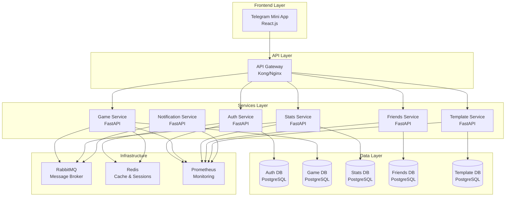
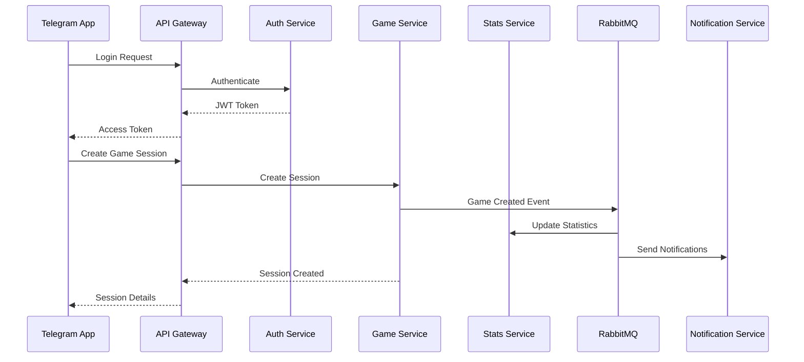

# Архитектура приложения Artel Billiards

##  ENTERING CREATIVE PHASE: ARCHITECTURE

## Описание компонента
В данном документе описывается архитектура приложения Artel Billiards, включая структуру базы данных, API и компонентную структуру клиентской части.

## Требования и ограничения
- Приложение должно работать как Telegram Mini App
- Необходима поддержка авторизации через Google Auth и Telegram
- Система должна обеспечивать реал-тайм обновление данных в игровой сессии
- Архитектура должна поддерживать масштабирование для будущих версий

## Варианты архитектуры

### Вариант 1: Монолитная архитектура

#### Описание
В этом варианте мы создаем единое приложение с бэкендом на FastAPI и фронтендом на React, интегрированным в Telegram Mini Apps.

#### Компоненты
- **Backend**: FastAPI (Python)
- **Frontend**: React.js в Telegram Mini Apps
- **База данных**: PostgreSQL
- **Аутентификация**: OAuth для Google и Telegram API
- **Реал-тайм обновления**: WebSockets

#### Преимущества
- Простота разработки и деплоя
- Единая кодовая база для бэкенда
- Легче отлаживать
- Меньше накладных расходов на коммуникацию между сервисами

#### Недостатки
- Сложнее масштабировать отдельные компоненты
- Менее гибкая архитектура для будущих расширений
- Все компоненты зависят друг от друга

### Вариант 2: Микросервисная архитектура

#### Описание
В этом варианте мы разделяем приложение на несколько независимых микросервисов, каждый из которых отвечает за определенную функциональность.

#### Компоненты
- **Auth Service**: Сервис авторизации и управления пользователями
- **Game Service**: Сервис управления играми и сессиями
- **Stats Service**: Сервис для сбора и анализа статистики
- **Frontend**: React.js в Telegram Mini Apps
- **API Gateway**: Единая точка входа для всех клиентских запросов
- **База данных**: Отдельные базы данных для каждого сервиса
- **Реал-тайм обновления**: RabbitMQ + WebSockets

#### Преимущества
- Лучшая масштабируемость отдельных компонентов
- Возможность независимого развития каждого сервиса
- Более высокая отказоустойчивость
- Легче добавлять новые функции в будущих версиях

#### Недостатки
- Сложность разработки и деплоя
- Необходимость в дополнительной инфраструктуре
- Сложнее отлаживать
- Больше накладных расходов на коммуникацию между сервисами

## 🎨 CREATIVE CHECKPOINT: Анализ вариантов завершен

## Принятое решение

**Выбранный вариант: Микросервисная архитектура (Вариант 2)**

### Обоснование выбора

Микросервисная архитектура выбрана по следующим причинам:

1. **Масштабируемость**: Каждый сервис можно масштабировать независимо в зависимости от нагрузки
2. **Гибкость развития**: Возможность независимой разработки разных команд на разных сервисах
3. **Отказоустойчивость**: Сбой одного сервиса не приводит к падению всей системы
4. **Технологическое разнообразие**: Каждый сервис может использовать оптимальные для него технологии
5. **Подготовка к будущему**: Легче добавлять новые функции (турниры, рейтинги, уведомления)

Хотя микросервисная архитектура сложнее в реализации, она обеспечивает долгосрочную гибкость и возможность роста приложения.

### Детальная архитектура выбранного решения

#### Сервисы системы:

1. **Auth Service** (Сервис аутентификации)
   - Управление пользователями
   - JWT токены
   - Интеграция с Google Auth и Telegram
   - База данных: PostgreSQL (users, sessions)

2. **Game Service** (Игровой сервис)
   - Управление игровыми сессиями
   - Логика игр (Американка, Московская, Колхоз)
   - Очереди игроков
   - База данных: PostgreSQL (games, sessions, events)

3. **Stats Service** (Сервис статистики)
   - Сбор и анализ статистики игр
   - Рейтинги игроков
   - История игр
   - База данных: PostgreSQL (statistics, rankings)

4. **Friends Service** (Сервис друзей)
   - Управление друзьями
   - Группировка пользователей
   - База данных: PostgreSQL (friendships, groups)

5. **Template Service** (Сервис шаблонов)
   - Управление шаблонами игр
   - Настройки правил
   - База данных: PostgreSQL (templates, rules)

6. **Notification Service** (Сервис уведомлений)
   - Отправка уведомлений в Telegram
   - Push-уведомления
   - Очереди сообщений: RabbitMQ

#### Инфраструктурные компоненты:

- **API Gateway**: Единая точка входа (Kong/Nginx)
- **Message Broker**: RabbitMQ для асинхронной коммуникации
- **Cache**: Redis для кеширования и сессий
- **Monitoring**: Prometheus + Grafana
- **Logging**: Centralized logging с ELK stack

### Архитектурная диаграмма

### Коммуникационная схема

## План реализации

### Фаза 1: Инфраструктура и базовые сервисы
1. Настройка Docker Compose для всех сервисов
2. Развертывание PostgreSQL кластера для каждого сервиса
3. Настройка RabbitMQ и Redis
4. Развертывание API Gateway
5. Базовая настройка мониторинга

### Фаза 2: Auth Service
1. Создание базовой структуры FastAPI
2. Реализация JWT аутентификации
3. Интеграция с Google Auth
4. Интеграция с Telegram API
5. Тестирование аутентификации

### Фаза 3: Game Service  
1. Создание игровых моделей данных
2. Реализация логики игровых сессий
3. Интеграция WebSocket для реал-тайм обновлений
4. Реализация логики разных типов игр
5. Интеграция с RabbitMQ для событий

### Фаза 4: Остальные сервисы
1. Stats Service для статистики
2. Friends Service для управления друзьями  
3. Template Service для шаблонов игр
4. Notification Service для уведомлений

### Фаза 5: Frontend интеграция
1. Настройка API клиента в React
2. Реализация аутентификации
3. Интеграция с игровыми сервисами
4. Реализация реал-тайм функций

### Фаза 6: Тестирование и оптимизация
1. End-to-end тестирование
2. Нагрузочное тестирование
3. Оптимизация производительности
4. Настройка production-готового мониторинга

## Верификация против требований

✅ **Telegram Mini App**: Поддержано через API Gateway и фронтенд на React
✅ **Авторизация Google/Telegram**: Реализовано в Auth Service
✅ **Реал-тайм обновления**: WebSockets в Game Service + RabbitMQ
✅ **Масштабирование**: Каждый сервис масштабируется независимо

## Технические решения

### API Gateway
- **Выбор**: Kong или Nginx с lua-скриптами
- **Функции**: Роутинг, аутентификация, rate limiting, логирование

### Базы данных
- **Стратегия**: Database per service
- **Технология**: PostgreSQL для всех сервисов
- **Миграции**: Alembic в каждом сервисе

### Межсервисная коммуникация
- **Синхронная**: HTTP REST через API Gateway
- **Асинхронная**: RabbitMQ для событий
- **Формат данных**: JSON

### Мониторинг
- **Метрики**: Prometheus с кастомными метриками
- **Логирование**: Centralized logging
- **Трейсинг**: Jaeger для distributed tracing

🎨🎨🎨 EXITING CREATIVE PHASE: ARCHITECTURE 🎨🎨🎨

**Ключевые решения:**
- Выбрана микросервисная архитектура
- 6 основных сервисов с разделением ответственности
- API Gateway как единая точка входа
- RabbitMQ для асинхронной коммуникации
- PostgreSQL database-per-service
- Comprehensive мониторинг и логирование

**Следующие шаги:** Переход к проектированию базы данных для каждого сервиса
