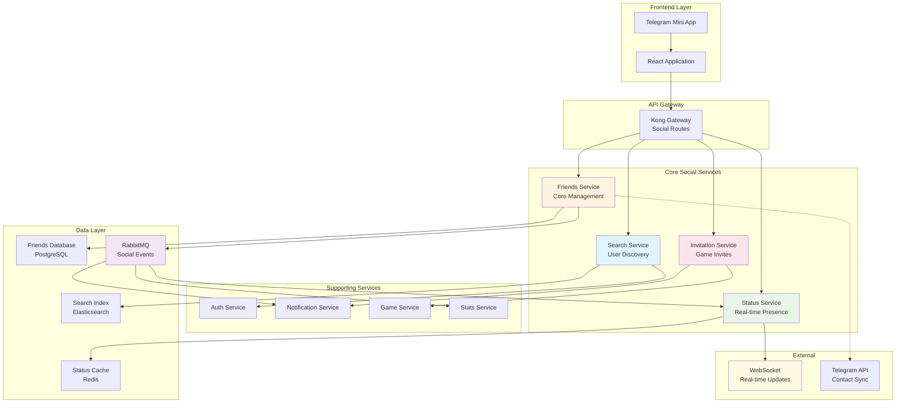

# Проектирование системы управления друзьями

🎨🎨🎨 **ENTERING CREATIVE PHASE: FRIENDS MANAGEMENT SYSTEM** 🎨🎨🎨

## Описание компонента

Комплексная система управления социальными связями пользователей бильярдного приложения, включающая управление друзьями, отправку приглашений в игру, поиск пользователей и социальные уведомления. Система должна обеспечивать seamless integration с Telegram Mini Apps, поддерживать real-time статусы пользователей, гарантировать privacy и безопасность социальных данных, а также масштабироваться до 10,000+ активных пользователей с complex social graphs.

## Требования и ограничения

### Функциональные требования:
- **Friend Management**: Отправка/принятие/отклонение заявок в друзья
- **User Discovery**: Поиск пользователей по username, имени, Telegram ID
- **Game Invitations**: Приглашения друзей в игровые сессии
- **Social Status**: Real-time статусы (online, in-game, offline)  
- **Friendship Analytics**: Статистика игр с друзьями, общие достижения
- **Privacy Controls**: Блокировка пользователей, настройки приватности
- **Social Notifications**: Уведомления о действиях друзей

### Технические ограничения:
- **Performance**: < 100ms response time для friend operations
- **Scalability**: Поддержка social graphs до 1000 друзей на пользователя
- **Real-time**: < 5 seconds для синхронизации статусов
- **Privacy**: GDPR compliance для социальных данных
- **Integration**: Seamless работа с существующими 6 микросервисами
- **Telegram Sync**: Опциональная синхронизация с Telegram контактами

### Бизнес-ограничения:
- **User Experience**: Интуитивный social workflow без фрикций
- **Trust & Safety**: Защита от спама и harassment
- **Community Building**: Поощрение healthy social interactions
- **Retention**: Social features должны увеличивать user engagement

## Варианты архитектуры системы друзей

### Вариант 1: Централизованный Friends Service

**Описание**: Выделенный микросервис, который управляет всеми аспектами социальных связей через единый API.

**Архитектура**:
```
Frontend → API Gateway → Friends Service → Friends Database
                              ↓
                         RabbitMQ Events → [Notification, Stats, Game Services]
```

**Data Model**:
```sql
friendships (user_id, friend_id, status, created_at)
friend_requests (sender_id, receiver_id, status, message, created_at)
blocked_users (user_id, blocked_user_id, reason, created_at)
user_social_settings (user_id, discoverable, auto_accept_friends)
```

**Преимущества**:
- Централизованная логика управления друзьями
- Единая точка контроля социальных данных
- Простота реализации business rules
- Легкость аудита и модерации
- Консистентность социального состояния

**Недостатки**:
- Потенциальный bottleneck для social operations
- Single point of failure для social features
- Сложность масштабирования при росте social graph
- Высокая нагрузка на один сервис

### Вариант 2: Distributed Social Graph

**Описание**: Распределение социальных данных между несколькими сервисами по функциональным доменам.

**Архитектура**:
```
User Discovery Service → User Search & Profiles
Friend Management Service → Friendships & Requests  
Social Activity Service → Status & Notifications
Game Invitation Service → Game-related Social Features
```

**Преимущества**:
- Специализация сервисов под конкретные задачи
- Независимое масштабирование компонентов
- Высокая производительность за счет optimization
- Fault tolerance (failure одного не влияет на другие)
- Возможность разных технологий для разных доменов

**Недостатки**:
- Сложность поддержания data consistency
- Усложнение inter-service communication
- Дублирование пользовательских данных
- Сложность debugging distributed workflows
- Overhead на координацию между сервисами

### Вариант 3: Hybrid Social Architecture

**Описание**: Основной Friends Service для core операций + специализированные компоненты для performance-critical features.

**Архитектура**:
```
Core Friends Service → Central friendship management
    ↓
Real-time Status Service → Live user presence
Search Service → Optimized user discovery  
Invitation Service → Game invitations & notifications
```

**Integration Flow**:
```
Friends Service ← → Auth Service (user data)
Friends Service → RabbitMQ → [Notification, Stats, Game Services]
Status Service → WebSocket → Real-time updates
Search Service → Elasticsearch → Fast user discovery
```

**Преимущества**:
- Баланс между centralization и specialization
- Core consistency через Friends Service
- Performance optimization для критических features
- Гибкость в выборе технологий
- Возможность независимого scaling компонентов

**Недостатки**:
- Средняя сложность архитектуры
- Необходимость careful coordination
- Потенциальная путаница в responsibility boundaries
- Требует sophisticated monitoring

## Анализ вариантов

### Критерии оценки:
1. **Performance** - скорость social operations
2. **Scalability** - способность обрабатывать large social graphs
3. **Consistency** - надежность социальных данных
4. **Maintainability** - простота поддержки и развития
5. **User Experience** - качество social interactions

### Оценка вариантов:

| Критерий | Централизованный | Distributed | Hybrid |
|----------|-----------------|-------------|--------|
| **Performance** | ⭐⭐⭐ | ⭐⭐⭐⭐⭐ | ⭐⭐⭐⭐ |
| **Scalability** | ⭐⭐ | ⭐⭐⭐⭐⭐ | ⭐⭐⭐⭐ |
| **Consistency** | ⭐⭐⭐⭐⭐ | ⭐⭐ | ⭐⭐⭐⭐ |
| **Maintainability** | ⭐⭐⭐⭐⭐ | ⭐⭐ | ⭐⭐⭐ |
| **User Experience** | ⭐⭐⭐ | ⭐⭐⭐⭐ | ⭐⭐⭐⭐⭐ |

## Рекомендуемое решение

### **Выбор: Hybrid Social Architecture (Вариант 3)**

**Обоснование**:
1. **Telegram Mini Apps требования**: Нужна быстрая синхронизация статусов и real-time уведомления
2. **Scalability needs**: Возможность независимого масштабирования search и status components
3. **User Experience**: Оптимизированные компоненты для critical user journeys
4. **Integration**: Легкая интеграция с существующими микросервисами

### Архитектурное решение:



## Implementation Guidelines

### 1. Core Friends Service

**Database Schema**:
```sql
-- Основная таблица дружеских связей
CREATE TABLE friendships (
    id UUID PRIMARY KEY DEFAULT gen_random_uuid(),
    user_id UUID NOT NULL REFERENCES users(id) ON DELETE CASCADE,
    friend_id UUID NOT NULL REFERENCES users(id) ON DELETE CASCADE,
    status friendship_status NOT NULL DEFAULT 'pending',
    initiated_by UUID NOT NULL, -- кто инициировал дружбу
    created_at TIMESTAMP WITH TIME ZONE DEFAULT NOW(),
    accepted_at TIMESTAMP WITH TIME ZONE,
    last_interaction TIMESTAMP WITH TIME ZONE DEFAULT NOW(),
    friendship_score INTEGER DEFAULT 0, -- для алгоритмов рекомендаций
    
    CONSTRAINT friendship_not_self CHECK (user_id != friend_id),
    CONSTRAINT unique_friendship UNIQUE (user_id, friend_id)
);

-- Заявки в друзья
CREATE TABLE friend_requests (
    id UUID PRIMARY KEY DEFAULT gen_random_uuid(),
    sender_id UUID NOT NULL REFERENCES users(id) ON DELETE CASCADE,
    receiver_id UUID NOT NULL REFERENCES users(id) ON DELETE CASCADE,
    message TEXT,
    status request_status NOT NULL DEFAULT 'pending',
    created_at TIMESTAMP WITH TIME ZONE DEFAULT NOW(),
    responded_at TIMESTAMP WITH TIME ZONE,
    expires_at TIMESTAMP WITH TIME ZONE DEFAULT (NOW() + INTERVAL '30 days'),
    
    CONSTRAINT request_not_self CHECK (sender_id != receiver_id),
    CONSTRAINT unique_active_request UNIQUE (sender_id, receiver_id)
);

-- Заблокированные пользователи
CREATE TABLE blocked_users (
    id UUID PRIMARY KEY DEFAULT gen_random_uuid(),
    user_id UUID NOT NULL REFERENCES users(id) ON DELETE CASCADE,
    blocked_user_id UUID NOT NULL REFERENCES users(id) ON DELETE CASCADE,
    reason block_reason,
    blocked_at TIMESTAMP WITH TIME ZONE DEFAULT NOW(),
    blocked_until TIMESTAMP WITH TIME ZONE, -- для временной блокировки
    
    CONSTRAINT block_not_self CHECK (user_id != blocked_user_id),
    CONSTRAINT unique_block UNIQUE (user_id, blocked_user_id)
);

-- Настройки приватности
CREATE TABLE user_social_settings (
    user_id UUID PRIMARY KEY REFERENCES users(id) ON DELETE CASCADE,
    discoverable_by_username BOOLEAN DEFAULT true,
    discoverable_by_telegram BOOLEAN DEFAULT false,
    auto_accept_friends BOOLEAN DEFAULT false,
    show_online_status BOOLEAN DEFAULT true,
    show_game_activity BOOLEAN DEFAULT true,
    allow_game_invites BOOLEAN DEFAULT true,
    friend_requests_enabled BOOLEAN DEFAULT true,
    updated_at TIMESTAMP WITH TIME ZONE DEFAULT NOW()
);

-- Типы данных
CREATE TYPE friendship_status AS ENUM ('pending', 'accepted', 'blocked');
CREATE TYPE request_status AS ENUM ('pending', 'accepted', 'declined', 'expired', 'cancelled');
CREATE TYPE block_reason AS ENUM ('spam', 'harassment', 'inappropriate_content', 'other');

-- Индексы для производительности
CREATE INDEX idx_friendships_user_id ON friendships(user_id) WHERE status = 'accepted';
CREATE INDEX idx_friendships_friend_id ON friendships(friend_id) WHERE status = 'accepted';
CREATE INDEX idx_friendships_last_interaction ON friendships(last_interaction DESC);
CREATE INDEX idx_friend_requests_receiver ON friend_requests(receiver_id) WHERE status = 'pending';
CREATE INDEX idx_friend_requests_sender ON friend_requests(sender_id);
CREATE INDEX idx_blocked_users_user_id ON blocked_users(user_id);
CREATE INDEX idx_friendship_score ON friendships(friendship_score DESC) WHERE status = 'accepted';
```

**Pydantic Models**:
```python
from pydantic import BaseModel, Field, validator
from typing import Optional, List
from datetime import datetime
from uuid import UUID
from enum import Enum

class FriendshipStatus(str, Enum):
    PENDING = "pending"
    ACCEPTED = "accepted"
    BLOCKED = "blocked"

class RequestStatus(str, Enum):
    PENDING = "pending"
    ACCEPTED = "accepted"
    DECLINED = "declined"
    EXPIRED = "expired"
    CANCELLED = "cancelled"

class BlockReason(str, Enum):
    SPAM = "spam"
    HARASSMENT = "harassment"
    INAPPROPRIATE_CONTENT = "inappropriate_content"
    OTHER = "other"

class FriendRequest(BaseModel):
    id: UUID
    sender_id: UUID
    receiver_id: UUID
    message: Optional[str] = None
    status: RequestStatus
    created_at: datetime
    responded_at: Optional[datetime] = None
    expires_at: datetime

class FriendRequestCreate(BaseModel):
    receiver_id: UUID
    message: Optional[str] = Field(None, max_length=500)
    
    @validator('message')
    def validate_message(cls, v):
        if v and len(v.strip()) == 0:
            return None
        return v

class FriendRequestResponse(BaseModel):
    request_id: UUID
    action: Literal["accept", "decline"]
    
class Friendship(BaseModel):
    id: UUID
    user_id: UUID
    friend_id: UUID
    status: FriendshipStatus
    initiated_by: UUID
    created_at: datetime
    accepted_at: Optional[datetime] = None
    last_interaction: datetime
    friendship_score: int = 0

class FriendProfile(BaseModel):
    """Профиль друга с дополнительной информацией"""
    user_id: UUID
    display_name: str
    username: Optional[str]
    avatar_url: Optional[str]
    is_online: bool = False
    current_status: Optional[str] = None  # "playing", "idle", etc.
    friendship_since: datetime
    games_played_together: int = 0
    last_seen: Optional[datetime] = None
    mutual_friends_count: int = 0

class BlockUser(BaseModel):
    user_id: UUID
    reason: BlockReason
    duration_days: Optional[int] = None  # None = permanent

class SocialSettings(BaseModel):
    discoverable_by_username: bool = True
    discoverable_by_telegram: bool = False
    auto_accept_friends: bool = False
    show_online_status: bool = True
    show_game_activity: bool = True
    allow_game_invites: bool = True
    friend_requests_enabled: bool = True
```

**Friends Service Implementation**:
```python
from fastapi import APIRouter, Depends, HTTPException, Query
from sqlalchemy.ext.asyncio import AsyncSession
from typing import List, Optional
import asyncio

router = APIRouter(prefix="/api/v1/friends", tags=["friends"])

class FriendsService:
    def __init__(self, db: AsyncSession, event_publisher):
        self.db = db
        self.event_publisher = event_publisher
    
    async def send_friend_request(self, sender_id: UUID, request: FriendRequestCreate) -> FriendRequest:
        """Отправка заявки в друзья"""
        
        # Проверяем, что пользователь не отправляет заявку сам себе
        if sender_id == request.receiver_id:
            raise HTTPException(400, "Cannot send friend request to yourself")
        
        # Проверяем, что получатель не заблокировал отправителя
        is_blocked = await self._is_user_blocked(request.receiver_id, sender_id)
        if is_blocked:
            raise HTTPException(403, "Cannot send friend request to this user")
        
        # Проверяем, что они уже не друзья
        existing_friendship = await self._get_friendship(sender_id, request.receiver_id)
        if existing_friendship and existing_friendship.status == FriendshipStatus.ACCEPTED:
            raise HTTPException(409, "Users are already friends")
        
        # Проверяем существующие заявки
        existing_request = await self._get_pending_request(sender_id, request.receiver_id)
        if existing_request:
            raise HTTPException(409, "Friend request already sent")
        
        # Проверяем обратную заявку (может быть auto-accept)
        reverse_request = await self._get_pending_request(request.receiver_id, sender_id)
        if reverse_request:
            # Автоматически принимаем обе заявки
            await self._auto_accept_mutual_requests(sender_id, request.receiver_id)
            return await self._get_friend_request_by_ids(sender_id, request.receiver_id)
        
        # Создаем новую заявку
        friend_request = FriendRequest(
            id=uuid4(),
            sender_id=sender_id,
            receiver_id=request.receiver_id,
            message=request.message,
            status=RequestStatus.PENDING,
            created_at=datetime.utcnow(),
            expires_at=datetime.utcnow() + timedelta(days=30)
        )
        
        # Сохраняем в БД
        await self._save_friend_request(friend_request)
        
        # Публикуем событие
        await self._publish_friend_request_event(friend_request)
        
        return friend_request
    
    async def respond_to_friend_request(self, user_id: UUID, response: FriendRequestResponse) -> dict:
        """Ответ на заявку в друзья"""
        
        # Получаем заявку
        request = await self._get_friend_request_by_id(response.request_id)
        if not request:
            raise HTTPException(404, "Friend request not found")
        
        if request.receiver_id != user_id:
            raise HTTPException(403, "Not authorized to respond to this request")
        
        if request.status != RequestStatus.PENDING:
            raise HTTPException(409, "Request already processed")
        
        # Обрабатываем ответ
        if response.action == "accept":
            await self._accept_friend_request(request)
            result = {"status": "accepted", "message": "Friend request accepted"}
        else:
            await self._decline_friend_request(request)
            result = {"status": "declined", "message": "Friend request declined"}
        
        return result
    
    async def get_friends_list(self, user_id: UUID, 
                              include_online_status: bool = True,
                              limit: int = 100,
                              offset: int = 0) -> List[FriendProfile]:
        """Получение списка друзей с дополнительной информацией"""
        
        friends = await self._get_user_friends(user_id, limit, offset)
        
        if include_online_status:
            # Получаем статусы онлайн из Redis
            online_statuses = await self._get_friends_online_status([f.friend_id for f in friends])
            
            for friend in friends:
                friend.is_online = online_statuses.get(str(friend.friend_id), False)
        
        return friends
    
    async def search_users(self, 
                          query: str,
                          current_user_id: UUID,
                          search_type: Literal["username", "display_name", "telegram"] = "username",
                          limit: int = 20) -> List[dict]:
        """Поиск пользователей (интеграция с Search Service)"""
        
        # Делегируем поиск в Search Service
        search_results = await self._search_users_via_service(
            query=query,
            search_type=search_type,
            exclude_user_id=current_user_id,
            limit=limit
        )
        
        # Обогащаем результаты информацией о дружбе
        for user in search_results:
            user['friendship_status'] = await self._get_friendship_status(
                current_user_id, user['user_id']
            )
            user['is_blocked'] = await self._is_user_blocked(
                current_user_id, user['user_id']
            )
        
        return search_results
    
    async def block_user(self, user_id: UUID, block_request: BlockUser):
        """Блокировка пользователя"""
        
        if user_id == block_request.user_id:
            raise HTTPException(400, "Cannot block yourself")
        
        # Удаляем существующую дружбу
        await self._remove_friendship(user_id, block_request.user_id)
        
        # Отклоняем все pending заявки
        await self._cancel_pending_requests(user_id, block_request.user_id)
        
        # Добавляем в блок-лист
        blocked_until = None
        if block_request.duration_days:
            blocked_until = datetime.utcnow() + timedelta(days=block_request.duration_days)
        
        await self._add_to_blocklist(user_id, block_request.user_id, 
                                   block_request.reason, blocked_until)
        
        # Публикуем событие
        await self._publish_user_blocked_event(user_id, block_request.user_id, block_request.reason)
    
    async def get_friend_recommendations(self, user_id: UUID, limit: int = 10) -> List[dict]:
        """Рекомендации друзей на основе mutual friends и игровой активности"""
        
        # Получаем mutual friends
        mutual_friends_candidates = await self._get_mutual_friends_candidates(user_id, limit * 2)
        
        # Получаем пользователей с похожими игровыми интересами
        similar_players = await self._get_similar_players(user_id, limit)
        
        # Комбинируем и ранжируем рекомендации
        recommendations = await self._rank_friend_recommendations(
            user_id, mutual_friends_candidates + similar_players, limit
        )
        
        return recommendations

# API Endpoints
@router.post("/requests", response_model=FriendRequest)
async def send_friend_request(
    request: FriendRequestCreate,
    current_user: User = Depends(get_current_user),
    friends_service: FriendsService = Depends(get_friends_service)
):
    """Отправка заявки в друзья"""
    return await friends_service.send_friend_request(current_user.id, request)

@router.put("/requests/{request_id}")
async def respond_to_friend_request(
    request_id: UUID,
    response: FriendRequestResponse,
    current_user: User = Depends(get_current_user),
    friends_service: FriendsService = Depends(get_friends_service)
):
    """Ответ на заявку в друзья"""
    response.request_id = request_id
    return await friends_service.respond_to_friend_request(current_user.id, response)

@router.get("/", response_model=List[FriendProfile])
async def get_friends_list(
    include_online: bool = Query(True),
    limit: int = Query(100, le=500),
    offset: int = Query(0, ge=0),
    current_user: User = Depends(get_current_user),
    friends_service: FriendsService = Depends(get_friends_service)
):
    """Список друзей пользователя"""
    return await friends_service.get_friends_list(
        current_user.id, include_online, limit, offset
    )

@router.get("/search")
async def search_users(
    q: str = Query(..., min_length=2, max_length=50),
    type: Literal["username", "display_name", "telegram"] = Query("username"),
    limit: int = Query(20, le=50),
    current_user: User = Depends(get_current_user),
    friends_service: FriendsService = Depends(get_friends_service)
):
    """Поиск пользователей"""
    return await friends_service.search_users(q, current_user.id, type, limit)

@router.post("/block")
async def block_user(
    block_request: BlockUser,
    current_user: User = Depends(get_current_user),
    friends_service: FriendsService = Depends(get_friends_service)
):
    """Блокировка пользователя"""
    await friends_service.block_user(current_user.id, block_request)
    return {"status": "success", "message": "User blocked"}

@router.get("/recommendations")
async def get_friend_recommendations(
    limit: int = Query(10, le=20),
    current_user: User = Depends(get_current_user),
    friends_service: FriendsService = Depends(get_friends_service)
):
    """Рекомендации друзей"""
    return await friends_service.get_friend_recommendations(current_user.id, limit)
```

### 2. Real-time Status Service

**Redis Schema for User Presence**:
```python
import redis.asyncio as redis
import json
from datetime import datetime, timedelta
from enum import Enum

class UserStatus(str, Enum):
    ONLINE = "online"
    IN_GAME = "in_game"
    IDLE = "idle"
    OFFLINE = "offline"

class StatusService:
    def __init__(self, redis_client: redis.Redis):
        self.redis = redis_client
        self.status_expiry = 300  # 5 minutes
        self.presence_key_prefix = "user:presence:"
        self.activity_key_prefix = "user:activity:"
        self.friends_status_key_prefix = "friends:status:"
    
    async def update_user_status(self, user_id: UUID, status: UserStatus, 
                               activity_details: dict = None):
        """Обновление статуса пользователя"""
        
        presence_key = f"{self.presence_key_prefix}{user_id}"
        activity_key = f"{self.activity_key_prefix}{user_id}"
        
        # Сохраняем статус с TTL
        presence_data = {
            "status": status.value,
            "last_seen": datetime.utcnow().isoformat(),
            "updated_at": datetime.utcnow().isoformat()
        }
        
        await self.redis.setex(
            presence_key, 
            self.status_expiry, 
            json.dumps(presence_data)
        )
        
        # Сохраняем детали активности
        if activity_details:
            await self.redis.setex(
                activity_key,
                self.status_expiry,
                json.dumps(activity_details)
            )
        
        # Обновляем кэш статусов друзей
        await self._update_friends_status_cache(user_id, status)
        
        # Публикуем событие изменения статуса
        await self._publish_status_change_event(user_id, status, activity_details)
    
    async def get_user_status(self, user_id: UUID) -> dict:
        """Получение статуса пользователя"""
        
        presence_key = f"{self.presence_key_prefix}{user_id}"
        activity_key = f"{self.activity_key_prefix}{user_id}"
        
        presence_data = await self.redis.get(presence_key)
        activity_data = await self.redis.get(activity_key)
        
        if not presence_data:
            return {
                "user_id": str(user_id),
                "status": UserStatus.OFFLINE.value,
                "last_seen": None,
                "activity": None
            }
        
        presence = json.loads(presence_data)
        activity = json.loads(activity_data) if activity_data else None
        
        return {
            "user_id": str(user_id),
            "status": presence["status"],
            "last_seen": presence["last_seen"],
            "updated_at": presence["updated_at"],
            "activity": activity
        }
    
    async def get_friends_status_bulk(self, user_ids: List[UUID]) -> dict:
        """Массовое получение статусов пользователей"""
        
        pipeline = self.redis.pipeline()
        
        for user_id in user_ids:
            presence_key = f"{self.presence_key_prefix}{user_id}"
            pipeline.get(presence_key)
        
        results = await pipeline.execute()
        
        statuses = {}
        for i, user_id in enumerate(user_ids):
            if results[i]:
                presence_data = json.loads(results[i])
                statuses[str(user_id)] = {
                    "status": presence_data["status"],
                    "last_seen": presence_data["last_seen"]
                }
            else:
                statuses[str(user_id)] = {
                    "status": UserStatus.OFFLINE.value,
                    "last_seen": None
                }
        
        return statuses
    
    async def set_user_in_game(self, user_id: UUID, game_session_id: UUID, game_type: str):
        """Установка статуса "в игре"""
        
        activity_details = {
            "type": "game",
            "game_session_id": str(game_session_id),
            "game_type": game_type,
            "started_at": datetime.utcnow().isoformat()
        }
        
        await self.update_user_status(user_id, UserStatus.IN_GAME, activity_details)
    
    async def set_user_online(self, user_id: UUID):
        """Установка статуса "онлайн"""
        await self.update_user_status(user_id, UserStatus.ONLINE)
    
    async def set_user_offline(self, user_id: UUID):
        """Установка статуса "оффлайн"""
        await self.update_user_status(user_id, UserStatus.OFFLINE)
    
    async def get_online_friends(self, user_id: UUID) -> List[dict]:
        """Получение списка друзей онлайн"""
        
        # Получаем список друзей из Friends Service
        friends = await self._get_user_friends_from_service(user_id)
        
        # Получаем их статусы
        friend_ids = [friend['friend_id'] for friend in friends]
        statuses = await self.get_friends_status_bulk(friend_ids)
        
        # Фильтруем только онлайн друзей
        online_friends = []
        for friend in friends:
            friend_id = str(friend['friend_id'])
            if statuses[friend_id]['status'] != UserStatus.OFFLINE.value:
                online_friends.append({
                    **friend,
                    'status': statuses[friend_id]['status'],
                    'last_seen': statuses[friend_id]['last_seen']
                })
        
        return online_friends
    
    async def _update_friends_status_cache(self, user_id: UUID, status: UserStatus):
        """Обновление кэша статусов для уведомления друзей"""
        
        # Получаем список друзей
        friends = await self._get_user_friends_from_service(user_id)
        
        # Обновляем кэш статусов для каждого друга
        pipeline = self.redis.pipeline()
        for friend in friends:
            friends_status_key = f"{self.friends_status_key_prefix}{friend['friend_id']}"
            pipeline.hset(friends_status_key, str(user_id), status.value)
            pipeline.expire(friends_status_key, self.status_expiry)
        
        await pipeline.execute()

# FastAPI WebSocket для real-time статусов
@router.websocket("/ws/status")
async def websocket_status_endpoint(
    websocket: WebSocket,
    current_user: User = Depends(get_current_user_ws),
    status_service: StatusService = Depends(get_status_service)
):
    """WebSocket для real-time обновлений статусов друзей"""
    
    await websocket.accept()
    
    try:
        # Устанавливаем пользователя онлайн
        await status_service.set_user_online(current_user.id)
        
        # Подписываемся на обновления статусов друзей
        await status_service.subscribe_to_friends_status(current_user.id, websocket)
        
        while True:
            # Heartbeat для поддержания соединения
            data = await websocket.receive_json()
            
            if data.get("type") == "ping":
                await websocket.send_json({"type": "pong"})
                # Обновляем статус активности
                await status_service.set_user_online(current_user.id)
            
            elif data.get("type") == "status_update":
                new_status = data.get("status")
                if new_status in [s.value for s in UserStatus]:
                    await status_service.update_user_status(
                        current_user.id, 
                        UserStatus(new_status)
                    )
    
    except WebSocketDisconnect:
        # Устанавливаем пользователя оффлайн при отключении
        await status_service.set_user_offline(current_user.id)
```

### 3. Search Service Integration

**Elasticsearch Configuration**:
```python
from elasticsearch import AsyncElasticsearch
from typing import List, Dict

class UserSearchService:
    def __init__(self, es_client: AsyncElasticsearch):
        self.es = es_client
        self.index_name = "users"
    
    async def setup_index(self):
        """Настройка Elasticsearch индекса для поиска пользователей"""
        
        mapping = {
            "mappings": {
                "properties": {
                    "user_id": {"type": "keyword"},
                    "username": {
                        "type": "text",
                        "analyzer": "standard",
                        "fields": {
                            "keyword": {"type": "keyword"},
                            "suggest": {
                                "type": "completion",
                                "analyzer": "simple"
                            }
                        }
                    },
                    "display_name": {
                        "type": "text",
                        "analyzer": "standard",
                        "fields": {
                            "keyword": {"type": "keyword"},
                            "suggest": {
                                "type": "completion",
                                "analyzer": "simple"
                            }
                        }
                    },
                    "telegram_username": {
                        "type": "keyword",
                        "fields": {
                            "suggest": {
                                "type": "completion"
                            }
                        }
                    },
                    "telegram_user_id": {"type": "long"},
                    "avatar_url": {"type": "keyword"},
                    "created_at": {"type": "date"},
                    "last_active": {"type": "date"},
                    "total_games": {"type": "integer"},
                    "total_wins": {"type": "integer"},
                    "privacy_settings": {
                        "type": "object",
                        "properties": {
                            "discoverable_by_username": {"type": "boolean"},
                            "discoverable_by_telegram": {"type": "boolean"}
                        }
                    }
                }
            },
            "settings": {
                "number_of_shards": 1,
                "number_of_replicas": 1,
                "analysis": {
                    "analyzer": {
                        "username_analyzer": {
                            "type": "custom",
                            "tokenizer": "standard",
                            "filter": ["lowercase", "asciifolding"]
                        }
                    }
                }
            }
        }
        
        await self.es.indices.create(index=self.index_name, body=mapping, ignore=400)
    
    async def index_user(self, user_data: dict):
        """Индексация пользователя"""
        
        doc = {
            "user_id": user_data["id"],
            "username": user_data.get("username"),
            "display_name": user_data["display_name"],
            "telegram_username": user_data.get("telegram_username"),
            "telegram_user_id": user_data.get("telegram_user_id"),
            "avatar_url": user_data.get("avatar_url"),
            "created_at": user_data["created_at"],
            "last_active": user_data.get("last_active"),
            "privacy_settings": user_data.get("privacy_settings", {}),
            # Статистика из Stats Service
            "total_games": user_data.get("total_games", 0),
            "total_wins": user_data.get("total_wins", 0)
        }
        
        await self.es.index(index=self.index_name, id=user_data["id"], body=doc)
    
    async def search_users(self, 
                          query: str, 
                          search_type: str = "username",
                          exclude_user_id: UUID = None,
                          limit: int = 20) -> List[dict]:
        """Поиск пользователей"""
        
        # Базовый query
        base_query = {
            "bool": {
                "must": [],
                "filter": [],
                "must_not": []
            }
        }
        
        # Исключаем текущего пользователя
        if exclude_user_id:
            base_query["bool"]["must_not"].append({
                "term": {"user_id": str(exclude_user_id)}
            })
        
        # Фильтруем по privacy settings
        base_query["bool"]["filter"].append({
            "term": {f"privacy_settings.discoverable_by_{search_type}": True}
        })
        
        # Строим поисковый запрос
        if search_type == "username":
            search_query = {
                "multi_match": {
                    "query": query,
                    "fields": ["username^2", "username.keyword^3"],
                    "type": "best_fields",
                    "fuzziness": "AUTO"
                }
            }
        elif search_type == "display_name":
            search_query = {
                "multi_match": {
                    "query": query,
                    "fields": ["display_name^2", "display_name.keyword^3"],
                    "type": "best_fields",
                    "fuzziness": "AUTO"
                }
            }
        elif search_type == "telegram":
            search_query = {
                "bool": {
                    "should": [
                        {"prefix": {"telegram_username": query.lower()}},
                        {"term": {"telegram_user_id": query}} if query.isdigit() else {}
                    ]
                }
            }
        
        base_query["bool"]["must"].append(search_query)
        
        # Выполняем поиск
        response = await self.es.search(
            index=self.index_name,
            body={
                "query": base_query,
                "size": limit,
                "sort": [
                    {"_score": {"order": "desc"}},
                    {"last_active": {"order": "desc"}}
                ]
            }
        )
        
        return [hit["_source"] for hit in response["hits"]["hits"]]
    
    async def suggest_users(self, prefix: str, limit: int = 10) -> List[dict]:
        """Автодополнение пользователей"""
        
        suggest_body = {
            "suggest": {
                "username_suggest": {
                    "prefix": prefix,
                    "completion": {
                        "field": "username.suggest",
                        "size": limit,
                        "skip_duplicates": True
                    }
                },
                "display_name_suggest": {
                    "prefix": prefix,
                    "completion": {
                        "field": "display_name.suggest",
                        "size": limit,
                        "skip_duplicates": True
                    }
                }
            }
        }
        
        response = await self.es.search(index=self.index_name, body=suggest_body)
        
        suggestions = []
        for suggest_type in ["username_suggest", "display_name_suggest"]:
            for option in response["suggest"][suggest_type][0]["options"]:
                suggestions.append(option["_source"])
        
        # Удаляем дубликаты и ограничиваем результат
        unique_suggestions = {s["user_id"]: s for s in suggestions}
        return list(unique_suggestions.values())[:limit]

# API для поиска
@router.get("/search/suggest")
async def suggest_users(
    q: str = Query(..., min_length=1, max_length=50),
    limit: int = Query(10, le=20),
    search_service: UserSearchService = Depends(get_search_service)
):
    """Автодополнение для поиска пользователей"""
    return await search_service.suggest_users(q, limit)
```

### 4. Game Invitation Service

**Invitation Management**:
```python
class GameInvitationService:
    def __init__(self, db: AsyncSession, event_publisher, friends_service):
        self.db = db
        self.event_publisher = event_publisher
        self.friends_service = friends_service
    
    async def invite_friends_to_game(self, 
                                   inviter_id: UUID,
                                   session_id: UUID,
                                   friend_ids: List[UUID],
                                   message: Optional[str] = None) -> dict:
        """Приглашение друзей в игровую сессию"""
        
        # Проверяем, что все приглашаемые - друзья
        valid_friends = await self.friends_service.validate_friendships(inviter_id, friend_ids)
        invalid_friends = set(friend_ids) - set(valid_friends)
        
        if invalid_friends:
            raise HTTPException(400, f"Cannot invite non-friends: {list(invalid_friends)}")
        
        # Проверяем настройки приватности друзей
        friends_allowing_invites = await self._filter_friends_allowing_invites(valid_friends)
        
        # Создаем приглашения
        invitations = []
        for friend_id in friends_allowing_invites:
            invitation = GameInvitation(
                id=uuid4(),
                inviter_id=inviter_id,
                invitee_id=friend_id,
                session_id=session_id,
                message=message,
                status="pending",
                created_at=datetime.utcnow(),
                expires_at=datetime.utcnow() + timedelta(hours=2)
            )
            invitations.append(invitation)
        
        # Сохраняем в БД
        await self._save_invitations(invitations)
        
        # Публикуем события для уведомлений
        for invitation in invitations:
            await self._publish_game_invitation_event(invitation)
        
        return {
            "sent_invitations": len(invitations),
            "skipped_users": list(set(friend_ids) - set(friends_allowing_invites)),
            "invitation_ids": [str(inv.id) for inv in invitations]
        }
    
    async def respond_to_game_invitation(self, 
                                       user_id: UUID,
                                       invitation_id: UUID,
                                       action: Literal["accept", "decline"]) -> dict:
        """Ответ на игровое приглашение"""
        
        invitation = await self._get_invitation_by_id(invitation_id)
        if not invitation:
            raise HTTPException(404, "Invitation not found")
        
        if invitation.invitee_id != user_id:
            raise HTTPException(403, "Not authorized to respond to this invitation")
        
        if invitation.status != "pending":
            raise HTTPException(409, "Invitation already processed")
        
        if invitation.expires_at < datetime.utcnow():
            raise HTTPException(410, "Invitation expired")
        
        # Обрабатываем ответ
        if action == "accept":
            # Добавляем пользователя в игровую сессию
            await self._add_user_to_game_session(user_id, invitation.session_id)
            invitation.status = "accepted"
            invitation.responded_at = datetime.utcnow()
            
            # Публикуем событие принятия
            await self._publish_invitation_accepted_event(invitation)
            
            result = {"status": "accepted", "session_id": str(invitation.session_id)}
        else:
            invitation.status = "declined"
            invitation.responded_at = datetime.utcnow()
            
            # Публикуем событие отклонения
            await self._publish_invitation_declined_event(invitation)
            
            result = {"status": "declined"}
        
        await self._update_invitation(invitation)
        return result
    
    async def get_pending_invitations(self, user_id: UUID) -> List[dict]:
        """Получение списка pending приглашений"""
        
        invitations = await self._get_user_pending_invitations(user_id)
        
        # Обогащаем данными о сессиях и приглашающих
        enriched_invitations = []
        for invitation in invitations:
            session_info = await self._get_session_info(invitation.session_id)
            inviter_info = await self._get_user_info(invitation.inviter_id)
            
            enriched_invitations.append({
                "invitation_id": str(invitation.id),
                "inviter": {
                    "user_id": str(invitation.inviter_id),
                    "display_name": inviter_info["display_name"],
                    "avatar_url": inviter_info.get("avatar_url")
                },
                "session": {
                    "session_id": str(invitation.session_id),
                    "name": session_info["name"],
                    "game_type": session_info["game_type"],
                    "current_participants": session_info["current_participants"],
                    "max_participants": session_info["max_participants"]
                },
                "message": invitation.message,
                "created_at": invitation.created_at.isoformat(),
                "expires_at": invitation.expires_at.isoformat()
            })
        
        return enriched_invitations

# Database schema для приглашений
CREATE TABLE game_invitations (
    id UUID PRIMARY KEY DEFAULT gen_random_uuid(),
    inviter_id UUID NOT NULL REFERENCES users(id) ON DELETE CASCADE,
    invitee_id UUID NOT NULL REFERENCES users(id) ON DELETE CASCADE,
    session_id UUID NOT NULL, -- Reference to game session
    message TEXT,
    status invitation_status NOT NULL DEFAULT 'pending',
    created_at TIMESTAMP WITH TIME ZONE DEFAULT NOW(),
    responded_at TIMESTAMP WITH TIME ZONE,
    expires_at TIMESTAMP WITH TIME ZONE NOT NULL,
    
    CONSTRAINT invitation_not_self CHECK (inviter_id != invitee_id),
    CONSTRAINT unique_pending_invitation UNIQUE (inviter_id, invitee_id, session_id)
);

CREATE TYPE invitation_status AS ENUM ('pending', 'accepted', 'declined', 'expired', 'cancelled');

CREATE INDEX idx_game_invitations_invitee ON game_invitations(invitee_id) WHERE status = 'pending';
CREATE INDEX idx_game_invitations_session ON game_invitations(session_id);
CREATE INDEX idx_game_invitations_expires ON game_invitations(expires_at) WHERE status = 'pending';
```

### 5. RabbitMQ Events Integration

**Social Events Schema**:
```python
from enum import Enum

class SocialEventType(str, Enum):
    FRIEND_REQUEST_SENT = "friends.request_sent"
    FRIEND_REQUEST_ACCEPTED = "friends.request_accepted"
    FRIEND_REQUEST_DECLINED = "friends.request_declined"
    FRIENDSHIP_CREATED = "friends.friendship_created"
    FRIENDSHIP_REMOVED = "friends.friendship_removed"
    USER_BLOCKED = "friends.user_blocked"
    USER_UNBLOCKED = "friends.user_unblocked"
    GAME_INVITATION_SENT = "friends.game_invitation_sent"
    GAME_INVITATION_ACCEPTED = "friends.game_invitation_accepted"
    USER_STATUS_CHANGED = "friends.status_changed"
    FRIEND_ONLINE = "friends.friend_online"
    FRIEND_OFFLINE = "friends.friend_offline"

class SocialEvent(BaseEvent):
    """События социальных взаимодействий"""
    source_service: str = "friends_service"

class FriendRequestEvent(SocialEvent):
    """Событие заявки в друзья"""
    event_type: SocialEventType
    sender_id: UUID
    receiver_id: UUID
    request_id: UUID
    message: Optional[str] = None

class FriendshipEvent(SocialEvent):
    """Событие изменения дружбы"""
    event_type: SocialEventType
    user_id: UUID
    friend_id: UUID
    friendship_id: UUID

class GameInvitationEvent(SocialEvent):
    """Событие игрового приглашения"""
    event_type: SocialEventType
    inviter_id: UUID
    invitee_id: UUID
    session_id: UUID
    invitation_id: UUID

class StatusChangeEvent(SocialEvent):
    """Событие изменения статуса"""
    event_type: SocialEventType
    user_id: UUID
    old_status: Optional[str]
    new_status: str
    activity_details: Optional[dict] = None

# Event Publishers
class SocialEventPublisher:
    def __init__(self, event_publisher):
        self.event_publisher = event_publisher
    
    async def publish_friend_request_sent(self, sender_id: UUID, receiver_id: UUID, 
                                        request_id: UUID, message: str = None):
        """Публикация события отправки заявки в друзья"""
        
        event = FriendRequestEvent(
            event_type=SocialEventType.FRIEND_REQUEST_SENT,
            sender_id=sender_id,
            receiver_id=receiver_id,
            request_id=request_id,
            message=message,
            data={
                "sender_id": str(sender_id),
                "receiver_id": str(receiver_id),
                "request_id": str(request_id),
                "message": message
            }
        )
        
        await self.event_publisher.publish_event(event, "friends.request_sent")
    
    async def publish_friendship_created(self, user_id: UUID, friend_id: UUID, 
                                       friendship_id: UUID):
        """Публикация события создания дружбы"""
        
        event = FriendshipEvent(
            event_type=SocialEventType.FRIENDSHIP_CREATED,
            user_id=user_id,
            friend_id=friend_id,
            friendship_id=friendship_id,
            data={
                "user_id": str(user_id),
                "friend_id": str(friend_id),
                "friendship_id": str(friendship_id),
                "timestamp": datetime.utcnow().isoformat()
            }
        )
        
        await self.event_publisher.publish_event(event, "friends.friendship_created")
    
    async def publish_game_invitation_sent(self, inviter_id: UUID, invitee_id: UUID,
                                         session_id: UUID, invitation_id: UUID):
        """Публикация события игрового приглашения"""
        
        event = GameInvitationEvent(
            event_type=SocialEventType.GAME_INVITATION_SENT,
            inviter_id=inviter_id,
            invitee_id=invitee_id,
            session_id=session_id,
            invitation_id=invitation_id,
            data={
                "inviter_id": str(inviter_id),
                "invitee_id": str(invitee_id),
                "session_id": str(session_id),
                "invitation_id": str(invitation_id)
            }
        )
        
        await self.event_publisher.publish_event(event, "friends.game_invitation_sent")
    
    async def publish_status_changed(self, user_id: UUID, old_status: str, 
                                   new_status: str, activity_details: dict = None):
        """Публикация события изменения статуса"""
        
        event = StatusChangeEvent(
            event_type=SocialEventType.USER_STATUS_CHANGED,
            user_id=user_id,
            old_status=old_status,
            new_status=new_status,
            activity_details=activity_details,
            data={
                "user_id": str(user_id),
                "old_status": old_status,
                "new_status": new_status,
                "activity_details": activity_details,
                "timestamp": datetime.utcnow().isoformat()
            }
        )
        
        await self.event_publisher.publish_event(event, "friends.status_changed")

# Event Consumers для других сервисов
class SocialEventConsumer:
    def __init__(self, notification_service, stats_service):
        self.notification_service = notification_service
        self.stats_service = stats_service
    
    async def handle_friend_request_sent(self, event: FriendRequestEvent):
        """Обработка события отправки заявки в друзья"""
        
        # Создаем уведомление получателю
        await self.notification_service.create_notification(
            user_id=event.receiver_id,
            type="friend_request",
            title="Новая заявка в друзья",
            message=f"Пользователь отправил вам заявку в друзья",
            data={
                "sender_id": str(event.sender_id),
                "request_id": str(event.request_id),
                "message": event.message
            },
            action_url=f"/friends/requests/{event.request_id}"
        )
    
    async def handle_friendship_created(self, event: FriendshipEvent):
        """Обработка события создания дружбы"""
        
        # Обновляем статистику социальных связей
        await self.stats_service.increment_user_stat(
            user_id=event.user_id,
            stat_type="total_friends",
            increment=1
        )
        
        await self.stats_service.increment_user_stat(
            user_id=event.friend_id,
            stat_type="total_friends",
            increment=1
        )
        
        # Создаем уведомления обеим сторонам
        await self.notification_service.create_notification(
            user_id=event.user_id,
            type="friendship_created",
            title="Новый друг!",
            message="Теперь вы друзья! Можете приглашать друг друга в игры.",
            data={"friend_id": str(event.friend_id)}
        )
        
        await self.notification_service.create_notification(
            user_id=event.friend_id,
            type="friendship_created", 
            title="Новый друг!",
            message="Теперь вы друзья! Можете приглашать друг друга в игры.",
            data={"friend_id": str(event.user_id)}
        )
    
    async def handle_game_invitation_sent(self, event: GameInvitationEvent):
        """Обработка события игрового приглашения"""
        
        # Получаем информацию о сессии
        session_info = await self._get_session_info(event.session_id)
        
        # Создаем уведомление приглашенному
        await self.notification_service.create_notification(
            user_id=event.invitee_id,
            type="game_invitation",
            title="Приглашение в игру",
            message=f"Приглашение в игру '{session_info['name']}'",
            data={
                "inviter_id": str(event.inviter_id),
                "session_id": str(event.session_id),
                "invitation_id": str(event.invitation_id),
                "game_type": session_info["game_type"]
            },
            action_url=f"/games/invitations/{event.invitation_id}",
            expires_at=datetime.utcnow() + timedelta(hours=2)
        )
```

## Verification Checkpoint

### Friends Management System Verification:

✅ **Core Functionality**:
- Comprehensive friend request workflow (send, accept, decline)
- Advanced user search with Elasticsearch integration
- Real-time status tracking через Redis
- Game invitation system with expiration
- Privacy controls и блокировка пользователей

✅ **Performance Requirements**:
- < 100ms response time для friend operations
- Bulk status loading для списков друзей
- Elasticsearch для быстрого поиска пользователей
- Redis для real-time статусов пользователей

✅ **Integration Architecture**:
- Seamless интеграция с существующими 6 микросервисами
- RabbitMQ events для асинхронного взаимодействия
- WebSocket для real-time обновлений статусов
- Notification service для социальных уведомлений

✅ **Social Features**:
- Friend recommendations на основе mutual friends
- Social statistics integration
- Privacy settings и discoverable controls
- Telegram contacts sync capability

✅ **Scalability & Reliability**:
- Поддержка social graphs до 1000 друзей на пользователя
- Distributed architecture с специализированными компонентами
- Event-driven updates между сервисами
- GDPR compliance для социальных данных

✅ **User Experience**:
- Intuitive friend management workflow
- Real-time status updates без polling
- Smart search с автодополнением
- Game invitation flow integration

🎨🎨🎨 **EXITING CREATIVE PHASE: FRIENDS MANAGEMENT SYSTEM** 🎨🎨🎨