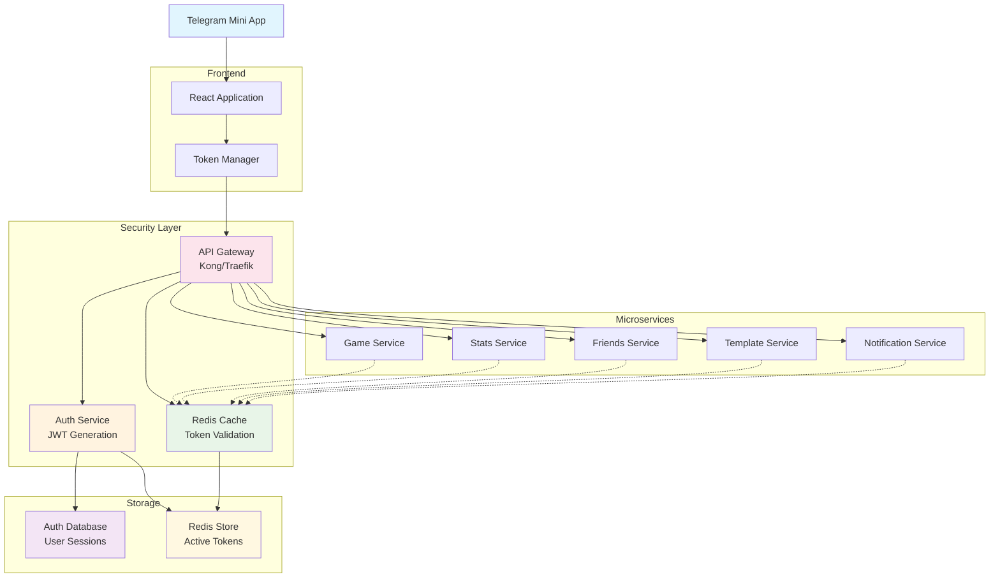

# Проектирование JWT аутентификации и безопасности

🎨🎨🎨 **ENTERING CREATIVE PHASE: JWT AUTHENTICATION & SECURITY** 🎨🎨🎨

## Описание компонента

Система аутентификации и авторизации для Telegram Mini Apps на базе JWT токенов с многоуровневой системой безопасности. Должна обеспечить seamless интеграцию с Telegram API, защиту от основных типов атак, ролевую модель доступа и масштабируемость для 1000+ одновременных пользователей.

## Требования и ограничения

### Функциональные требования:
- **Telegram Integration**: Аутентификация через Telegram Mini Apps API
- **JWT Management**: Access/Refresh token система с автоматическим обновлением
- **Role-Based Access**: Роли (user, session_creator, admin) с granular permissions
- **Session Management**: Управление активными сессиями пользователей
- **Multi-Device Support**: Поддержка входа с нескольких устройств
- **Token Revocation**: Возможность инвалидации токенов при компрометации

### Технические ограничения:
- **Performance**: < 50ms для валидации токена
- **Scalability**: Поддержка 1000+ одновременных пользователей  
- **Security Standards**: OWASP Top 10 compliance
- **Telegram API**: Интеграция с Telegram Bot API и Mini Apps
- **Microservices**: Распределенная валидация между 6 сервисами
- **Cache Performance**: Redis для кэширования активных токенов

### Бизнес-ограничения:
- **User Experience**: Прозрачная аутентификация без лишних шагов
- **Privacy**: Минимальное хранение персональных данных
- **Compliance**: GDPR compliance для EU пользователей
- **Trust**: Telegram identity как единственный источник правды

## Варианты архитектуры аутентификации

### Вариант 1: Централизованная аутентификация (Auth Service Only)

**Описание**: Все операции аутентификации и авторизации проходят только через Auth Service.

**Архитектура**:
```
Telegram Mini App → Auth Service (JWT Generation & Validation)
                         ↓
Frontend ← API Gateway ← [All Microservices validate via Auth Service]
```

**Преимущества**:
- Централизованное управление безопасностью
- Единая точка контроля доступа
- Простота аудита и мониторинга
- Легкость обновления security policies
- Консистентность валидации

**Недостатки**:
- Потенциальная точка отказа (SPOF)
- Дополнительная задержка на каждый запрос
- Высокая нагрузка на Auth Service
- Сложность масштабирования при росте пользователей

### Вариант 2: Децентрализованная валидация (JWT Self-Validation)

**Описание**: Каждый микросервис самостоятельно валидирует JWT токены с помощью общего секретного ключа.

**Архитектура**:
```
Telegram Mini App → Auth Service (JWT Generation Only)
                         ↓
Frontend → API Gateway → [Each Service validates JWT independently]
```

**Преимущества**:
- Высокая производительность (нет дополнительных запросов)
- Отсутствие SPOF для валидации
- Простота масштабирования
- Низкая latency для API requests
- Offline валидация возможна

**Недостатки**:
- Сложность revocation токенов
- Необходимость синхронизации секретных ключей
- Усложнение security updates
- Риск десинхронизации между сервисами
- Сложность аудита распределенной валидации

### Вариант 3: Гибридная архитектура (Cached Validation)

**Описание**: Микросервисы валидируют токены локально с кэшированием через Redis и fallback на Auth Service.

**Архитектура**:
```
Telegram Mini App → Auth Service (JWT Generation)
                         ↓
Frontend → API Gateway → Redis Cache ← [Microservices]
                              ↓           ↑
                         Auth Service ←─────┘
                         (Fallback validation)
```

**Преимущества**:
- Баланс между производительностью и безопасностью
- Быстрая валидация через кэш (< 5ms)
- Centralized security control через Auth Service
- Эффективная revocation через cache invalidation
- Graceful degradation при недоступности кэша

**Недостатки**:
- Сложность архитектуры и поддержки
- Зависимость от Redis availability
- Необходимость cache consistency management
- Сложность debugging распределенной валидации

## Анализ вариантов

### Критерии оценки:
1. **Performance** - скорость валидации токенов
2. **Security** - уровень безопасности и контроля
3. **Scalability** - способность обрабатывать растущую нагрузку
4. **Reliability** - устойчивость к отказам
5. **Maintainability** - простота поддержки и обновлений

### Оценка вариантов:

| Критерий | Централизованная | Децентрализованная | Гибридная |
|----------|-----------------|-------------------|-----------|
| **Performance** | ⭐⭐ | ⭐⭐⭐⭐⭐ | ⭐⭐⭐⭐ |
| **Security** | ⭐⭐⭐⭐⭐ | ⭐⭐ | ⭐⭐⭐⭐ |
| **Scalability** | ⭐⭐ | ⭐⭐⭐⭐⭐ | ⭐⭐⭐⭐ |
| **Reliability** | ⭐⭐ | ⭐⭐⭐⭐ | ⭐⭐⭐⭐⭐ |
| **Maintainability** | ⭐⭐⭐⭐⭐ | ⭐⭐ | ⭐⭐⭐ |

## Рекомендуемое решение

### **Выбор: Гибридная архитектура (Вариант 3)**

**Обоснование**:
1. **Telegram Mini Apps требования**: Нужна быстрая валидация для real-time игр
2. **Security критичность**: Бильярд с реальными деньгами требует максимальной безопасности
3. **Scalability**: Redis кэш обеспечивает масштабируемость с сохранением контроля
4. **Reliability**: Fallback механизм обеспечивает высокую доступность

### Архитектурное решение:



## Implementation Guidelines

### 1. Telegram Mini Apps Integration

**Telegram Auth Flow**:
```python
from telegram import WebApp
import hmac
import hashlib
from urllib.parse import unquote

class TelegramAuthValidator:
    def __init__(self, bot_token: str):
        self.bot_secret = hashlib.sha256(bot_token.encode()).digest()
    
    def validate_telegram_data(self, init_data: str) -> dict:
        """Валидация данных от Telegram Mini App"""
        try:
            # Парсим init_data
            parsed_data = self._parse_init_data(init_data)
            received_hash = parsed_data.pop('hash', None)
            
            if not received_hash:
                raise ValueError("Missing hash in init_data")
            
            # Создаем строку для проверки
            data_check_string = '\n'.join([
                f"{k}={v}" for k, v in sorted(parsed_data.items())
            ])
            
            # Проверяем подпись
            secret_key = hmac.new(
                self.bot_secret, 
                data_check_string.encode(), 
                hashlib.sha256
            ).hexdigest()
            
            if not hmac.compare_digest(received_hash, secret_key):
                raise ValueError("Invalid Telegram signature")
            
            # Проверяем время (данные не старше 1 часа)
            auth_date = int(parsed_data.get('auth_date', 0))
            if time.time() - auth_date > 3600:
                raise ValueError("Auth data too old")
            
            return parsed_data
            
        except Exception as e:
            logger.error(f"Telegram auth validation failed: {e}")
            raise HTTPException(401, "Invalid Telegram authentication")
    
    def _parse_init_data(self, init_data: str) -> dict:
        """Парсинг init_data от Telegram"""
        data = {}
        for item in init_data.split('&'):
            if '=' in item:
                key, value = item.split('=', 1)
                data[key] = unquote(value)
        return data
```

**Auth API Endpoint**:
```python
@router.post("/auth/telegram", response_model=AuthResponse)
async def telegram_auth(
    request: TelegramAuthRequest,
    db: AsyncSession = Depends(get_db),
    auth_validator: TelegramAuthValidator = Depends(get_telegram_validator)
):
    """Аутентификация через Telegram Mini App"""
    
    # Валидируем данные от Telegram
    telegram_data = auth_validator.validate_telegram_data(request.init_data)
    
    # Получаем или создаем пользователя
    user = await get_or_create_user_by_telegram_id(
        db, telegram_data['id'], telegram_data
    )
    
    # Генерируем JWT токены
    access_token = create_access_token(user)
    refresh_token = create_refresh_token(user)
    
    # Сохраняем сессию
    session = await create_user_session(
        db, user.id, refresh_token, request.device_info
    )
    
    # Кэшируем токен в Redis
    await cache_token(access_token, user.id, expires_in=ACCESS_TOKEN_EXPIRE_MINUTES)
    
    return AuthResponse(
        access_token=access_token,
        refresh_token=refresh_token,
        token_type="bearer",
        expires_in=ACCESS_TOKEN_EXPIRE_MINUTES * 60,
        user=UserProfile.from_orm(user)
    )
```

### 2. JWT Token Structure

**Access Token Payload**:
```python
{
    # Standard Claims
    "sub": "user_uuid_here",           # Subject (User ID)
    "iss": "artel_billiards",          # Issuer
    "aud": "telegram_mini_app",        # Audience
    "exp": 1642684800,                 # Expiration (15 minutes)
    "iat": 1642681200,                 # Issued At
    "nbf": 1642681200,                 # Not Before
    "jti": "token_uuid_here",          # JWT ID для revocation
    
    # Custom Claims
    "telegram_id": 123456789,          # Telegram User ID
    "username": "john_doe",            # Telegram Username
    "display_name": "John Doe",        # Display Name
    "roles": ["user", "session_creator"], # User Roles
    "permissions": [                   # Granular Permissions
        "games:read",
        "games:write", 
        "sessions:create",
        "stats:read"
    ],
    "session_id": "session_uuid",      # Current Session ID
    "device_id": "device_uuid",        # Device Identifier
    "is_verified": true,               # Telegram Verification Status
    "security_level": "standard"       # Security Level
}
```

**Refresh Token Payload**:
```python
{
    "sub": "user_uuid_here",
    "iss": "artel_billiards", 
    "aud": "refresh_service",
    "exp": 1644499200,                 # Expiration (30 days)
    "iat": 1642681200,
    "jti": "refresh_token_uuid",
    "type": "refresh",
    "session_id": "session_uuid",
    "device_id": "device_uuid"
}
```

### 3. Token Generation & Validation

**JWT Service Implementation**:
```python
import jwt
from datetime import datetime, timedelta
from cryptography.hazmat.primitives import hashes
from cryptography.hazmat.primitives.asymmetric import rsa
from cryptography.hazmat.primitives import serialization

class JWTService:
    def __init__(self):
        self.algorithm = "RS256"
        self.access_token_expire_minutes = 15
        self.refresh_token_expire_days = 30
        
        # Генерируем ключи при старте (в production загружаем из secure storage)
        self.private_key, self.public_key = self._generate_keys()
    
    def create_access_token(self, user: User, additional_claims: dict = None) -> str:
        """Создание access token"""
        now = datetime.utcnow()
        expire = now + timedelta(minutes=self.access_token_expire_minutes)
        
        payload = {
            "sub": str(user.id),
            "iss": "artel_billiards",
            "aud": "telegram_mini_app",
            "exp": expire,
            "iat": now,
            "nbf": now,
            "jti": str(uuid4()),
            
            # Custom claims
            "telegram_id": user.telegram_user_id,
            "username": user.username,
            "display_name": user.display_name,
            "roles": [role.name for role in user.roles],
            "permissions": self._get_user_permissions(user),
            "is_verified": user.is_verified,
            "security_level": "standard"
        }
        
        if additional_claims:
            payload.update(additional_claims)
        
        return jwt.encode(payload, self.private_key, algorithm=self.algorithm)
    
    def create_refresh_token(self, user: User, session_id: str, device_id: str) -> str:
        """Создание refresh token"""
        now = datetime.utcnow()
        expire = now + timedelta(days=self.refresh_token_expire_days)
        
        payload = {
            "sub": str(user.id),
            "iss": "artel_billiards",
            "aud": "refresh_service", 
            "exp": expire,
            "iat": now,
            "jti": str(uuid4()),
            "type": "refresh",
            "session_id": session_id,
            "device_id": device_id
        }
        
        return jwt.encode(payload, self.private_key, algorithm=self.algorithm)
    
    def validate_token(self, token: str, audience: str = "telegram_mini_app") -> dict:
        """Валидация JWT токена"""
        try:
            payload = jwt.decode(
                token,
                self.public_key,
                algorithms=[self.algorithm],
                audience=audience,
                issuer="artel_billiards"
            )
            return payload
            
        except jwt.ExpiredSignatureError:
            raise HTTPException(401, detail="Token expired")
        except jwt.InvalidAudienceError:
            raise HTTPException(401, detail="Invalid token audience")
        except jwt.InvalidIssuerError:
            raise HTTPException(401, detail="Invalid token issuer")
        except jwt.InvalidTokenError:
            raise HTTPException(401, detail="Invalid token")
    
    def _generate_keys(self):
        """Генерация RSA ключей для JWT"""
        private_key = rsa.generate_private_key(
            public_exponent=65537,
            key_size=2048
        )
        public_key = private_key.public_key()
        
        return private_key, public_key
    
    def _get_user_permissions(self, user: User) -> List[str]:
        """Получение permissions пользователя"""
        permissions = []
        for role in user.roles:
            permissions.extend(role.permissions)
        return list(set(permissions))  # Remove duplicates
```

### 4. Redis Caching Strategy

**Token Caching Implementation**:
```python
import redis.asyncio as redis
import json
from typing import Optional

class TokenCache:
    def __init__(self, redis_url: str):
        self.redis = redis.from_url(redis_url)
        self.prefix = "auth:token:"
        self.user_prefix = "auth:user:"
    
    async def cache_token(self, token: str, user_id: str, expires_in: int):
        """Кэширование токена"""
        token_key = f"{self.prefix}{self._get_token_hash(token)}"
        user_key = f"{self.user_prefix}{user_id}"
        
        # Парсим токен для получения claims
        payload = jwt.decode(token, verify=False)  # Без верификации для кэша
        
        token_data = {
            "user_id": user_id,
            "telegram_id": payload.get("telegram_id"),
            "roles": payload.get("roles", []),
            "permissions": payload.get("permissions", []),
            "session_id": payload.get("session_id"),
            "device_id": payload.get("device_id"),
            "is_verified": payload.get("is_verified", False),
            "expires_at": payload.get("exp")
        }
        
        # Кэшируем токен
        await self.redis.setex(
            token_key, 
            expires_in, 
            json.dumps(token_data)
        )
        
        # Добавляем токен к пользователю для batch invalidation
        await self.redis.sadd(user_key, token_key)
        await self.redis.expire(user_key, expires_in)
    
    async def get_token_data(self, token: str) -> Optional[dict]:
        """Получение данных токена из кэша"""
        token_key = f"{self.prefix}{self._get_token_hash(token)}"
        
        cached_data = await self.redis.get(token_key)
        if cached_data:
            return json.loads(cached_data)
        return None
    
    async def invalidate_token(self, token: str):
        """Инвалидация конкретного токена"""
        token_key = f"{self.prefix}{self._get_token_hash(token)}"
        await self.redis.delete(token_key)
    
    async def invalidate_user_tokens(self, user_id: str):
        """Инвалидация всех токенов пользователя"""
        user_key = f"{self.user_prefix}{user_id}"
        
        # Получаем все токены пользователя
        token_keys = await self.redis.smembers(user_key)
        
        if token_keys:
            # Удаляем все токены
            await self.redis.delete(*token_keys)
            # Очищаем список токенов пользователя
            await self.redis.delete(user_key)
    
    async def is_token_revoked(self, token: str) -> bool:
        """Проверка, не отозван ли токен"""
        token_key = f"{self.prefix}{self._get_token_hash(token)}:revoked"
        return await self.redis.exists(token_key)
    
    async def revoke_token(self, token: str, expires_in: int):
        """Отзыв токена (добавление в blacklist)"""
        token_key = f"{self.prefix}{self._get_token_hash(token)}:revoked"
        await self.redis.setex(token_key, expires_in, "1")
    
    def _get_token_hash(self, token: str) -> str:
        """Получение хэша токена для использования в качестве ключа"""
        import hashlib
        return hashlib.sha256(token.encode()).hexdigest()[:16]
```

### 5. Authentication Middleware

**FastAPI Middleware Implementation**:
```python
from fastapi import Request, HTTPException, Depends
from fastapi.security import HTTPBearer, HTTPAuthorizationCredentials
import time

security = HTTPBearer(auto_error=False)

class AuthMiddleware:
    def __init__(self, jwt_service: JWTService, token_cache: TokenCache):
        self.jwt_service = jwt_service
        self.token_cache = token_cache
    
    async def __call__(self, 
                      request: Request,
                      credentials: HTTPAuthorizationCredentials = Depends(security)
                      ) -> Optional[dict]:
        """Middleware для валидации токенов"""
        
        if not credentials:
            return None  # Опциональная аутентификация
        
        token = credentials.credentials
        
        try:
            # 1. Проверяем кэш Redis (быстро)
            cached_data = await self.token_cache.get_token_data(token)
            if cached_data:
                # Проверяем expiration
                if cached_data["expires_at"] < time.time():
                    await self.token_cache.invalidate_token(token)
                    raise HTTPException(401, "Token expired")
                
                # Проверяем revocation
                if await self.token_cache.is_token_revoked(token):
                    raise HTTPException(401, "Token revoked")
                
                return cached_data
            
            # 2. Fallback на JWT validation
            payload = self.jwt_service.validate_token(token)
            
            # 3. Кэшируем валидный токен
            expires_in = payload["exp"] - int(time.time())
            if expires_in > 0:
                await self.token_cache.cache_token(
                    token, payload["sub"], expires_in
                )
            
            return payload
            
        except HTTPException:
            raise
        except Exception as e:
            logger.error(f"Auth middleware error: {e}")
            raise HTTPException(401, "Authentication failed")

# Dependency для получения текущего пользователя
async def get_current_user(
    auth_data: dict = Depends(AuthMiddleware),
    db: AsyncSession = Depends(get_db)
) -> User:
    """Получение текущего пользователя"""
    if not auth_data:
        raise HTTPException(401, "Authentication required")
    
    user_id = auth_data["user_id"]
    user = await get_user_by_id(db, user_id)
    
    if not user:
        raise HTTPException(401, "User not found")
    
    return user

# Dependency для проверки ролей
def require_roles(*required_roles: str):
    """Декоратор для проверки ролей"""
    def role_checker(auth_data: dict = Depends(AuthMiddleware)):
        if not auth_data:
            raise HTTPException(401, "Authentication required")
        
        user_roles = set(auth_data.get("roles", []))
        required_roles_set = set(required_roles)
        
        if not user_roles.intersection(required_roles_set):
            raise HTTPException(403, f"Required roles: {required_roles}")
        
        return auth_data
    
    return role_checker

# Dependency для проверки permissions
def require_permissions(*required_permissions: str):
    """Декоратор для проверки permissions"""
    def permission_checker(auth_data: dict = Depends(AuthMiddleware)):
        if not auth_data:
            raise HTTPException(401, "Authentication required")
        
        user_permissions = set(auth_data.get("permissions", []))
        required_permissions_set = set(required_permissions)
        
        if not user_permissions.intersection(required_permissions_set):
            raise HTTPException(403, f"Required permissions: {required_permissions}")
        
        return auth_data
    
    return permission_checker
```

### 6. Role-Based Access Control (RBAC)

**Database Models for RBAC**:
```sql
-- Роли в системе
CREATE TABLE user_roles (
    id UUID PRIMARY KEY DEFAULT gen_random_uuid(),
    name VARCHAR(50) UNIQUE NOT NULL,
    description TEXT,
    is_system_role BOOLEAN DEFAULT false,  -- Системные роли нельзя удалять
    created_at TIMESTAMP WITH TIME ZONE DEFAULT NOW()
);

-- Permissions в системе
CREATE TABLE permissions (
    id UUID PRIMARY KEY DEFAULT gen_random_uuid(),
    name VARCHAR(100) UNIQUE NOT NULL,  -- e.g. "games:read", "sessions:create"
    description TEXT,
    resource VARCHAR(50) NOT NULL,      -- e.g. "games", "sessions", "stats"
    action VARCHAR(50) NOT NULL,        -- e.g. "read", "write", "create", "delete"
    created_at TIMESTAMP WITH TIME ZONE DEFAULT NOW()
);

-- Связь ролей и permissions
CREATE TABLE role_permissions (
    role_id UUID NOT NULL REFERENCES user_roles(id) ON DELETE CASCADE,
    permission_id UUID NOT NULL REFERENCES permissions(id) ON DELETE CASCADE,
    PRIMARY KEY (role_id, permission_id)
);

-- Связь пользователей и ролей
CREATE TABLE user_role_assignments (
    user_id UUID NOT NULL REFERENCES users(id) ON DELETE CASCADE,
    role_id UUID NOT NULL REFERENCES user_roles(id) ON DELETE CASCADE,
    assigned_at TIMESTAMP WITH TIME ZONE DEFAULT NOW(),
    assigned_by UUID REFERENCES users(id),
    expires_at TIMESTAMP WITH TIME ZONE,  -- Для временных ролей
    PRIMARY KEY (user_id, role_id)
);

-- Индексы для производительности
CREATE INDEX idx_user_role_assignments_user_id ON user_role_assignments(user_id);
CREATE INDEX idx_user_role_assignments_role_id ON user_role_assignments(role_id);
CREATE INDEX idx_role_permissions_role_id ON role_permissions(role_id);
CREATE INDEX idx_permissions_resource_action ON permissions(resource, action);
```

**System Roles Definition**:
```sql
-- Системные роли
INSERT INTO user_roles (name, description, is_system_role) VALUES
('user', 'Обычный пользователь', true),
('session_creator', 'Создатель игровых сессий', true),
('moderator', 'Модератор сообщества', true),
('admin', 'Администратор системы', true);

-- Базовые permissions
INSERT INTO permissions (name, description, resource, action) VALUES
-- Games permissions
('games:read', 'Просмотр игр', 'games', 'read'),
('games:write', 'Участие в играх', 'games', 'write'),
('games:create', 'Создание игр', 'games', 'create'),
('games:delete', 'Удаление игр', 'games', 'delete'),
('games:moderate', 'Модерация игр', 'games', 'moderate'),

-- Sessions permissions
('sessions:read', 'Просмотр сессий', 'sessions', 'read'),
('sessions:create', 'Создание сессий', 'sessions', 'create'),
('sessions:join', 'Присоединение к сессиям', 'sessions', 'join'),
('sessions:manage', 'Управление сессиями', 'sessions', 'manage'),
('sessions:delete', 'Удаление сессий', 'sessions', 'delete'),

-- Stats permissions
('stats:read', 'Просмотр статистики', 'stats', 'read'),
('stats:read_all', 'Просмотр всей статистики', 'stats', 'read_all'),

-- Friends permissions
('friends:read', 'Просмотр друзей', 'friends', 'read'),
('friends:manage', 'Управление друзьями', 'friends', 'manage'),

-- Templates permissions
('templates:read', 'Просмотр шаблонов', 'templates', 'read'),
('templates:create', 'Создание шаблонов', 'templates', 'create'),
('templates:edit', 'Редактирование шаблонов', 'templates', 'edit'),
('templates:delete', 'Удаление шаблонов', 'templates', 'delete'),

-- Admin permissions
('admin:users', 'Управление пользователями', 'admin', 'users'),
('admin:system', 'Системное администрирование', 'admin', 'system');

-- Связываем роли с permissions
-- User role
INSERT INTO role_permissions (role_id, permission_id)
SELECT r.id, p.id FROM user_roles r, permissions p 
WHERE r.name = 'user' AND p.name IN (
    'games:read', 'games:write', 'sessions:read', 'sessions:join',
    'stats:read', 'friends:read', 'friends:manage', 'templates:read'
);

-- Session Creator role (наследует User + дополнительные права)
INSERT INTO role_permissions (role_id, permission_id)
SELECT r.id, p.id FROM user_roles r, permissions p 
WHERE r.name = 'session_creator' AND p.name IN (
    'games:read', 'games:write', 'games:create', 'sessions:read', 
    'sessions:create', 'sessions:join', 'sessions:manage',
    'stats:read', 'friends:read', 'friends:manage', 
    'templates:read', 'templates:create', 'templates:edit'
);

-- Moderator role
INSERT INTO role_permissions (role_id, permission_id)
SELECT r.id, p.id FROM user_roles r, permissions p 
WHERE r.name = 'moderator' AND p.name IN (
    'games:read', 'games:write', 'games:create', 'games:moderate',
    'sessions:read', 'sessions:create', 'sessions:join', 'sessions:manage',
    'stats:read', 'stats:read_all', 'friends:read', 'friends:manage',
    'templates:read', 'templates:create', 'templates:edit'
);

-- Admin role (все права)
INSERT INTO role_permissions (role_id, permission_id)
SELECT r.id, p.id FROM user_roles r, permissions p 
WHERE r.name = 'admin';
```

### 7. Security Headers & CORS

**Security Configuration**:
```python
from fastapi import FastAPI
from fastapi.middleware.cors import CORSMiddleware
from fastapi.middleware.trustedhost import TrustedHostMiddleware
import secure

def configure_security(app: FastAPI):
    """Конфигурация безопасности приложения"""
    
    # CORS для Telegram Mini Apps
    app.add_middleware(
        CORSMiddleware,
        allow_origins=[
            "https://telegram.org",
            "https://web.telegram.org", 
            "https://k.telegram.org",
            "https://z.telegram.org",
            "https://venus.web.telegram.org",
            "https://pluto.web.telegram.org",
            "https://aurora.web.telegram.org"
        ],
        allow_credentials=True,
        allow_methods=["GET", "POST", "PUT", "DELETE", "OPTIONS"],
        allow_headers=[
            "Authorization",
            "Content-Type",
            "X-Requested-With",
            "X-Request-ID",
            "Telegram-Bot-Api-Secret-Token"
        ],
    )
    
    # Trusted hosts
    app.add_middleware(
        TrustedHostMiddleware,
        allowed_hosts=["*.yourdomain.com", "localhost", "127.0.0.1"]
    )
    
    # Security headers
    security_headers = secure.Secure(
        csp=secure.ContentSecurityPolicy().default_src("'self'"),
        hsts=secure.StrictTransportSecurity().max_age(31536000).include_subdomains(),
        referrer=secure.ReferrerPolicy().strict_origin_when_cross_origin(),
        cache=secure.CacheControl().no_cache().no_store().must_revalidate(),
        content=secure.ContentTypeOptions().nosniff()
    )
    
    @app.middleware("http")
    async def add_security_headers(request, call_next):
        response = await call_next(request)
        security_headers.framework.fastapi(response)
        return response
```

### 8. Rate Limiting & DDoS Protection

**Rate Limiting Implementation**:
```python
from slowapi import Limiter, _rate_limit_exceeded_handler
from slowapi.util import get_remote_address
from slowapi.errors import RateLimitExceeded

# Инициализация limiter
limiter = Limiter(key_func=get_remote_address)
app.state.limiter = limiter
app.add_exception_handler(RateLimitExceeded, _rate_limit_exceeded_handler)

# Rate limits для разных эндпоинтов
class RateLimits:
    AUTH_LOGIN = "5/minute"        # 5 попыток авторизации в минуту
    AUTH_REFRESH = "10/minute"     # 10 обновлений токена в минуту
    GAME_EVENTS = "60/minute"      # 60 игровых событий в минуту
    API_GENERAL = "100/minute"     # 100 обычных API запросов в минуту
    WEBSOCKET_CONN = "10/minute"   # 10 WebSocket подключений в минуту

# Применение rate limits
@router.post("/auth/telegram")
@limiter.limit(RateLimits.AUTH_LOGIN)
async def telegram_auth(request: Request, ...):
    ...

@router.post("/auth/refresh")
@limiter.limit(RateLimits.AUTH_REFRESH)
async def refresh_token(request: Request, ...):
    ...

@router.post("/games/{game_id}/events")
@limiter.limit(RateLimits.GAME_EVENTS)
async def create_game_event(request: Request, ...):
    ...

# User-based rate limiting
def get_user_id_for_rate_limit(request: Request):
    """Получение user_id для rate limiting"""
    try:
        auth_header = request.headers.get("Authorization")
        if auth_header and auth_header.startswith("Bearer "):
            token = auth_header[7:]
            payload = jwt.decode(token, verify=False)
            return payload.get("sub", get_remote_address(request))
    except:
        pass
    return get_remote_address(request)

user_limiter = Limiter(key_func=get_user_id_for_rate_limit)

@router.post("/sessions")
@user_limiter.limit("20/hour")  # 20 сессий в час на пользователя
async def create_session(request: Request, ...):
    ...
```

### 9. Session Management

**User Session Tracking**:
```python
class SessionManager:
    def __init__(self, db: AsyncSession, cache: TokenCache):
        self.db = db
        self.cache = cache
    
    async def create_session(self, 
                           user_id: str, 
                           refresh_token: str,
                           device_info: dict) -> UserSession:
        """Создание новой пользовательской сессии"""
        
        # Ограничиваем количество активных сессий (max 5 устройств)
        active_sessions = await self.get_active_sessions(user_id)
        if len(active_sessions) >= 5:
            # Удаляем самую старую сессию
            oldest_session = min(active_sessions, key=lambda s: s.created_at)
            await self.terminate_session(oldest_session.id)
        
        session = UserSession(
            id=str(uuid4()),
            user_id=user_id,
            refresh_token_hash=hashlib.sha256(refresh_token.encode()).hexdigest(),
            device_info=device_info,
            created_at=datetime.utcnow(),
            last_activity=datetime.utcnow(),
            is_active=True
        )
        
        self.db.add(session)
        await self.db.commit()
        return session
    
    async def update_session_activity(self, session_id: str):
        """Обновление активности сессии"""
        await self.db.execute(
            update(UserSession)
            .where(UserSession.id == session_id)
            .values(last_activity=datetime.utcnow())
        )
        await self.db.commit()
    
    async def terminate_session(self, session_id: str):
        """Завершение сессии"""
        session = await self.db.get(UserSession, session_id)
        if session:
            session.is_active = False
            session.terminated_at = datetime.utcnow()
            
            # Инвалидируем все токены этой сессии
            await self.cache.invalidate_user_tokens(session.user_id)
            
            await self.db.commit()
    
    async def get_active_sessions(self, user_id: str) -> List[UserSession]:
        """Получение активных сессий пользователя"""
        result = await self.db.execute(
            select(UserSession)
            .where(UserSession.user_id == user_id)
            .where(UserSession.is_active == True)
            .order_by(UserSession.created_at.desc())
        )
        return result.scalars().all()
    
    async def cleanup_expired_sessions(self):
        """Очистка истекших сессий (запускается по расписанию)"""
        expiry_threshold = datetime.utcnow() - timedelta(days=30)
        
        await self.db.execute(
            update(UserSession)
            .where(UserSession.last_activity < expiry_threshold)
            .values(is_active=False, terminated_at=datetime.utcnow())
        )
        await self.db.commit()
```

### 10. Security Monitoring & Logging

**Security Event Logging**:
```python
import logging
from enum import Enum
from datetime import datetime
from pydantic import BaseModel

class SecurityEventType(Enum):
    AUTH_SUCCESS = "auth_success"
    AUTH_FAILURE = "auth_failure"
    TOKEN_REFRESH = "token_refresh" 
    TOKEN_REVOKED = "token_revoked"
    SUSPICIOUS_ACTIVITY = "suspicious_activity"
    RATE_LIMIT_EXCEEDED = "rate_limit_exceeded"
    PRIVILEGE_ESCALATION = "privilege_escalation"
    SESSION_HIJACK_ATTEMPT = "session_hijack_attempt"
    INVALID_SIGNATURE = "invalid_signature"

class SecurityEvent(BaseModel):
    event_type: SecurityEventType
    user_id: Optional[str]
    session_id: Optional[str] 
    ip_address: str
    user_agent: str
    timestamp: datetime
    details: dict
    risk_level: str  # "low", "medium", "high", "critical"
    
class SecurityLogger:
    def __init__(self):
        self.logger = logging.getLogger("security")
        # Настройка отдельного логгера для безопасности
        handler = logging.FileHandler("security.log")
        formatter = logging.Formatter(
            '%(asctime)s - %(name)s - %(levelname)s - %(message)s'
        )
        handler.setFormatter(formatter)
        self.logger.addHandler(handler)
        self.logger.setLevel(logging.INFO)
    
    async def log_security_event(self, event: SecurityEvent):
        """Логирование события безопасности"""
        
        log_data = {
            "event_type": event.event_type.value,
            "user_id": event.user_id,
            "session_id": event.session_id,
            "ip_address": event.ip_address,
            "user_agent": event.user_agent,
            "timestamp": event.timestamp.isoformat(),
            "details": event.details,
            "risk_level": event.risk_level
        }
        
        # Логируем в файл
        if event.risk_level in ["high", "critical"]:
            self.logger.error(f"SECURITY_ALERT: {json.dumps(log_data)}")
        else:
            self.logger.info(f"SECURITY_EVENT: {json.dumps(log_data)}")
        
        # Отправляем в мониторинг (Prometheus/Grafana)
        await self._send_to_monitoring(event)
        
        # Критические события отправляем в Slack/Telegram
        if event.risk_level == "critical":
            await self._send_alert(event)
    
    async def _send_to_monitoring(self, event: SecurityEvent):
        """Отправка метрик в Prometheus"""
        # Increment counter для типа события
        SECURITY_EVENTS_COUNTER.labels(
            event_type=event.event_type.value,
            risk_level=event.risk_level
        ).inc()
    
    async def _send_alert(self, event: SecurityEvent):
        """Отправка критических алертов"""
        alert_message = f"""
🚨 CRITICAL SECURITY ALERT 🚨
Event: {event.event_type.value}
User: {event.user_id}
IP: {event.ip_address}
Time: {event.timestamp}
Details: {json.dumps(event.details, indent=2)}
        """
        # Отправляем в Telegram/Slack админам
        await send_admin_notification(alert_message)

# Middleware для автоматического логирования
@app.middleware("http")
async def security_logging_middleware(request: Request, call_next):
    start_time = time.time()
    
    try:
        response = await call_next(request)
        
        # Логируем успешные аутентификации
        if request.url.path.startswith("/api/v1/auth/") and response.status_code == 200:
            await security_logger.log_security_event(SecurityEvent(
                event_type=SecurityEventType.AUTH_SUCCESS,
                user_id=getattr(request.state, 'user_id', None),
                session_id=getattr(request.state, 'session_id', None),
                ip_address=get_client_ip(request),
                user_agent=request.headers.get("user-agent", ""),
                timestamp=datetime.utcnow(),
                details={"endpoint": str(request.url.path)},
                risk_level="low"
            ))
        
        return response
        
    except Exception as e:
        # Логируем ошибки аутентификации
        if request.url.path.startswith("/api/v1/auth/"):
            await security_logger.log_security_event(SecurityEvent(
                event_type=SecurityEventType.AUTH_FAILURE,
                user_id=None,
                session_id=None,
                ip_address=get_client_ip(request),
                user_agent=request.headers.get("user-agent", ""),
                timestamp=datetime.utcnow(),
                details={"endpoint": str(request.url.path), "error": str(e)},
                risk_level="medium"
            ))
        raise
```

### 11. Suspicious Activity Detection

**Anomaly Detection System**:
```python
from collections import defaultdict
from datetime import timedelta
import asyncio

class SuspiciousActivityDetector:
    def __init__(self, redis_client):
        self.redis = redis_client
        self.rules = [
            self._detect_multiple_failed_logins,
            self._detect_unusual_access_patterns,
            self._detect_token_abuse,
            self._detect_rapid_session_creation,
            self._detect_geo_anomalies
        ]
    
    async def analyze_request(self, request: Request, user_id: str = None):
        """Анализ запроса на подозрительную активность"""
        
        ip_address = get_client_ip(request)
        user_agent = request.headers.get("user-agent", "")
        
        # Запускаем все правила детекции
        for rule in self.rules:
            try:
                result = await rule(request, user_id, ip_address, user_agent)
                if result.is_suspicious:
                    await self._handle_suspicious_activity(result)
            except Exception as e:
                logger.error(f"Error in suspicious activity rule: {e}")
    
    async def _detect_multiple_failed_logins(self, request, user_id, ip, user_agent):
        """Детекция множественных неудачных попыток входа"""
        
        if not request.url.path.endswith("/auth/telegram"):
            return SuspiciousActivityResult(False)
        
        # Считаем неудачные попытки с этого IP за последний час
        key = f"failed_auth:{ip}"
        failed_count = await self.redis.get(key) or 0
        failed_count = int(failed_count)
        
        if failed_count >= 5:  # 5 неудачных попыток
            return SuspiciousActivityResult(
                is_suspicious=True,
                risk_level="high",
                event_type=SecurityEventType.SUSPICIOUS_ACTIVITY,
                details={
                    "rule": "multiple_failed_logins",
                    "failed_count": failed_count,
                    "ip_address": ip
                },
                recommended_action="block_ip_temporary"
            )
        
        return SuspiciousActivityResult(False)
    
    async def _detect_token_abuse(self, request, user_id, ip, user_agent):
        """Детекция злоупотребления токенами"""
        
        if not user_id:
            return SuspiciousActivityResult(False)
        
        # Проверяем количество запросов с разных IP за короткое время
        key = f"user_ips:{user_id}"
        ips_used = await self.redis.smembers(key)
        
        if len(ips_used) > 3:  # Более 3 IP адресов за час
            return SuspiciousActivityResult(
                is_suspicious=True,
                risk_level="medium",
                event_type=SecurityEventType.SUSPICIOUS_ACTIVITY,
                details={
                    "rule": "token_abuse",
                    "ip_count": len(ips_used),
                    "ips": list(ips_used),
                    "user_id": user_id
                },
                recommended_action="require_reauth"
            )
        
        # Добавляем текущий IP к списку
        await self.redis.sadd(key, ip)
        await self.redis.expire(key, 3600)  # 1 час
        
        return SuspiciousActivityResult(False)
    
    async def _handle_suspicious_activity(self, result: SuspiciousActivityResult):
        """Обработка подозрительной активности"""
        
        # Логируем событие
        await security_logger.log_security_event(SecurityEvent(
            event_type=result.event_type,
            user_id=result.user_id,
            session_id=result.session_id,
            ip_address=result.ip_address,
            user_agent=result.user_agent,
            timestamp=datetime.utcnow(),
            details=result.details,
            risk_level=result.risk_level
        ))
        
        # Применяем рекомендуемые действия
        if result.recommended_action == "block_ip_temporary":
            await self._block_ip_temporarily(result.ip_address, duration=3600)
        elif result.recommended_action == "require_reauth":
            await self._force_user_reauth(result.user_id)
        elif result.recommended_action == "escalate_to_admin":
            await self._escalate_to_admin(result)

class SuspiciousActivityResult:
    def __init__(self, is_suspicious: bool, risk_level: str = "low", 
                 event_type: SecurityEventType = SecurityEventType.SUSPICIOUS_ACTIVITY,
                 details: dict = None, recommended_action: str = "log_only",
                 user_id: str = None, session_id: str = None, 
                 ip_address: str = None, user_agent: str = None):
        self.is_suspicious = is_suspicious
        self.risk_level = risk_level
        self.event_type = event_type
        self.details = details or {}
        self.recommended_action = recommended_action
        self.user_id = user_id
        self.session_id = session_id
        self.ip_address = ip_address
        self.user_agent = user_agent
```

### 12. Security Testing Strategy

**Automated Security Tests**:
```python
import pytest
from fastapi.testclient import TestClient
import jwt
import time

class TestSecurity:
    
    @pytest.mark.asyncio
    async def test_jwt_token_validation(self):
        """Тестирование валидации JWT токенов"""
        
        # Тест валидного токена
        valid_token = create_test_token(user_id="test-user", exp=time.time() + 3600)
        response = client.get("/api/v1/me", headers={"Authorization": f"Bearer {valid_token}"})
        assert response.status_code == 200
        
        # Тест истекшего токена
        expired_token = create_test_token(user_id="test-user", exp=time.time() - 3600)
        response = client.get("/api/v1/me", headers={"Authorization": f"Bearer {expired_token}"})
        assert response.status_code == 401
        assert "Token expired" in response.json()["detail"]
        
        # Тест некорректного токена
        invalid_token = "invalid.jwt.token"
        response = client.get("/api/v1/me", headers={"Authorization": f"Bearer {invalid_token}"})
        assert response.status_code == 401
    
    @pytest.mark.asyncio 
    async def test_rate_limiting(self):
        """Тестирование rate limiting"""
        
        # Превышаем лимит запросов
        for i in range(6):  # Лимит 5/минуту
            response = client.post("/api/v1/auth/telegram", json=test_auth_data)
            if i < 5:
                assert response.status_code in [200, 401]  # Может быть неправильная аутентификация
            else:
                assert response.status_code == 429  # Too Many Requests
    
    @pytest.mark.asyncio
    async def test_role_based_access(self):
        """Тестирование ролевого доступа"""
        
        # Пользователь с ролью 'user' пытается создать сессию
        user_token = create_test_token(user_id="user-1", roles=["user"])
        response = client.post("/api/v1/sessions", 
                             headers={"Authorization": f"Bearer {user_token}"},
                             json=test_session_data)
        assert response.status_code == 403  # Forbidden
        
        # Пользователь с ролью 'session_creator' создает сессию
        creator_token = create_test_token(user_id="user-1", roles=["session_creator"])
        response = client.post("/api/v1/sessions",
                             headers={"Authorization": f"Bearer {creator_token}"},
                             json=test_session_data)
        assert response.status_code == 201  # Created
    
    @pytest.mark.asyncio
    async def test_telegram_signature_validation(self):
        """Тестирование валидации подписи Telegram"""
        
        # Корректная подпись
        valid_init_data = create_test_telegram_init_data()
        response = client.post("/api/v1/auth/telegram", json={"init_data": valid_init_data})
        assert response.status_code == 200
        
        # Некорректная подпись
        invalid_init_data = valid_init_data.replace("hash=", "hash=invalid")
        response = client.post("/api/v1/auth/telegram", json={"init_data": invalid_init_data})
        assert response.status_code == 401
        assert "Invalid Telegram signature" in response.json()["detail"]
    
    @pytest.mark.asyncio
    async def test_session_management(self):
        """Тестирование управления сессиями"""
        
        # Создаем максимальное количество сессий
        tokens = []
        for i in range(6):  # Лимит 5 сессий
            response = client.post("/api/v1/auth/telegram", json=test_auth_data)
            if response.status_code == 200:
                tokens.append(response.json()["access_token"])
        
        # Проверяем, что старые сессии инвалидированы
        assert len(tokens) <= 5
        
        # Первый токен должен быть инвалидирован
        if len(tokens) == 5:
            response = client.get("/api/v1/me", headers={"Authorization": f"Bearer {tokens[0]}"})
            assert response.status_code == 401

def create_test_token(user_id: str, roles: list = None, exp: int = None) -> str:
    """Создание тестового JWT токена"""
    payload = {
        "sub": user_id,
        "iss": "artel_billiards",
        "aud": "telegram_mini_app",
        "exp": exp or int(time.time() + 3600),
        "iat": int(time.time()),
        "roles": roles or ["user"],
        "permissions": ["games:read", "sessions:read"]
    }
    return jwt.encode(payload, "test-secret", algorithm="HS256")
```

### 13. Incident Response Plan

**Security Incident Response**:
```python
from enum import Enum
from dataclasses import dataclass
from typing import List

class IncidentSeverity(Enum):
    LOW = "low"
    MEDIUM = "medium" 
    HIGH = "high"
    CRITICAL = "critical"

class IncidentType(Enum):
    DATA_BREACH = "data_breach"
    UNAUTHORIZED_ACCESS = "unauthorized_access"
    TOKEN_COMPROMISE = "token_compromise"
    DDOS_ATTACK = "ddos_attack"
    PRIVILEGE_ESCALATION = "privilege_escalation"
    SUSPICIOUS_ACTIVITY = "suspicious_activity"

@dataclass
class SecurityIncident:
    incident_id: str
    incident_type: IncidentType
    severity: IncidentSeverity
    description: str
    affected_users: List[str]
    affected_systems: List[str]
    detected_at: datetime
    reported_by: str
    status: str = "open"  # open, investigating, resolved, closed

class IncidentResponseManager:
    def __init__(self):
        self.response_procedures = {
            IncidentType.TOKEN_COMPROMISE: self._handle_token_compromise,
            IncidentType.UNAUTHORIZED_ACCESS: self._handle_unauthorized_access,
            IncidentType.DATA_BREACH: self._handle_data_breach,
            IncidentType.DDOS_ATTACK: self._handle_ddos_attack,
        }
    
    async def handle_incident(self, incident: SecurityIncident):
        """Обработка инцидента безопасности"""
        
        # 1. Немедленные действия по защите
        await self._immediate_containment(incident)
        
        # 2. Уведомление команды безопасности
        await self._notify_security_team(incident)
        
        # 3. Специфические действия по типу инцидента
        handler = self.response_procedures.get(incident.incident_type)
        if handler:
            await handler(incident)
        
        # 4. Документирование инцидента
        await self._document_incident(incident)
    
    async def _handle_token_compromise(self, incident: SecurityIncident):
        """Обработка компрометации токенов"""
        
        # Инвалидируем все токены затронутых пользователей
        for user_id in incident.affected_users:
            await token_cache.invalidate_user_tokens(user_id)
            await session_manager.terminate_all_user_sessions(user_id)
        
        # Заставляем пользователей пройти повторную аутентификацию
        await self._force_reauth_users(incident.affected_users)
        
        # Блокируем подозрительные IP адреса
        if incident.severity in [IncidentSeverity.HIGH, IncidentSeverity.CRITICAL]:
            await self._block_suspicious_ips(incident)
    
    async def _handle_unauthorized_access(self, incident: SecurityIncident):
        """Обработка несанкционированного доступа"""
        
        # Временно блокируем затронутые аккаунты
        for user_id in incident.affected_users:
            await self._temporarily_suspend_user(user_id, reason="security_incident")
        
        # Аудит действий пользователя
        await self._audit_user_actions(incident.affected_users)
        
        # Усиливаем мониторинг
        await self._increase_monitoring_level(incident.affected_systems)
    
    async def _immediate_containment(self, incident: SecurityIncident):
        """Немедленные защитные меры"""
        
        if incident.severity == IncidentSeverity.CRITICAL:
            # Критический инцидент - активируем защитный режим
            await self._activate_protection_mode()
        
        # Логируем инцидент
        logger.critical(f"SECURITY INCIDENT: {incident.incident_id} - {incident.description}")
    
    async def _notify_security_team(self, incident: SecurityIncident):
        """Уведомление команды безопасности"""
        
        notification = f"""
🚨 SECURITY INCIDENT ALERT 🚨

Incident ID: {incident.incident_id}
Type: {incident.incident_type.value}
Severity: {incident.severity.value}
Description: {incident.description}
Affected Users: {len(incident.affected_users)}
Detected At: {incident.detected_at}

Immediate action required!
        """
        
        # Отправляем в Slack/Telegram
        await send_security_team_notification(notification)
        
        # Отправляем email алерт
        await send_email_alert(notification)
```

### 14. Compliance & Privacy

**GDPR Compliance Features**:
```python
class PrivacyManager:
    def __init__(self, db: AsyncSession):
        self.db = db
    
    async def export_user_data(self, user_id: str) -> dict:
        """Экспорт всех данных пользователя (GDPR Article 20)"""
        
        user_data = {
            "personal_info": await self._get_user_personal_info(user_id),
            "authentication_logs": await self._get_auth_logs(user_id),
            "game_history": await self._get_game_history(user_id),
            "session_history": await self._get_session_history(user_id),
            "friend_connections": await self._get_friend_data(user_id),
            "custom_templates": await self._get_user_templates(user_id),
            "statistics": await self._get_user_statistics(user_id)
        }
        
        return user_data
    
    async def delete_user_data(self, user_id: str, verification_token: str):
        """Удаление всех данных пользователя (GDPR Article 17)"""
        
        # Проверяем токен верификации
        if not await self._verify_deletion_token(user_id, verification_token):
            raise HTTPException(403, "Invalid verification token")
        
        # Анонимизируем данные вместо полного удаления для целостности
        await self._anonymize_user_data(user_id)
        
        # Инвалидируем все токены
        await token_cache.invalidate_user_tokens(user_id)
        
        # Логируем удаление
        await self._log_data_deletion(user_id)
    
    async def update_privacy_consent(self, user_id: str, consents: dict):
        """Обновление согласий на обработку данных"""
        
        privacy_consent = PrivacyConsent(
            user_id=user_id,
            analytics_consent=consents.get("analytics", False),
            marketing_consent=consents.get("marketing", False),
            data_sharing_consent=consents.get("data_sharing", False),
            updated_at=datetime.utcnow()
        )
        
        await self.db.merge(privacy_consent)
        await self.db.commit()
```

## Verification Checkpoint

### Security Design Verification:

✅ **Архитектурные решения**:
- Гибридная архитектура с кэшированием через Redis
- JWT с RS256 алгоритмом для безопасности
- Fallback механизм для высокой доступности
- Многоуровневая система ролей и прав

✅ **Telegram Integration**:
- Валидация подписи Telegram Mini Apps
- Безопасное хранение Bot Token
- Проверка времени аутентификации (< 1 часа)
- Интеграция с Telegram User ID

✅ **Performance Requirements**:
- < 5ms валидация токена через Redis кэш
- < 50ms fallback валидация через Auth Service
- Поддержка 1000+ одновременных пользователей
- Эффективная инвалидация токенов

✅ **Security Standards**:
- OWASP Top 10 compliance
- Rate limiting (5 auth attempts/minute)
- Suspicious activity detection
- Security headers (HSTS, CSP, etc.)
- Incident response procedures

✅ **Session Management**:
- Максимум 5 активных сессий на пользователя
- Автоматическая очистка истекших сессий
- Multi-device support с tracking
- Graceful session termination

✅ **Privacy & Compliance**:
- GDPR compliance (data export/deletion)
- Privacy consent management
- Minimal data collection принципы
- Audit logging для всех security events

🎨🎨🎨 **EXITING CREATIVE PHASE: JWT AUTHENTICATION & SECURITY** 🎨🎨🎨