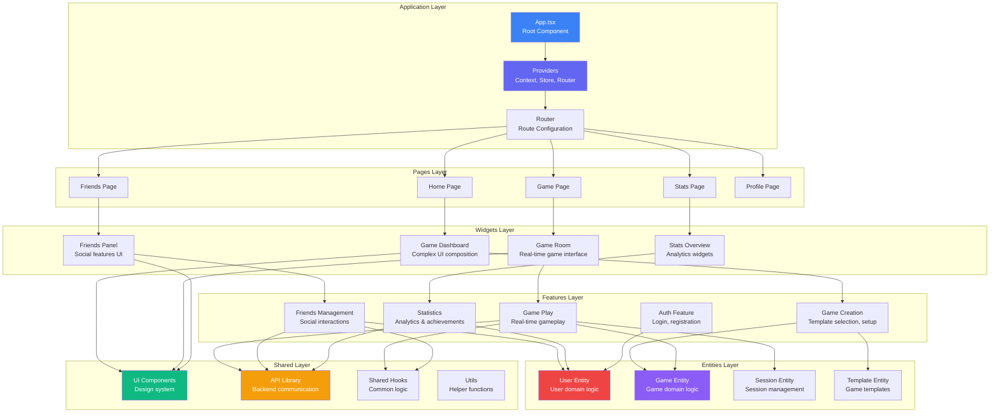

# Проектирование компонентной архитектуры React

🎨🎨🎨 **ENTERING CREATIVE PHASE: REACT COMPONENT ARCHITECTURE** 🎨🎨🎨

## Описание компонента

Комплексная архитектура React приложения для Telegram Mini App бильярдного приложения, включающая state management, component hierarchy, data flow patterns, real-time synchronization и complex game logic. Архитектура должна обеспечить scalable development, maintainable codebase, optimal performance для mobile devices и seamless integration с backend микросервисами через WebSocket и REST API.

## Требования и ограничения

### Функциональные требования:
- **Component Organization**: Scalable folder structure с clear separation of concerns
- **State Management**: Эффективное управление global/local state для игр и social features
- **Real-time Sync**: WebSocket integration для live game updates
- **Data Fetching**: Optimized API calls с caching и error handling
- **Routing**: Client-side navigation с deep linking support
- **Forms & Validation**: Robust form handling для game creation и settings
- **Performance**: Code splitting, lazy loading, мемоизация для mobile optimization

### Технические ограничения:
- **React 18+**: Concurrent features, Suspense, Transitions
- **TypeScript**: Strict typing для всех components и data structures
- **Bundle Size**: < 500KB initial bundle для fast loading
- **Memory Usage**: Efficient component lifecycle для long gaming sessions
- **Mobile Performance**: 60fps animations, smooth scrolling
- **Browser Support**: Modern mobile browsers (Chrome 90+, Safari 14+)
- **Development DX**: Hot reload, dev tools, debugging capabilities

### Архитектурные ограничения:
- **Telegram Mini App**: WebApp API constraints и lifecycle management
- **Microservices Integration**: Multiple backend services coordination
- **Offline Capability**: Graceful degradation при network issues
- **Security**: Client-side data protection и input validation
- **Scalability**: Support для feature growth и team expansion
- **Testing**: Component testability с jest и React Testing Library

### UX требования:
- **Responsive Design**: Seamless experience на всех screen sizes
- **Accessibility**: Screen readers, keyboard navigation, ARIA
- **Error Boundaries**: Graceful error handling без app crashes
- **Loading States**: Skeleton screens, progressive loading
- **Internationalization**: Multi-language support (RU/EN)

## Варианты архитектуры React

### Вариант 1: Feature-Based Modular Architecture

**Описание**: Организация кода по features с собственными components, hooks, services и types для каждой функциональности.

**Структура проекта**:
```
src/
├── app/                     # App-level configuration
│   ├── App.tsx
│   ├── store.ts
│   └── router.tsx
├── shared/                  # Shared utilities
│   ├── components/          # Reusable UI components
│   ├── hooks/              # Common custom hooks
│   ├── utils/              # Helper functions
│   ├── types/              # Global TypeScript types
│   └── constants/          # App constants
├── features/               # Feature modules
│   ├── auth/
│   │   ├── components/
│   │   ├── hooks/
│   │   ├── services/
│   │   ├── types/
│   │   └── index.ts
│   ├── game/
│   ├── friends/
│   ├── stats/
│   └── profile/
└── widgets/                # Page-level compositions
    ├── GameDashboard/
    ├── FriendsPanel/
    └── GameRoom/
```

**State Management Pattern**:
```typescript
// Feature-specific stores
const useGameStore = create<GameState>((set) => ({
  currentGame: null,
  gameHistory: [],
  updateScore: (playerId, score) => set(state => ({ ... }))
}));

// Global app state
const useAppStore = create<AppState>((set) => ({
  user: null,
  theme: 'light',
  notifications: []
}));
```

**Преимущества**:
- Clear feature boundaries и ownership
- Independent development и testing
- Easy feature addition/removal
- Reduced coupling между modules
- Better code organization для larger teams

**Недостатки**:
- Potential code duplication между features
- Complex shared state coordination
- Need for clear contracts между modules
- Initial setup complexity

### Вариант 2: Layer-Based Traditional Architecture

**Описание**: Классическая организация по типам файлов с четким разделением на presentation, business logic и data layers.

**Структура проекта**:
```
src/
├── components/             # All React components
│   ├── ui/                # Base UI components
│   ├── forms/             # Form components
│   ├── layout/            # Layout components
│   └── game/              # Game-specific components
├── hooks/                 # All custom hooks
├── services/              # API и business logic
├── store/                 # State management
│   ├── slices/
│   ├── middleware/
│   └── index.ts
├── utils/                 # Helper functions
├── types/                 # TypeScript definitions
├── constants/             # App constants
└── pages/                 # Route components
```

**State Management Pattern**:
```typescript
// Centralized Redux store
const store = configureStore({
  reducer: {
    auth: authSlice.reducer,
    game: gameSlice.reducer,
    friends: friendsSlice.reducer,
    ui: uiSlice.reducer
  }
});
```

**Преимущества**:
- Familiar structure для большинства developers
- Easy to find files по типу
- Centralized state management
- Simple dependency management
- Clear separation of concerns

**Недостатки**:
- Poor scalability для large applications
- Tight coupling между layers
- Difficult feature extraction
- Complex файловая навигация

### Вариант 3: Hybrid Domain-Driven Architecture

**Описание**: Комбинация feature-based и layer-based подходов с domain-driven design principles.

**Структура проекта**:
```
src/
├── app/                    # Application layer
│   ├── App.tsx
│   ├── providers/
│   ├── router/
│   └── store/
├── shared/                 # Shared kernel
│   ├── ui/                # Design system components
│   ├── lib/               # Third-party integrations
│   ├── api/               # API clients
│   ├── hooks/             # Reusable hooks
│   └── utils/
├── entities/               # Business entities
│   ├── user/
│   ├── game/
│   ├── session/
│   └── template/
├── features/               # Feature implementations
│   ├── auth/
│   ├── game-creation/
│   ├── game-play/
│   ├── friends-management/
│   └── statistics/
├── widgets/                # UI compositions
│   ├── game-dashboard/
│   ├── game-room/
│   └── friends-panel/
└── pages/                  # Route handlers
    ├── HomePage/
    ├── GamePage/
    └── ProfilePage/
```

**State Management Pattern**:
```typescript
// Entity-based stores
const useUserEntity = () => {
  // User domain logic
};

const useGameEntity = () => {
  // Game domain logic
};

// Feature-specific state
const useGameCreation = () => {
  // Game creation workflow state
};
```

**Преимущества**:
- Domain-driven organization
- Clear business logic separation
- Scalable architecture
- Reusable entities
- Good separation между UI и business logic

**Недостатки**:
- Learning curve для team
- More complex initial setup
- Need for domain expertise
- Potential over-engineering для simple features

## Анализ вариантов

### Критерии оценки:
1. **Scalability** - способность архитектуры расти с проектом
2. **Maintainability** - простота поддержки и изменений
3. **Developer Experience** - удобство разработки
4. **Performance** - влияние на производительность
5. **Team Collaboration** - возможность параллельной работы

### Оценка вариантов:

| Критерий | Feature-Based | Layer-Based | Hybrid DDD |
|----------|---------------|-------------|------------|
| **Scalability** | ⭐⭐⭐⭐ | ⭐⭐ | ⭐⭐⭐⭐⭐ |
| **Maintainability** | ⭐⭐⭐⭐ | ⭐⭐⭐ | ⭐⭐⭐⭐⭐ |
| **Developer Experience** | ⭐⭐⭐ | ⭐⭐⭐⭐⭐ | ⭐⭐⭐ |
| **Performance** | ⭐⭐⭐⭐ | ⭐⭐⭐ | ⭐⭐⭐⭐ |
| **Team Collaboration** | ⭐⭐⭐⭐⭐ | ⭐⭐ | ⭐⭐⭐⭐ |

## Рекомендуемое решение

### **Выбор: Hybrid Domain-Driven Architecture (Вариант 3)**

**Обоснование**:
1. **Complex Business Logic**: Игровая логика требует четкого domain separation
2. **Multiple Teams**: DDD approach facilitates parallel development
3. **Long-term Scalability**: Architecture должна поддерживать future growth
4. **Microservices Alignment**: Domain structure aligns с backend services
5. **Code Reusability**: Entities могут быть reused across features

### React Architecture Design:



## Implementation Guidelines

### 1. Project Structure

**Detailed Folder Organization**:
```
src/
├── app/
│   ├── App.tsx                 # Root application component
│   ├── providers/
│   │   ├── index.tsx           # Combined providers
│   │   ├── StoreProvider.tsx   # State management
│   │   ├── ThemeProvider.tsx   # UI theming
│   │   ├── ErrorBoundary.tsx   # Error handling
│   │   └── TelegramProvider.tsx # Telegram WebApp API
│   ├── router/
│   │   ├── index.tsx           # Router configuration
│   │   ├── routes.tsx          # Route definitions
│   │   ├── guards.tsx          # Route protection
│   │   └── lazy-pages.tsx      # Code splitting
│   └── store/
│       ├── index.ts            # Store configuration
│       ├── middleware.ts       # Custom middleware
│       └── types.ts            # Store types
├── shared/
│   ├── ui/                     # Design system
│   │   ├── components/
│   │   │   ├── Button/
│   │   │   ├── Input/
│   │   │   ├── Modal/
│   │   │   ├── Card/
│   │   │   └── index.ts
│   │   ├── layouts/
│   │   │   ├── AppLayout/
│   │   │   ├── GameLayout/
│   │   │   └── index.ts
│   │   └── constants/
│   │       ├── colors.ts
│   │       ├── typography.ts
│   │       └── spacing.ts
│   ├── lib/
│   │   ├── telegram/           # Telegram WebApp API
│   │   ├── websocket/          # WebSocket client
│   │   ├── api/                # REST API client
│   │   ├── storage/            # Local storage wrapper
│   │   └── validation/         # Schema validation
│   ├── hooks/
│   │   ├── useLocalStorage.ts
│   │   ├── useWebSocket.ts
│   │   ├── useDebounce.ts
│   │   ├── useIntersection.ts
│   │   └── index.ts
│   ├── utils/
│   │   ├── format.ts           # Data formatting
│   │   ├── validation.ts       # Input validation
│   │   ├── constants.ts        # App constants
│   │   └── helpers.ts          # Helper functions
│   └── types/
│       ├── api.ts              # API response types
│       ├── common.ts           # Common types
│       └── telegram.ts         # Telegram types
├── entities/                   # Business entities
│   ├── user/
│   │   ├── model/
│   │   │   ├── types.ts
│   │   │   ├── store.ts
│   │   │   └── selectors.ts
│   │   ├── api/
│   │   │   ├── userApi.ts
│   │   │   └── types.ts
│   │   └── index.ts
│   ├── game/
│   │   ├── model/
│   │   ├── api/
│   │   ├── lib/                # Game logic utilities
│   │   └── index.ts
│   ├── session/
│   │   ├── model/
│   │   ├── api/
│   │   └── index.ts
│   └── template/
│       ├── model/
│       ├── api/
│       └── index.ts
├── features/                   # Feature implementations
│   ├── auth/
│   │   ├── ui/                 # Feature UI components
│   │   │   ├── LoginForm/
│   │   │   ├── TelegramAuth/
│   │   │   └── index.ts
│   │   ├── model/              # Feature state
│   │   │   ├── store.ts
│   │   │   └── types.ts
│   │   ├── api/                # Feature API calls
│   │   │   └── authApi.ts
│   │   └── index.ts
│   ├── game-creation/
│   │   ├── ui/
│   │   │   ├── TemplateSelector/
│   │   │   ├── RulesEditor/
│   │   │   ├── PlayerInviter/
│   │   │   └── GameSetup/
│   │   ├── model/
│   │   ├── lib/                # Creation logic
│   │   └── index.ts
│   ├── game-play/
│   │   ├── ui/
│   │   │   ├── BilliardTable/
│   │   │   ├── ScoreBoard/
│   │   │   ├── PlayerQueue/
│   │   │   ├── GameControls/
│   │   │   └── ChatPanel/
│   │   ├── model/
│   │   ├── lib/                # Game mechanics
│   │   └── index.ts
│   ├── friends-management/
│   │   ├── ui/
│   │   │   ├── FriendsList/
│   │   │   ├── UserSearch/
│   │   │   ├── FriendRequests/
│   │   │   └── InviteModal/
│   │   ├── model/
│   │   └── index.ts
│   └── statistics/
│       ├── ui/
│       │   ├── StatsOverview/
│       │   ├── GameHistory/
│       │   ├── Achievements/
│       │   └── Leaderboard/
│       ├── model/
│       └── index.ts
├── widgets/                    # Page-level compositions
│   ├── game-dashboard/
│   │   ├── ui/
│   │   │   ├── GameDashboard.tsx
│   │   │   ├── QuickActions/
│   │   │   ├── RecentGames/
│   │   │   └── OnlineFriends/
│   │   ├── model/
│   │   └── index.ts
│   ├── game-room/
│   │   ├── ui/
│   │   │   ├── GameRoom.tsx
│   │   │   ├── GameHeader/
│   │   │   ├── GameFooter/
│   │   │   └── GameSidebar/
│   │   ├── model/
│   │   └── index.ts
│   └── friends-panel/
│       ├── ui/
│       ├── model/
│       └── index.ts
└── pages/                      # Route components
    ├── HomePage/
    │   ├── HomePage.tsx
    │   └── index.ts
    ├── GamePage/
    │   ├── GamePage.tsx
    │   ├── GamePageSkeleton.tsx
    │   └── index.ts
    ├── FriendsPage/
    ├── StatsPage/
    └── ProfilePage/
```

### 2. State Management Strategy

**Zustand-based Entity Stores**:
```typescript
// entities/user/model/store.ts
import { create } from 'zustand';
import { subscribeWithSelector } from 'zustand/middleware';
import { immer } from 'zustand/middleware/immer';

interface UserState {
  currentUser: User | null;
  isAuthenticated: boolean;
  preferences: UserPreferences;
  
  // Actions
  setUser: (user: User) => void;
  updatePreferences: (preferences: Partial<UserPreferences>) => void;
  logout: () => void;
}

export const useUserStore = create<UserState>()(
  subscribeWithSelector(
    immer((set, get) => ({
      currentUser: null,
      isAuthenticated: false,
      preferences: DEFAULT_PREFERENCES,
      
      setUser: (user) => set((state) => {
        state.currentUser = user;
        state.isAuthenticated = true;
      }),
      
      updatePreferences: (newPreferences) => set((state) => {
        state.preferences = { ...state.preferences, ...newPreferences };
      }),
      
      logout: () => set((state) => {
        state.currentUser = null;
        state.isAuthenticated = false;
        state.preferences = DEFAULT_PREFERENCES;
      })
    }))
  )
);

// Selectors
export const useCurrentUser = () => useUserStore(state => state.currentUser);
export const useIsAuthenticated = () => useUserStore(state => state.isAuthenticated);
export const useUserPreferences = () => useUserStore(state => state.preferences);
```

**Game Entity Store**:
```typescript
// entities/game/model/store.ts
interface GameState {
  currentGame: GameSession | null;
  gameHistory: GameResult[];
  availableGames: GameSession[];
  
  // Real-time game state
  gameEvents: GameEvent[];
  currentPlayer: Player | null;
  scores: Record<string, number>;
  
  // Actions
  setCurrentGame: (game: GameSession) => void;
  updateGameState: (update: Partial<GameSession>) => void;
  addGameEvent: (event: GameEvent) => void;
  updateScores: (scores: Record<string, number>) => void;
  setCurrentPlayer: (player: Player) => void;
}

export const useGameStore = create<GameState>()(
  subscribeWithSelector(
    immer((set, get) => ({
      currentGame: null,
      gameHistory: [],
      availableGames: [],
      gameEvents: [],
      currentPlayer: null,
      scores: {},
      
      setCurrentGame: (game) => set((state) => {
        state.currentGame = game;
        state.gameEvents = [];
        state.scores = {};
      }),
      
      updateGameState: (update) => set((state) => {
        if (state.currentGame) {
          Object.assign(state.currentGame, update);
        }
      }),
      
      addGameEvent: (event) => set((state) => {
        state.gameEvents.push(event);
        
        // Update scores based on event
        if (event.type === 'ball_potted') {
          const playerId = event.playerId;
          state.scores[playerId] = (state.scores[playerId] || 0) + event.points;
        }
      }),
      
      updateScores: (newScores) => set((state) => {
        state.scores = { ...state.scores, ...newScores };
      }),
      
      setCurrentPlayer: (player) => set((state) => {
        state.currentPlayer = player;
      })
    }))
  )
);

// Game-specific selectors
export const useCurrentGame = () => useGameStore(state => state.currentGame);
export const useGameScores = () => useGameStore(state => state.scores);
export const useCurrentPlayer = () => useGameStore(state => state.currentPlayer);
export const useGameEvents = () => useGameStore(state => state.gameEvents);
```

**Feature Store Pattern**:
```typescript
// features/game-creation/model/store.ts
interface GameCreationState {
  step: number;
  selectedTemplate: GameTemplate | null;
  gameConfig: Partial<GameConfiguration>;
  invitedPlayers: User[];
  
  // Actions
  nextStep: () => void;
  prevStep: () => void;
  setTemplate: (template: GameTemplate) => void;
  updateConfig: (config: Partial<GameConfiguration>) => void;
  addPlayer: (player: User) => void;
  removePlayer: (playerId: string) => void;
  reset: () => void;
}

export const useGameCreationStore = create<GameCreationState>()(
  immer((set, get) => ({
    step: 1,
    selectedTemplate: null,
    gameConfig: {},
    invitedPlayers: [],
    
    nextStep: () => set((state) => {
      if (state.step < 4) state.step += 1;
    }),
    
    prevStep: () => set((state) => {
      if (state.step > 1) state.step -= 1;
    }),
    
    setTemplate: (template) => set((state) => {
      state.selectedTemplate = template;
      state.gameConfig = { ...template.defaultConfig };
    }),
    
    updateConfig: (config) => set((state) => {
      state.gameConfig = { ...state.gameConfig, ...config };
    }),
    
    addPlayer: (player) => set((state) => {
      if (!state.invitedPlayers.find(p => p.id === player.id)) {
        state.invitedPlayers.push(player);
      }
    }),
    
    removePlayer: (playerId) => set((state) => {
      state.invitedPlayers = state.invitedPlayers.filter(p => p.id !== playerId);
    }),
    
    reset: () => set(() => ({
      step: 1,
      selectedTemplate: null,
      gameConfig: {},
      invitedPlayers: []
    }))
  }))
);
```

### 3. Component Patterns

**Component Composition Pattern**:
```tsx
// shared/ui/components/Button/Button.tsx
interface ButtonProps {
  variant?: 'primary' | 'secondary' | 'ghost';
  size?: 'sm' | 'md' | 'lg';
  loading?: boolean;
  disabled?: boolean;
  leftIcon?: React.ReactNode;
  rightIcon?: React.ReactNode;
  children: React.ReactNode;
  onClick?: () => void;
}

export const Button: React.FC<ButtonProps> = ({
  variant = 'primary',
  size = 'md',
  loading = false,
  disabled = false,
  leftIcon,
  rightIcon,
  children,
  onClick,
  ...props
}) => {
  const baseClasses = 'inline-flex items-center justify-center font-medium rounded-lg transition-all focus:outline-none focus:ring-2 focus:ring-offset-2';
  
  const variants = {
    primary: 'bg-primary-blue text-white hover:bg-blue-700 focus:ring-blue-500 disabled:bg-blue-300',
    secondary: 'bg-gray-200 text-gray-900 hover:bg-gray-300 focus:ring-gray-500 disabled:bg-gray-100',
    ghost: 'text-primary-blue hover:bg-blue-50 focus:ring-blue-500 disabled:text-blue-300'
  };
  
  const sizes = {
    sm: 'px-3 py-1.5 text-sm',
    md: 'px-4 py-2 text-base',
    lg: 'px-6 py-3 text-lg'
  };
  
  const className = cn(
    baseClasses,
    variants[variant],
    sizes[size],
    (disabled || loading) && 'opacity-50 cursor-not-allowed'
  );
  
  return (
    <button
      className={className}
      disabled={disabled || loading}
      onClick={onClick}
      {...props}
    >
      {loading && <LoadingSpinner className="mr-2" size="sm" />}
      {leftIcon && !loading && <span className="mr-2">{leftIcon}</span>}
      {children}
      {rightIcon && <span className="ml-2">{rightIcon}</span>}
    </button>
  );
};

// Usage with composition
const GameActions = () => {
  return (
    <div className="flex space-x-3">
      <Button
        variant="primary"
        leftIcon={<PlayIcon />}
        onClick={startGame}
        loading={isStarting}
      >
        Начать игру
      </Button>
      <Button
        variant="secondary"
        leftIcon={<SettingsIcon />}
        onClick={openSettings}
      >
        Настройки
      </Button>
    </div>
  );
};
```

**Custom Hook Pattern**:
```tsx
// shared/hooks/useWebSocket.ts
interface UseWebSocketOptions {
  onConnect?: () => void;
  onDisconnect?: () => void;
  onMessage?: (data: any) => void;
  onError?: (error: Event) => void;
  reconnectAttempts?: number;
  reconnectInterval?: number;
}

export const useWebSocket = (url: string, options: UseWebSocketOptions = {}) => {
  const [isConnected, setIsConnected] = useState(false);
  const [connectionState, setConnectionState] = useState<'connecting' | 'connected' | 'disconnected'>('disconnected');
  const socketRef = useRef<WebSocket | null>(null);
  const reconnectTimeoutRef = useRef<NodeJS.Timeout | null>(null);
  const reconnectAttempts = useRef(0);
  
  const {
    onConnect,
    onDisconnect,
    onMessage,
    onError,
    reconnectAttempts: maxReconnectAttempts = 3,
    reconnectInterval = 3000
  } = options;
  
  const connect = useCallback(() => {
    if (socketRef.current?.readyState === WebSocket.CONNECTING) return;
    
    setConnectionState('connecting');
    
    try {
      const socket = new WebSocket(url);
      
      socket.onopen = () => {
        setIsConnected(true);
        setConnectionState('connected');
        reconnectAttempts.current = 0;
        onConnect?.();
      };
      
      socket.onclose = () => {
        setIsConnected(false);
        setConnectionState('disconnected');
        onDisconnect?.();
        
        // Auto-reconnect logic
        if (reconnectAttempts.current < maxReconnectAttempts) {
          reconnectTimeoutRef.current = setTimeout(() => {
            reconnectAttempts.current += 1;
            connect();
          }, reconnectInterval);
        }
      };
      
      socket.onmessage = (event) => {
        try {
          const data = JSON.parse(event.data);
          onMessage?.(data);
        } catch (error) {
          console.error('WebSocket message parse error:', error);
        }
      };
      
      socket.onerror = (error) => {
        console.error('WebSocket error:', error);
        onError?.(error);
      };
      
      socketRef.current = socket;
    } catch (error) {
      console.error('WebSocket connection error:', error);
      setConnectionState('disconnected');
    }
  }, [url, onConnect, onDisconnect, onMessage, onError, maxReconnectAttempts, reconnectInterval]);
  
  const disconnect = useCallback(() => {
    if (reconnectTimeoutRef.current) {
      clearTimeout(reconnectTimeoutRef.current);
      reconnectTimeoutRef.current = null;
    }
    
    if (socketRef.current) {
      socketRef.current.close();
      socketRef.current = null;
    }
    
    setIsConnected(false);
    setConnectionState('disconnected');
  }, []);
  
  const sendMessage = useCallback((data: any) => {
    if (socketRef.current?.readyState === WebSocket.OPEN) {
      socketRef.current.send(JSON.stringify(data));
      return true;
    }
    return false;
  }, []);
  
  useEffect(() => {
    connect();
    
    return () => {
      disconnect();
    };
  }, [connect, disconnect]);
  
  return {
    isConnected,
    connectionState,
    sendMessage,
    connect,
    disconnect
  };
};

// Usage in game component
const GameRoom = ({ sessionId }: { sessionId: string }) => {
  const updateGameState = useGameStore(state => state.updateGameState);
  const addGameEvent = useGameStore(state => state.addGameEvent);
  
  const { isConnected, sendMessage } = useWebSocket(
    `wss://api.artelbilliards.com/ws/games/${sessionId}`,
    {
      onMessage: (data) => {
        switch (data.type) {
          case 'game_state_update':
            updateGameState(data.payload);
            break;
          case 'game_event':
            addGameEvent(data.payload);
            break;
        }
      },
      onConnect: () => {
        console.log('Connected to game session');
      },
      onDisconnect: () => {
        console.log('Disconnected from game session');
      }
    }
  );
  
  const handleBallClick = (ballId: string) => {
    sendMessage({
      type: 'ball_potted',
      payload: { ballId, playerId: 'current-player-id' }
    });
  };
  
  return (
    <div className="game-room">
      <ConnectionStatus isConnected={isConnected} />
      <BilliardTable onBallClick={handleBallClick} />
    </div>
  );
};
```

### 4. Data Fetching Strategy

**React Query Integration**:
```tsx
// shared/lib/api/queryClient.ts
import { QueryClient } from '@tanstack/react-query';

export const queryClient = new QueryClient({
  defaultOptions: {
    queries: {
      staleTime: 5 * 60 * 1000, // 5 minutes
      cacheTime: 10 * 60 * 1000, // 10 minutes
      retry: (failureCount, error: any) => {
        if (error?.status === 404) return false;
        return failureCount < 3;
      },
      refetchOnWindowFocus: false
    },
    mutations: {
      retry: false
    }
  }
});

// Entity-specific query hooks
// entities/game/api/queries.ts
export const gameQueries = {
  all: () => ['games'] as const,
  lists: () => [...gameQueries.all(), 'list'] as const,
  list: (filters: GameFilters) => [...gameQueries.lists(), filters] as const,
  details: () => [...gameQueries.all(), 'detail'] as const,
  detail: (id: string) => [...gameQueries.details(), id] as const,
  templates: () => [...gameQueries.all(), 'templates'] as const
};

export const useGamesQuery = (filters: GameFilters) => {
  return useQuery({
    queryKey: gameQueries.list(filters),
    queryFn: () => gameApi.getGames(filters),
    keepPreviousData: true
  });
};

export const useGameQuery = (gameId: string) => {
  return useQuery({
    queryKey: gameQueries.detail(gameId),
    queryFn: () => gameApi.getGame(gameId),
    enabled: !!gameId
  });
};

export const useGameTemplatesQuery = () => {
  return useQuery({
    queryKey: gameQueries.templates(),
    queryFn: () => gameApi.getTemplates(),
    staleTime: 15 * 60 * 1000 // Templates don't change often
  });
};

// Mutation hooks
export const useCreateGameMutation = () => {
  const queryClient = useQueryClient();
  
  return useMutation({
    mutationFn: gameApi.createGame,
    onSuccess: (newGame) => {
      // Invalidate and refetch games list
      queryClient.invalidateQueries({ queryKey: gameQueries.lists() });
      
      // Add the new game to the cache
      queryClient.setQueryData(gameQueries.detail(newGame.id), newGame);
      
      // Show success notification
      toast.success('Игра создана успешно!');
    },
    onError: (error: ApiError) => {
      toast.error(error.message || 'Ошибка создания игры');
    }
  });
};

export const useJoinGameMutation = () => {
  const queryClient = useQueryClient();
  
  return useMutation({
    mutationFn: ({ gameId, userId }: { gameId: string; userId: string }) =>
      gameApi.joinGame(gameId, userId),
    onSuccess: (updatedGame, { gameId }) => {
      // Update the game cache
      queryClient.setQueryData(gameQueries.detail(gameId), updatedGame);
      
      // Invalidate games list to reflect changes
      queryClient.invalidateQueries({ queryKey: gameQueries.lists() });
    }
  });
};
```

**Optimistic Updates Pattern**:
```tsx
// features/friends-management/model/mutations.ts
export const useSendFriendRequestMutation = () => {
  const queryClient = useQueryClient();
  
  return useMutation({
    mutationFn: friendsApi.sendFriendRequest,
    onMutate: async (newRequest) => {
      // Cancel any outgoing refetches
      await queryClient.cancelQueries({ queryKey: ['friends', 'requests'] });
      
      // Snapshot the previous value
      const previousRequests = queryClient.getQueryData(['friends', 'requests']);
      
      // Optimistically update
      queryClient.setQueryData(['friends', 'requests'], (old: FriendRequest[]) => [
        ...old,
        {
          id: 'temp-' + Date.now(),
          ...newRequest,
          status: 'pending',
          createdAt: new Date().toISOString()
        }
      ]);
      
      return { previousRequests };
    },
    onError: (err, newRequest, context) => {
      // Rollback on error
      queryClient.setQueryData(['friends', 'requests'], context?.previousRequests);
      toast.error('Не удалось отправить заявку в друзья');
    },
    onSettled: () => {
      // Always refetch after error or success
      queryClient.invalidateQueries({ queryKey: ['friends', 'requests'] });
    }
  });
};
```

### 5. Error Handling Architecture

**Error Boundary Strategy**:
```tsx
// shared/ui/components/ErrorBoundary/ErrorBoundary.tsx
interface ErrorBoundaryState {
  hasError: boolean;
  error: Error | null;
  errorInfo: ErrorInfo | null;
}

interface ErrorBoundaryProps {
  fallback?: React.ComponentType<{ error: Error; retry: () => void }>;
  onError?: (error: Error, errorInfo: ErrorInfo) => void;
  children: React.ReactNode;
}

export class ErrorBoundary extends React.Component<ErrorBoundaryProps, ErrorBoundaryState> {
  constructor(props: ErrorBoundaryProps) {
    super(props);
    this.state = { hasError: false, error: null, errorInfo: null };
  }
  
  static getDerivedStateFromError(error: Error): Partial<ErrorBoundaryState> {
    return { hasError: true, error };
  }
  
  componentDidCatch(error: Error, errorInfo: ErrorInfo) {
    this.setState({ errorInfo });
    
    // Log to monitoring service
    this.props.onError?.(error, errorInfo);
    
    // Send to error reporting service
    if (process.env.NODE_ENV === 'production') {
      reportError(error, {
        componentStack: errorInfo.componentStack,
        props: this.props
      });
    }
  }
  
  retry = () => {
    this.setState({ hasError: false, error: null, errorInfo: null });
  };
  
  render() {
    if (this.state.hasError) {
      const FallbackComponent = this.props.fallback || DefaultErrorFallback;
      return <FallbackComponent error={this.state.error!} retry={this.retry} />;
    }
    
    return this.props.children;
  }
}

// Feature-specific error fallbacks
const GameErrorFallback: React.FC<{ error: Error; retry: () => void }> = ({ error, retry }) => {
  return (
    <div className="flex flex-col items-center justify-center h-full p-6 text-center">
      <div className="w-16 h-16 bg-red-100 rounded-full flex items-center justify-center mb-4">
        <ExclamationTriangleIcon className="w-8 h-8 text-red-600" />
      </div>
      <h2 className="text-lg font-semibold mb-2">Ошибка в игре</h2>
      <p className="text-gray-600 mb-4">
        Произошла ошибка во время игры. Попробуйте перезагрузить игру.
      </p>
      <div className="space-x-3">
        <Button onClick={retry}>Попробовать снова</Button>
        <Button variant="secondary" onClick={() => window.location.href = '/'}>
          На главную
        </Button>
      </div>
    </div>
  );
};

// Usage in app structure
const App = () => {
  return (
    <ErrorBoundary onError={logError}>
      <TelegramProvider>
        <QueryClientProvider client={queryClient}>
          <Router>
            <Routes>
              <Route path="/game/:id" element={
                <ErrorBoundary fallback={GameErrorFallback}>
                  <GamePage />
                </ErrorBoundary>
              } />
            </Routes>
          </Router>
        </QueryClientProvider>
      </TelegramProvider>
    </ErrorBoundary>
  );
};
```

**Error Handling Hooks**:
```tsx
// shared/hooks/useErrorHandler.ts
interface ErrorHandlerOptions {
  onError?: (error: Error) => void;
  showToast?: boolean;
  logError?: boolean;
}

export const useErrorHandler = (options: ErrorHandlerOptions = {}) => {
  const { onError, showToast = true, logError = true } = options;
  
  const handleError = useCallback((error: Error | string, context?: Record<string, any>) => {
    const errorObj = typeof error === 'string' ? new Error(error) : error;
    
    if (logError) {
      console.error('Application Error:', errorObj, context);
      
      if (process.env.NODE_ENV === 'production') {
        reportError(errorObj, context);
      }
    }
    
    if (showToast) {
      toast.error(errorObj.message || 'Произошла ошибка');
    }
    
    onError?.(errorObj);
  }, [onError, showToast, logError]);
  
  return { handleError };
};

// API Error handling
export const useApiErrorHandler = () => {
  const { handleError } = useErrorHandler();
  
  const handleApiError = useCallback((error: ApiError) => {
    const message = getErrorMessage(error);
    
    switch (error.status) {
      case 401:
        // Redirect to login
        window.location.href = '/auth';
        break;
      case 403:
        toast.error('У вас нет прав для этого действия');
        break;
      case 404:
        toast.error('Ресурс не найден');
        break;
      case 429:
        toast.error('Слишком много запросов. Попробуйте позже');
        break;
      case 500:
        handleError(new Error('Ошибка сервера. Попробуйте позже'));
        break;
      default:
        handleError(new Error(message));
    }
  }, [handleError]);
  
  return { handleApiError };
};
```

### 6. Performance Optimization

**React Performance Patterns**:
```tsx
// Performance optimization hooks
export const useOptimizedCallback = <T extends (...args: any[]) => any>(
  callback: T,
  deps: React.DependencyList
): T => {
  return useCallback(callback, deps);
};

export const useStableValue = <T>(value: T): T => {
  const ref = useRef<T>(value);
  
  if (!Object.is(ref.current, value)) {
    ref.current = value;
  }
  
  return ref.current;
};

// Memoized components
const GameCard = React.memo<GameCardProps>(({ game, onJoin, onView }) => {
  const handleJoin = useOptimizedCallback(() => onJoin(game.id), [game.id, onJoin]);
  const handleView = useOptimizedCallback(() => onView(game.id), [game.id, onView]);
  
  return (
    <Card className="hover-lift">
      <div className="flex items-center justify-between">
        <div>
          <h3 className="font-semibold">{game.name}</h3>
          <p className="text-sm text-gray-600">
            {game.participants.length}/{game.maxParticipants} игроков
          </p>
        </div>
        <div className="space-x-2">
          <Button size="sm" variant="ghost" onClick={handleView}>
            Просмотр
          </Button>
          <Button size="sm" onClick={handleJoin}>
            Присоединиться
          </Button>
        </div>
      </div>
    </Card>
  );
});

// Virtual scrolling for large lists
import { FixedSizeList as List } from 'react-window';

const VirtualGamesList: React.FC<{ games: Game[] }> = ({ games }) => {
  const Row = useCallback(({ index, style }: { index: number; style: React.CSSProperties }) => (
    <div style={style}>
      <GameCard game={games[index]} />
    </div>
  ), [games]);
  
  return (
    <List
      height={600}
      itemCount={games.length}
      itemSize={120}
      itemData={games}
    >
      {Row}
    </List>
  );
};

// Code splitting with React.lazy
const GameRoom = React.lazy(() => 
  import('./GameRoom').then(module => ({ default: module.GameRoom }))
);

const LazyGameRoom: React.FC<GameRoomProps> = (props) => (
  <Suspense fallback={<GameRoomSkeleton />}>
    <GameRoom {...props} />
  </Suspense>
);

// Image optimization
const OptimizedImage: React.FC<{
  src: string;
  alt: string;
  width?: number;
  height?: number;
  loading?: 'lazy' | 'eager';
}> = ({ src, alt, width, height, loading = 'lazy', ...props }) => {
  const [imageLoaded, setImageLoaded] = useState(false);
  const [imageError, setImageError] = useState(false);
  
  return (
    <div className="relative overflow-hidden">
      {!imageLoaded && !imageError && (
        <div 
          className="absolute inset-0 bg-gray-200 animate-pulse"
          style={{ width, height }}
        />
      )}
      
       setImageLoaded(true)}
        onError={() => setImageError(true)}
        className={cn(
          'transition-opacity duration-300',
          imageLoaded ? 'opacity-100' : 'opacity-0'
        )}
        {...props}
      />
      
      {imageError && (
        <div className="absolute inset-0 flex items-center justify-center bg-gray-100">
          <PhotoIcon className="w-8 h-8 text-gray-400" />
        </div>
      )}
    </div>
  );
};
```

### 7. Routing Architecture

**React Router Configuration**:
```tsx
// app/router/routes.tsx
import { createBrowserRouter } from 'react-router-dom';
import { lazy } from 'react';

// Lazy-loaded pages
const HomePage = lazy(() => import('../../pages/HomePage'));
const GamePage = lazy(() => import('../../pages/GamePage'));
const FriendsPage = lazy(() => import('../../pages/FriendsPage'));
const StatsPage = lazy(() => import('../../pages/StatsPage'));
const ProfilePage = lazy(() => import('../../pages/ProfilePage'));

// Route guards
const ProtectedRoute: React.FC<{ children: React.ReactNode }> = ({ children }) => {
  const isAuthenticated = useIsAuthenticated();
  
  if (!isAuthenticated) {
    return <Navigate to="/auth" replace />;
  }
  
  return <>{children}</>;
};

const GameRoute: React.FC<{ children: React.ReactNode }> = ({ children }) => {
  const { gameId } = useParams<{ gameId: string }>();
  const { data: game, isLoading, error } = useGameQuery(gameId!);
  
  if (isLoading) return <GamePageSkeleton />;
  if (error) return <Navigate to="/" replace />;
  if (!game) return <NotFoundPage />;
  
  return <>{children}</>;
};

export const router = createBrowserRouter([
  {
    path: '/',
    element: <AppLayout />,
    errorElement: <ErrorPage />,
    children: [
      {
        index: true,
        element: (
          <ProtectedRoute>
            <Suspense fallback={<HomePageSkeleton />}>
              <HomePage />
            </Suspense>
          </ProtectedRoute>
        )
      },
      {
        path: 'game/:gameId',
        element: (
          <ProtectedRoute>
            <GameRoute>
              <Suspense fallback={<GamePageSkeleton />}>
                <GamePage />
              </Suspense>
            </GameRoute>
          </ProtectedRoute>
        )
      },
      {
        path: 'friends',
        element: (
          <ProtectedRoute>
            <Suspense fallback={<FriendsPageSkeleton />}>
              <FriendsPage />
            </Suspense>
          </ProtectedRoute>
        )
      },
      {
        path: 'stats',
        element: (
          <ProtectedRoute>
            <Suspense fallback={<StatsPageSkeleton />}>
              <StatsPage />
            </Suspense>
          </ProtectedRoute>
        )
      },
      {
        path: 'profile',
        element: (
          <ProtectedRoute>
            <Suspense fallback={<ProfilePageSkeleton />}>
              <ProfilePage />
            </Suspense>
          </ProtectedRoute>
        )
      }
    ]
  },
  {
    path: '/auth',
    element: <AuthPage />
  },
  {
    path: '*',
    element: <NotFoundPage />
  }
]);

// Navigation hooks
export const useAppNavigation = () => {
  const navigate = useNavigate();
  
  const goToGame = useCallback((gameId: string) => {
    navigate(`/game/${gameId}`);
  }, [navigate]);
  
  const goToFriends = useCallback(() => {
    navigate('/friends');
  }, [navigate]);
  
  const goToStats = useCallback(() => {
    navigate('/stats');
  }, [navigate]);
  
  const goToProfile = useCallback(() => {
    navigate('/profile');
  }, [navigate]);
  
  const goBack = useCallback(() => {
    navigate(-1);
  }, [navigate]);
  
  return {
    goToGame,
    goToFriends,
    goToStats,
    goToProfile,
    goBack
  };
};
```

### 8. Real-time Integration

**WebSocket Management**:
```tsx
// shared/lib/websocket/manager.ts
class WebSocketManager {
  private connections = new Map<string, WebSocket>();
  private listeners = new Map<string, Set<(data: any) => void>>();
  private reconnectTimeouts = new Map<string, NodeJS.Timeout>();
  
  connect(endpoint: string, options: WebSocketOptions = {}) {
    const url = `${WS_BASE_URL}${endpoint}`;
    
    if (this.connections.has(endpoint)) {
      return this.connections.get(endpoint)!;
    }
    
    const ws = new WebSocket(url);
    
    ws.onopen = () => {
      console.log(`Connected to ${endpoint}`);
      options.onConnect?.();
    };
    
    ws.onmessage = (event) => {
      try {
        const data = JSON.parse(event.data);
        this.notifyListeners(endpoint, data);
      } catch (error) {
        console.error('WebSocket message parse error:', error);
      }
    };
    
    ws.onclose = () => {
      console.log(`Disconnected from ${endpoint}`);
      this.connections.delete(endpoint);
      options.onDisconnect?.();
      
      // Auto-reconnect
      if (options.autoReconnect !== false) {
        const timeout = setTimeout(() => {
          this.connect(endpoint, options);
        }, options.reconnectInterval || 3000);
        
        this.reconnectTimeouts.set(endpoint, timeout);
      }
    };
    
    ws.onerror = (error) => {
      console.error(`WebSocket error on ${endpoint}:`, error);
      options.onError?.(error);
    };
    
    this.connections.set(endpoint, ws);
    return ws;
  }
  
  disconnect(endpoint: string) {
    const ws = this.connections.get(endpoint);
    if (ws) {
      ws.close();
      this.connections.delete(endpoint);
    }
    
    const timeout = this.reconnectTimeouts.get(endpoint);
    if (timeout) {
      clearTimeout(timeout);
      this.reconnectTimeouts.delete(endpoint);
    }
    
    this.listeners.delete(endpoint);
  }
  
  send(endpoint: string, data: any) {
    const ws = this.connections.get(endpoint);
    if (ws && ws.readyState === WebSocket.OPEN) {
      ws.send(JSON.stringify(data));
      return true;
    }
    return false;
  }
  
  subscribe(endpoint: string, listener: (data: any) => void) {
    if (!this.listeners.has(endpoint)) {
      this.listeners.set(endpoint, new Set());
    }
    
    this.listeners.get(endpoint)!.add(listener);
    
    return () => {
      this.listeners.get(endpoint)?.delete(listener);
    };
  }
  
  private notifyListeners(endpoint: string, data: any) {
    const listeners = this.listeners.get(endpoint);
    if (listeners) {
      listeners.forEach(listener => listener(data));
    }
  }
}

export const wsManager = new WebSocketManager();

// React hook for WebSocket
export const useWebSocketSubscription = (
  endpoint: string,
  handler: (data: any) => void,
  options: WebSocketOptions = {}
) => {
  const [isConnected, setIsConnected] = useState(false);
  
  useEffect(() => {
    const ws = wsManager.connect(endpoint, {
      ...options,
      onConnect: () => {
        setIsConnected(true);
        options.onConnect?.();
      },
      onDisconnect: () => {
        setIsConnected(false);
        options.onDisconnect?.();
      }
    });
    
    const unsubscribe = wsManager.subscribe(endpoint, handler);
    
    return () => {
      unsubscribe();
      if (!options.persistent) {
        wsManager.disconnect(endpoint);
      }
    };
  }, [endpoint, handler, options]);
  
  const sendMessage = useCallback((data: any) => {
    return wsManager.send(endpoint, data);
  }, [endpoint]);
  
  return { isConnected, sendMessage };
};
```

### 9. TypeScript Integration

**Type-Safe API Client**:
```typescript
// shared/types/api.ts
export interface ApiResponse<T> {
  data: T;
  message?: string;
  status: 'success' | 'error';
}

export interface PaginatedResponse<T> {
  data: T[];
  pagination: {
    page: number;
    limit: number;
    total: number;
    totalPages: number;
  };
}

export interface ApiError {
  message: string;
  status: number;
  code?: string;
  details?: Record<string, any>;
}

// Type-safe API client
class ApiClient {
  private baseURL: string;
  private defaultHeaders: Record<string, string>;
  
  constructor(baseURL: string) {
    this.baseURL = baseURL;
    this.defaultHeaders = {
      'Content-Type': 'application/json'
    };
  }
  
  private async request<T>(
    endpoint: string,
    options: RequestInit = {}
  ): Promise<T> {
    const url = `${this.baseURL}${endpoint}`;
    const token = getAuthToken();
    
    const config: RequestInit = {
      ...options,
      headers: {
        ...this.defaultHeaders,
        ...(token && { Authorization: `Bearer ${token}` }),
        ...options.headers
      }
    };
    
    try {
      const response = await fetch(url, config);
      
      if (!response.ok) {
        const errorData = await response.json().catch(() => ({}));
        throw new ApiError({
          message: errorData.message || response.statusText,
          status: response.status,
          code: errorData.code,
          details: errorData.details
        });
      }
      
      return await response.json();
    } catch (error) {
      if (error instanceof ApiError) {
        throw error;
      }
      
      throw new ApiError({
        message: 'Network error',
        status: 0
      });
    }
  }
  
  async get<T>(endpoint: string): Promise<T> {
    return this.request<T>(endpoint, { method: 'GET' });
  }
  
  async post<T>(endpoint: string, data?: any): Promise<T> {
    return this.request<T>(endpoint, {
      method: 'POST',
      body: data ? JSON.stringify(data) : undefined
    });
  }
  
  async put<T>(endpoint: string, data?: any): Promise<T> {
    return this.request<T>(endpoint, {
      method: 'PUT',
      body: data ? JSON.stringify(data) : undefined
    });
  }
  
  async delete<T>(endpoint: string): Promise<T> {
    return this.request<T>(endpoint, { method: 'DELETE' });
  }
}

// Type-safe entity APIs
export class GameApi {
  constructor(private client: ApiClient) {}
  
  async getGames(filters: GameFilters): Promise<PaginatedResponse<Game>> {
    const params = new URLSearchParams(filters as any).toString();
    return this.client.get(`/games?${params}`);
  }
  
  async getGame(gameId: string): Promise<Game> {
    return this.client.get(`/games/${gameId}`);
  }
  
  async createGame(gameData: CreateGameRequest): Promise<Game> {
    return this.client.post('/games', gameData);
  }
  
  async joinGame(gameId: string, userId: string): Promise<Game> {
    return this.client.post(`/games/${gameId}/join`, { userId });
  }
  
  async getTemplates(): Promise<GameTemplate[]> {
    return this.client.get('/games/templates');
  }
}
```

### 10. Testing Strategy

**Component Testing**:
```tsx
// __tests__/components/Button.test.tsx
import { render, screen, fireEvent } from '@testing-library/react';
import { Button } from '../Button';

describe('Button Component', () => {
  it('renders children correctly', () => {
    render(<Button>Click me</Button>);
    expect(screen.getByRole('button', { name: /click me/i })).toBeInTheDocument();
  });
  
  it('handles click events', () => {
    const handleClick = jest.fn();
    render(<Button onClick={handleClick}>Click me</Button>);
    
    fireEvent.click(screen.getByRole('button'));
    expect(handleClick).toHaveBeenCalledTimes(1);
  });
  
  it('shows loading state', () => {
    render(<Button loading>Loading button</Button>);
    expect(screen.getByRole('button')).toBeDisabled();
    expect(screen.getByTestId('loading-spinner')).toBeInTheDocument();
  });
  
  it('applies correct variant styles', () => {
    const { rerender } = render(<Button variant="primary">Primary</Button>);
    expect(screen.getByRole('button')).toHaveClass('bg-primary-blue');
    
    rerender(<Button variant="secondary">Secondary</Button>);
    expect(screen.getByRole('button')).toHaveClass('bg-gray-200');
  });
});

// Hook testing
// __tests__/hooks/useWebSocket.test.ts
import { renderHook, act } from '@testing-library/react';
import { useWebSocket } from '../useWebSocket';

// Mock WebSocket
global.WebSocket = jest.fn(() => ({
  close: jest.fn(),
  send: jest.fn(),
  addEventListener: jest.fn(),
  removeEventListener: jest.fn(),
  readyState: WebSocket.OPEN
})) as any;

describe('useWebSocket', () => {
  it('connects to WebSocket on mount', () => {
    const { result } = renderHook(() => 
      useWebSocket('ws://localhost:8080/test')
    );
    
    expect(WebSocket).toHaveBeenCalledWith('ws://localhost:8080/test');
  });
  
  it('sends messages when connected', () => {
    const mockSend = jest.fn();
    (WebSocket as jest.Mock).mockImplementation(() => ({
      send: mockSend,
      readyState: WebSocket.OPEN
    }));
    
    const { result } = renderHook(() => 
      useWebSocket('ws://localhost:8080/test')
    );
    
    act(() => {
      result.current.sendMessage({ type: 'test', data: 'hello' });
    });
    
    expect(mockSend).toHaveBeenCalledWith(
      JSON.stringify({ type: 'test', data: 'hello' })
    );
  });
});

// Integration testing
// __tests__/features/GameCreation.test.tsx
import { render, screen, fireEvent, waitFor } from '@testing-library/react';
import { QueryClient, QueryClientProvider } from '@tanstack/react-query';
import { GameCreation } from '../GameCreation';

const createTestQueryClient = () => new QueryClient({
  defaultOptions: {
    queries: { retry: false },
    mutations: { retry: false }
  }
});

const renderWithProviders = (component: React.ReactElement) => {
  const queryClient = createTestQueryClient();
  return render(
    <QueryClientProvider client={queryClient}>
      {component}
    </QueryClientProvider>
  );
};

describe('Game Creation Flow', () => {
  it('completes full game creation flow', async () => {
    renderWithProviders(<GameCreation />);
    
    // Step 1: Select template
    expect(screen.getByText('Выбор шаблона')).toBeInTheDocument();
    fireEvent.click(screen.getByText('Колхоз'));
    fireEvent.click(screen.getByText('Далее'));
    
    // Step 2: Configure rules
    await waitFor(() => {
      expect(screen.getByText('Настройка правил')).toBeInTheDocument();
    });
    
    fireEvent.change(screen.getByLabelText('Стоимость очка'), {
      target: { value: '50' }
    });
    fireEvent.click(screen.getByText('Далее'));
    
    // Step 3: Invite players
    await waitFor(() => {
      expect(screen.getByText('Приглашение игроков')).toBeInTheDocument();
    });
    
    fireEvent.click(screen.getByText('Создать игру'));
    
    // Verify API call
    await waitFor(() => {
      expect(mockCreateGame).toHaveBeenCalledWith({
        template: 'kolkhoz',
        rules: { pointValue: 50 },
        invitedPlayers: []
      });
    });
  });
});
```

## Verification Checkpoint

### React Architecture Verification:

✅ **Scalable Architecture**:
- Domain-driven folder structure
- Feature-based organization
- Clear separation of concerns
- Entity-centric design

✅ **State Management**:
- Zustand для global state
- React Query для server state
- Feature-specific stores
- Optimistic updates

✅ **Performance Optimization**:
- Code splitting с React.lazy
- Component memoization
- Virtual scrolling для large lists
- Image optimization с fallbacks

✅ **Developer Experience**:
- TypeScript strict typing
- Custom hooks для reusability
- Error boundaries для stability
- Comprehensive testing strategy

✅ **Real-time Features**:
- WebSocket manager
- Subscription patterns
- Event-driven updates
- Connection state management

✅ **Mobile Optimization**:
- Bundle size < 500KB
- Lazy loading для heavy components
- Touch-friendly interactions
- Performance monitoring

✅ **Code Quality**:
- ESLint и Prettier configuration
- Testing с Jest и RTL
- Type safety с TypeScript
- Error handling patterns

✅ **Integration Ready**:
- API client с type safety
- Authentication flow
- Routing с guards
- Telegram WebApp API integration

🎨🎨🎨 **EXITING CREATIVE PHASE: REACT COMPONENT ARCHITECTURE** 🎨🎨🎨