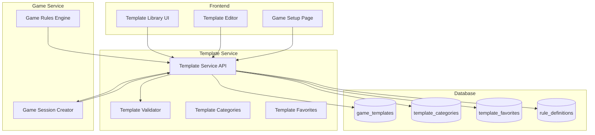

# 🎨🎨🎨 ENTERING CREATIVE PHASE: GAME TEMPLATES SYSTEM 🎨🎨🎨

## Описание компонента

Система шаблонов игр предназначена для создания, хранения и управления настраиваемыми правилами различных типов бильярдных игр. Система должна поддерживать гибкую настройку правил для игр "Американка", "Московская пирамида" и "Колхоз" с возможностью создания пользовательских вариантов.

## Требования и ограничения

### Функциональные требования:
- Поддержка всех трех типов игр с их специфическими правилами
- Возможность создания пользовательских шаблонов на основе базовых
- Система категоризации шаблонов для удобной навигации
- Возможность добавления шаблонов в избранное
- Валидация правил при создании/редактировании шаблонов
- Публичные и приватные шаблоны
- Системные шаблоны по умолчанию

### Технические ограничения:
- Интеграция с Template Service (микросервисная архитектура)
- Использование JSONB для хранения правил (PostgreSQL)
- API для создания/редактирования через FastAPI
- Поддержка версионирования шаблонов
- Валидация данных через Pydantic модели

### Специфические требования для игры "Колхоз":
- Настройка стоимости одного очка в рублях
- Определение цветов и стоимости шаров
- Правила очередности игроков
- Настройки расчета финансовых результатов

## 🎨 CREATIVE CHECKPOINT: Анализ требований завершен

## Анализ вариантов архитектуры шаблонов

### Вариант 1: Простые JSON конфигурации

**Описание**: Хранение правил игр в виде простых JSON объектов без жесткой структуры.

**Плюсы**:
- Максимальная гибкость в определении правил
- Простота реализации
- Быстрое добавление новых правил
- Минимальные ограничения на структуру данных

**Минусы**:
- Отсутствие валидации правил
- Сложность обеспечения консистентности
- Трудности с версионированием
- Риск создания некорректных шаблонов

**Сложность**: Низкая
**Время реализации**: 2-3 дня

### Вариант 2: Строго типизированная система правил

**Описание**: Предопределенная схема для каждого типа игры с строгой валидацией через Pydantic.

**Плюсы**:
- Гарантированная валидность правил
- Четкая структура данных
- Автоматическая валидация при создании
- Легкость документирования API
- Типобезопасность

**Минусы**:
- Ограниченная гибкость
- Сложность добавления новых типов правил
- Больше кода для поддержки
- Возможные ограничения для будущих расширений

**Сложность**: Высокая
**Время реализации**: 5-7 дней

### Вариант 3: Гибридная система (РЕКОМЕНДУЕМЫЙ)

**Описание**: Комбинация базовых типизированных правил с возможностью расширения через дополнительные JSON поля.

**Плюсы**:
- Баланс между гибкостью и валидацией
- Поддержка основных правил через типизацию
- Возможность расширения для специфических случаев
- Обратная совместимость при добавлении новых правил
- Хорошая производительность валидации

**Минусы**:
- Средняя сложность реализации
- Необходимость планирования структуры
- Двухуровневая система валидации

**Сложность**: Средняя
**Время реализации**: 4-5 дней

## Принятое решение

**Выбранный вариант: Гибридная система (Вариант 3)**

### Обоснование выбора

1. **Валидация**: Основные правила валидируются через Pydantic модели
2. **Гибкость**: Дополнительные настройки через расширяемые JSON поля
3. **Производительность**: Быстрая валидация критических параметров
4. **Расширяемость**: Легкое добавление новых правил без изменения схемы
5. **Удобство разработки**: Четкая документация API для основных правил

## Детальное проектирование системы шаблонов

### Базовая структура шаблона

```python
# Pydantic модели для валидации шаблонов

class BaseGameRules(BaseModel):
    """Базовые правила для всех типов игр"""
    game_type: Literal["americana", "moscow_pyramid", "kolkhoz"]
    max_players: int = Field(ge=2, le=8)
    min_players: int = Field(ge=2, le=8)
    point_value_rubles: Decimal = Field(ge=0, le=10000)  # Стоимость очка в рублях
    time_limit_minutes: Optional[int] = Field(None, ge=5, le=180)
    
class BallConfig(BaseModel):
    """Конфигурация шара"""
    color: str
    points: int = Field(ge=1, le=10)
    is_required: bool = True  # Обязательный ли шар для игры
    order_priority: int = 0   # Приоритет в очередности

class KolkhozRules(BaseGameRules):
    """Специфические правила для игры Колхоз"""
    game_type: Literal["kolkhoz"] = "kolkhoz"
    balls: List[BallConfig]  # Настраивается пользователем при создании шаблона
    payment_direction: Literal["clockwise", "counter_clockwise"] = "clockwise"
    allow_queue_change: bool = True  # Можно ли менять очередность между играми
    queue_algorithm: Literal["always_random", "random_no_repeat", "manual"] = "random_no_repeat"
    calculate_net_result: bool = True  # Рассчитывать чистый результат
    
    # Дополнительные настройки через расширяемые поля
    advanced_settings: Dict[str, Any] = Field(default_factory=dict)

class AmericanaRules(BaseGameRules):
    """Правила для Американки"""
    game_type: Literal["americana"] = "americana"
    balls_count: int = Field(15, ge=9, le=15)
    break_rules: Dict[str, Any] = Field(default_factory=dict)
    foul_penalties: Dict[str, int] = Field(default_factory=dict)
    
class MoscowPyramidRules(BaseGameRules):
    """Правила для Московской пирамиды"""
    game_type: Literal["moscow_pyramid"] = "moscow_pyramid"
    pyramid_type: Literal["dynamic", "combined", "free"] = "dynamic"
    balls_count: int = Field(15, ge=15, le=15)
    win_condition: Dict[str, Any] = Field(default_factory=dict)
```

### Структура шаблона в базе данных

```sql
-- Пример записи в game_templates для игры "Колхоз"
INSERT INTO game_templates (
    id, creator_user_id, game_type_id, name, description, rules, settings, is_public, is_system
) VALUES (
    gen_random_uuid(),
    'system-user-uuid',
    3, -- ID типа игры "Колхоз"
    'Колхоз стандартный (50₽ за очко)',
    'Стандартные правила игры Колхоз с оплатой 50 рублей за очко',
    '{
        "game_type": "kolkhoz",
        "max_players": 6,
        "min_players": 2,
        "point_value_rubles": 50.00,
        "balls": [
            {"color": "white", "points": 1, "order_priority": 1},
            {"color": "yellow", "points": 2, "order_priority": 2},
            {"color": "green", "points": 3, "order_priority": 3},
            {"color": "brown", "points": 4, "order_priority": 4},
            {"color": "blue", "points": 5, "order_priority": 5},
            {"color": "pink", "points": 6, "order_priority": 6},
            {"color": "black", "points": 7, "order_priority": 7}
        ],
        "payment_direction": "clockwise",
        "allow_queue_change": true,
        "calculate_net_result": true
    }',
    '{
        "ui_theme": "classic",
        "show_running_total": true,
        "enable_sound_effects": true,
        "auto_calculate_results": true
    }',
    true,  -- Публичный шаблон
    true   -- Системный шаблон
);
```

### Категоризация шаблонов

```sql
-- Системные категории шаблонов
INSERT INTO template_categories (name, description, sort_order) VALUES
('Колхоз', 'Шаблоны для игры Колхоз', 1),
('Американка', 'Шаблоны для Американки', 2),
('Московская пирамида', 'Шаблоны для Московской пирамиды', 3),
('Турниры', 'Шаблоны для турнирных игр', 4),
('Обучение', 'Упрощенные шаблоны для новичков', 5),
('Пользовательские', 'Созданные пользователями', 6);

-- Подкатегории убраны как избыточная логика
```

### Предопределенные шаблоны для игры "Колхоз"

#### 1. Бюджетный Колхоз (25₽ за очко)
```json
{
    "name": "Колхоз бюджетный",
    "rules": {
        "game_type": "kolkhoz",
        "point_value_rubles": 25.00,
        "max_players": 4,
        "balls": [
            {"color": "white", "points": 1, "order_priority": 1},
            {"color": "yellow", "points": 2, "order_priority": 2},
            {"color": "green", "points": 3, "order_priority": 3},
            {"color": "pink", "points": 4, "order_priority": 4}
        ]
    }
}
```

#### 2. Премиум Колхоз (200₽ за очко)
```json
{
    "name": "Колхоз премиум",
    "rules": {
        "game_type": "kolkhoz", 
        "point_value_rubles": 200.00,
        "max_players": 6,
        "time_limit_minutes": 30,
        "balls": [
            {"color": "white", "points": 1, "order_priority": 1},
            {"color": "yellow", "points": 2, "order_priority": 2},
            {"color": "green", "points": 3, "order_priority": 3},
            {"color": "brown", "points": 4, "order_priority": 4},
            {"color": "blue", "points": 5, "order_priority": 5},
            {"color": "pink", "points": 6, "order_priority": 6},
            {"color": "black", "points": 7, "order_priority": 7}
        ]
    },
    "settings": {
        "require_confirmation": true,
        "show_money_warnings": true
    }
}
```

#### 3. Быстрый Колхоз (15 минут)
```json
{
    "name": "Колхоз экспресс",
    "rules": {
        "game_type": "kolkhoz",
        "point_value_rubles": 50.00,
        "time_limit_minutes": 15,
        "balls": [
            {"color": "white", "points": 1, "order_priority": 1},
            {"color": "yellow", "points": 2, "order_priority": 2},
            {"color": "pink", "points": 3, "order_priority": 3}
        ]
    }
}
```

**Примечание:** Очки за каждый цвет шара настраиваются пользователем при создании шаблона. В системных шаблонах используются стандартные значения, но пользователи могут создавать свои варианты с любыми очками от 1 до 10.

### API для работы с шаблонами

```python
# FastAPI эндпоинты для Template Service

@router.get("/templates")
async def get_templates(
    game_type: Optional[str] = None,
    category_id: Optional[int] = None,
    is_public: bool = True,
    current_user: User = Depends(get_current_user)
):
    """Получить список доступных шаблонов"""
    return await get_filtered_templates(
        game_type=game_type,
        category_id=category_id, 
        is_public=is_public,
        user_id=current_user.id
    )

@router.post("/templates")
async def create_template(
    template: GameTemplateCreate,
    current_user: User = Depends(get_current_user)
):
    """Создать новый шаблон"""
    # Валидация правил через Pydantic
    if template.game_type == "kolkhoz":
        validated_rules = KolkhozRules(**template.rules)
    elif template.game_type == "americana":
        validated_rules = AmericanaRules(**template.rules)
    elif template.game_type == "moscow_pyramid":
        validated_rules = MoscowPyramidRules(**template.rules)
    
    return await create_game_template(
        creator_id=current_user.id,
        validated_rules=validated_rules.dict(),
        template_data=template
    )

@router.get("/templates/{template_id}")
async def get_template(template_id: UUID):
    """Получить детали шаблона"""
    return await get_template_by_id(template_id)

@router.put("/templates/{template_id}")
async def update_template(
    template_id: UUID,
    template: GameTemplateUpdate,
    current_user: User = Depends(get_current_user)
):
    """Обновить шаблон (только создатель)"""
    return await update_game_template(template_id, template, current_user.id)

@router.post("/templates/{template_id}/favorite")
async def add_to_favorites(
    template_id: UUID,
    current_user: User = Depends(get_current_user)
):
    """Добавить шаблон в избранное"""
    return await add_template_to_favorites(template_id, current_user.id)

@router.get("/templates/categories")
async def get_categories():
    """Получить список категорий шаблонов"""
    return await get_template_categories()
```

### Валидация и бизнес-логика

```python
class TemplateValidator:
    """Валидатор шаблонов игр"""
    
    @staticmethod
    def validate_kolkhoz_rules(rules: KolkhozRules) -> List[str]:
        """Валидация правил Колхоза"""
        errors = []
        
        # Проверка корректности шаров
        if len(rules.balls) < 2:
            errors.append("Должно быть минимум 2 шара")
            
        # Проверка уникальности цветов
        colors = [ball.color for ball in rules.balls]
        if len(colors) != len(set(colors)):
            errors.append("Цвета шаров должны быть уникальными")
            
        # Проверка разумности ставок
        if rules.point_value_rubles > 10000:
            errors.append("Слишком высокая ставка (более 10 000₽ за очко)")
            
        # Проверка количества игроков
        if rules.min_players > rules.max_players:
            errors.append("Минимум игроков не может быть больше максимума")
            
        # Проверка очков за шары
        for ball in rules.balls:
            if ball.points < 1 or ball.points > 10:
                errors.append(f"Очки за шар {ball.color} должны быть от 1 до 10")
            
        return errors
    
    @staticmethod
    def validate_template_permissions(template: GameTemplate, user: User) -> bool:
        """Проверка прав на редактирование шаблона"""
        if template.is_system:
            return user.is_admin  # Только админы могут редактировать системные
        return template.creator_user_id == user.id

## Алгоритмы очередности игроков

### Типы алгоритмов очередности

#### 1. **Always Random** (Всегда рандом)

**Описание**: Каждую новую игру очередность определяется случайно.

**Принцип работы**:
```python
import random

def generate_always_random_queue(participants: List[Participant]) -> List[Participant]:
    """Случайная очередность для каждой игры"""
    shuffled = participants.copy()
    random.shuffle(shuffled)
    return shuffled

# Пример для 3 игроков (Игрок А, Б, В):
# Игра 1: А → Б → В
# Игра 2: В → А → Б  
# Игра 3: А → В → Б
# Игра 4: Б → А → В (может повториться предыдущий порядок)
```

**Плюсы**:
- Полная случайность
- Простота реализации
- Невозможно предсказать очередность

**Минусы**:
- Может быть несправедливо (один игрок часто ходит первым)
- Возможны повторения одинаковой очередности
- Нет гарантии равномерного распределения позиций

#### 2. **Random No Repeat** (Рандом без повторов) - РЕКОМЕНДУЕМЫЙ

**Описание**: Циклическая смена очередности с элементом случайности, гарантирующая справедливое распределение позиций.

**Принцип работы**:
```python
def generate_random_no_repeat_queue(
    participants: List[Participant], 
    previous_queues: List[List[Participant]],
    max_history: int = None  # Будет вычислен автоматически
) -> List[Participant]:
    """Рандом без повторения недавних очередностей"""
    
    # Получаем все возможные перестановки
    from itertools import permutations
    import math
    
    all_permutations = list(permutations(participants))
    total_permutations = math.factorial(len(participants))
    
    # Автоматически определяем размер истории
    # Для полного цикла без повторений храним (N! - 1) игр
    if max_history is None:
        max_history = total_permutations - 1
    
    # Исключаем недавно использованные очередности
    recent_queues = previous_queues[-max_history:]
    available_queues = [
        perm for perm in all_permutations 
        if list(perm) not in recent_queues
    ]
    
    # Если все варианты использованы - сбрасываем историю и начинаем новый цикл
    if not available_queues:
        available_queues = all_permutations
        # Логируем завершение полного цикла
        print(f"🔄 Завершен полный цикл из {total_permutations} игр. Начинаем новый цикл.")
    
    # Выбираем случайный из доступных
    return list(random.choice(available_queues))

# МАТЕМАТИКА АЛГОРИТМА:

# ДЛЯ 2 ИГРОКОВ (2! = 2 перестановки):
# Игра 1: А → Б
# Игра 2: Б → А (не повторяет Игру 1)
# Игра 3: А → Б (сброс истории - повторение после 2 игр)

# ДЛЯ 3 ИГРОКОВ (3! = 6 перестановок):
# Игра 1: А → Б → В
# Игра 2: В → А → Б (не повторяет Игру 1)
# Игра 3: Б → В → А (не повторяет Игры 1-2)
# Игра 4: А → В → Б (не повторяет Игры 1-3)
# Игра 5: Б → А → В (не повторяет Игры 1-4)
# Игра 6: В → Б → А (не повторяет Игры 1-5)
# Игра 7: А → Б → В (сброс истории - повторение после 6 игр)

# ДЛЯ 4 ИГРОКОВ (4! = 24 перестановки):
# Повторение произойдет только на 25-й игре
```

**Плюсы**:
- Справедливое распределение позиций
- Нет повторений в ближайших играх
- Элемент случайности сохраняется
- Гарантия разнообразия

**Минусы**:
- Сложнее в реализации
- Требует хранения истории очередностей
- Для большого количества игроков может потребовать много памяти

#### 3. **Manual** (Ручная настройка)

**Описание**: Создатель сессии вручную определяет очередность перед каждой игрой.

**Принцип работы**:
```python
def set_manual_queue(
    participants: List[Participant],
    creator_choice: List[UUID]
) -> List[Participant]:
    """Ручная установка очередности создателем сессии"""
    
    # Валидация выбора
    if len(creator_choice) != len(participants):
        raise ValueError("Количество игроков не совпадает")
    
    if set(creator_choice) != set(p.id for p in participants):
        raise ValueError("Некорректный список игроков")
    
    # Устанавливаем очередность по выбору создателя
    ordered_participants = []
    for participant_id in creator_choice:
        participant = next(p for p in participants if p.id == participant_id)
        ordered_participants.append(participant)
    
    return ordered_participants
```

**Плюсы**:
- Полный контроль создателя сессии
- Возможность стратегического планирования
- Гибкость в зависимости от ситуации

**Минусы**:
- Требует вмешательства перед каждой игрой
- Может быть несправедливо
- Замедляет процесс начала игры

### Реализация в базе данных

```sql
-- Добавление таблицы для хранения истории очередностей
CREATE TABLE session_queue_history (
    id UUID PRIMARY KEY DEFAULT gen_random_uuid(),
    session_id UUID NOT NULL REFERENCES game_sessions(id) ON DELETE CASCADE,
    game_number INTEGER NOT NULL,
    queue_order JSONB NOT NULL, -- Массив participant_id в порядке очереди
    algorithm_used VARCHAR(50) NOT NULL,
    created_at TIMESTAMP WITH TIME ZONE DEFAULT NOW(),
    UNIQUE(session_id, game_number)
);

-- Индексы для быстрого поиска
CREATE INDEX idx_queue_history_session ON session_queue_history(session_id);
CREATE INDEX idx_queue_history_game_number ON session_queue_history(session_id, game_number);
```

### API для управления очередностью

```python
@router.post("/sessions/{session_id}/games/{game_number}/queue")
async def generate_game_queue(
    session_id: UUID,
    game_number: int,
    current_user: User = Depends(get_current_user)
):
    """Генерация очередности для новой игры"""
    
    # Получаем сессию и её правила
    session = await get_session_by_id(session_id)
    template = await get_template_by_id(session.template_id)
    rules = KolkhozRules(**template.rules)
    
    # Получаем участников
    participants = await get_session_participants(session_id)
    
    # Генерируем очередность в зависимости от алгоритма
    if rules.queue_algorithm == "always_random":
        queue = await generate_always_random_queue(participants)
    elif rules.queue_algorithm == "random_no_repeat":
        # Определяем размер истории из настроек шаблона
        import math
        history_size = template.settings.get("queue_history_size", "auto")
        if history_size == "auto":
            history_size = math.factorial(len(participants)) - 1
        
        previous_queues = await get_recent_queue_history(session_id, limit=history_size)
        queue = await generate_random_no_repeat_queue(participants, previous_queues, history_size)
    elif rules.queue_algorithm == "manual":
        # Возвращаем текущий порядок, ждем ручной настройки
        queue = participants
    
    # Сохраняем в истории
    await save_queue_history(session_id, game_number, queue, rules.queue_algorithm)
    
    # Обновляем позиции в session_participants
    await update_participant_positions(queue)
    
    return {
        "queue": [{"participant_id": p.id, "display_name": p.display_name, "position": i+1} 
                 for i, p in enumerate(queue)],
        "algorithm": rules.queue_algorithm
    }

@router.put("/sessions/{session_id}/games/{game_number}/queue/manual")
async def set_manual_queue(
    session_id: UUID,
    game_number: int,
    queue_order: List[UUID],
    current_user: User = Depends(get_current_user)
):
    """Ручная установка очередности (только для создателя сессии)"""
    
    # Проверяем права
    session = await get_session_by_id(session_id)
    if session.creator_user_id != current_user.id:
        raise HTTPException(403, "Только создатель сессии может изменять очередность")
    
    # Применяем ручную очередность
    participants = await get_session_participants(session_id)
    queue = await set_manual_participant_queue(participants, queue_order)
    
    # Сохраняем в истории
    await save_queue_history(session_id, game_number, queue, "manual")
    
    return {"status": "success", "queue": queue}
```

### Настройка в шаблонах

```json
{
    "name": "Колхоз справедливый",
    "rules": {
        "game_type": "kolkhoz",
        "point_value_rubles": 50.00,
        "queue_algorithm": "random_no_repeat",
        "balls": [/* настройки шаров */]
    },
    "settings": {
        "queue_history_size": "auto",  // "auto" = (N!-1), или число для ручной настройки
        "show_queue_preview": true,  // Показывать предварительную очередность
        "allow_queue_manual_override": false,  // Можно ли изменить автоочередность
        "notify_cycle_completion": true  // Уведомлять о завершении полного цикла
    }
}
```

### WebSocket уведомления об очередности

**Стандартное уведомление:**
```json
{
    "type": "queue_generated",
    "session_id": "session-uuid",
    "game_number": 3,
    "queue": [
        {"participant_id": "uuid-1", "display_name": "Игрок 1", "position": 1},
        {"participant_id": "uuid-2", "display_name": "Игрок 2", "position": 2},
        {"participant_id": "uuid-3", "display_name": "Игрок 3", "position": 3}
    ],
    "algorithm": "random_no_repeat",
    "message": "Очередность для игры 3 сгенерирована",
    "is_new_cycle": false,
    "total_permutations": 6,
    "games_until_repeat": 3
}
```

**Уведомление о завершении цикла (для 3 игроков на 7-й игре):**
```json
{
    "type": "queue_cycle_completed",
    "session_id": "session-uuid", 
    "game_number": 7,
    "queue": [
        {"participant_id": "uuid-1", "display_name": "Игрок 1", "position": 1},
        {"participant_id": "uuid-2", "display_name": "Игрок 2", "position": 2},
        {"participant_id": "uuid-3", "display_name": "Игрок 3", "position": 3}
    ],
    "algorithm": "random_no_repeat",
    "message": "🔄 Завершен полный цикл из 6 уникальных очередностей. Начинается новый цикл.",
    "is_new_cycle": true,
    "completed_cycle_games": 6,
    "total_permutations": 6
}
```

### Аналитика очередности

```python
@router.get("/sessions/{session_id}/queue/analytics")
async def get_queue_analytics(session_id: UUID):
    """Аналитика справедливости очередности"""
    
    history = await get_full_queue_history(session_id)
    
    # Подсчет позиций для каждого игрока
    position_stats = {}
    for record in history:
        for i, participant_id in enumerate(record.queue_order):
            if participant_id not in position_stats:
                position_stats[participant_id] = {"total_games": 0, "positions": {}}
            
            position_stats[participant_id]["total_games"] += 1
            pos = i + 1
            if pos not in position_stats[participant_id]["positions"]:
                position_stats[participant_id]["positions"][pos] = 0
            position_stats[participant_id]["positions"][pos] += 1
    
    # Расчет справедливости (стандартное отклонение)
    fairness_score = calculate_fairness_score(position_stats)
    
    return {
        "position_statistics": position_stats,
        "fairness_score": fairness_score,
        "total_games": len(history)
    }
```

### Рекомендуемые настройки для разных ситуаций

**Для быстрых игр (3-5 игр)**:
```json
{"queue_algorithm": "always_random"}
```

**Для длинных сессий (10+ игр)**:
```json
{"queue_algorithm": "random_no_repeat", "queue_history_size": "auto"}
```

### 📊 Справочная таблица повторений для "Random No Repeat"

| Количество игроков | Возможных перестановок (N!) | Повторение произойдет на игре | Полный цикл |
|-------------------|----------------------------|------------------------------|-------------|
| **2 игрока** | 2 | **3-я игра** | 2 игры |
| **3 игрока** | 6 | **7-я игра** | 6 игр |
| **4 игрока** | 24 | **25-я игра** | 24 игры |
| **5 игроков** | 120 | **121-я игра** | 120 игр |
| **6 игроков** | 720 | **721-я игра** | 720 игр |

**⚠️ ОТВЕТЫ НА ВАШИ ВОПРОСЫ:**

✅ **Для 2 игроков после 2 игр на 3-й игре будет повторение**
- Игра 1: А → Б
- Игра 2: Б → А  
- Игра 3: **А → Б (повтор)**

✅ **Для 3 игроков после 6 игр на 7-й игре будет повторение**  
- Игры 1-6: все уникальные комбинации
- Игра 7: **повтор одной из предыдущих**

**🎯 Практические выводы:**
- Для **2 игроков**: очередность чередуется каждые 2 игры
- Для **3 игроков**: полный справедливый цикл = 6 игр  
- Для **4+ игроков**: повторения очень редкие (24+ игр)

**Для турниров и соревнований**:
```json
{"queue_algorithm": "manual"}
```

### Использование шаблонов при создании сессии

```python
@router.post("/sessions")
async def create_game_session(
    session_data: SessionCreate,
    current_user: User = Depends(get_current_user)
):
    """Создание игровой сессии на основе шаблона"""
    
    # Получаем шаблон
    template = await get_template_by_id(session_data.template_id)
    if not template:
        raise HTTPException(404, "Шаблон не найден")
    
    # Применяем правила из шаблона
    session = await create_session_with_template(
        creator_id=current_user.id,
        template=template,
        session_name=session_data.name,
        custom_settings=session_data.custom_settings
    )
    
    return session

async def create_session_with_template(
    creator_id: UUID, 
    template: GameTemplate, 
    session_name: str,
    custom_settings: Optional[Dict] = None
):
    """Создание сессии с применением шаблона"""
    
    # Парсим правила из шаблона
    rules = template.rules
    settings = {**template.settings}
    
    # Применяем пользовательские настройки
    if custom_settings:
        settings.update(custom_settings)
    
    # Создаем сессию
    session = await create_game_session_db(
        creator_user_id=creator_id,
        template_id=template.id,
        name=session_name,
        rules=rules,
        max_players=rules.get("max_players", 4)
    )
    
    return session
```

### Система версионирования шаблонов

```sql
-- Таблица для версий шаблонов (будущее расширение)
CREATE TABLE template_versions (
    id UUID PRIMARY KEY DEFAULT gen_random_uuid(),
    template_id UUID NOT NULL REFERENCES game_templates(id) ON DELETE CASCADE,
    version_number INTEGER NOT NULL,
    rules JSONB NOT NULL,
    settings JSONB,
    change_description TEXT,
    created_at TIMESTAMP WITH TIME ZONE DEFAULT NOW(),
    created_by_user_id UUID NOT NULL,
    UNIQUE(template_id, version_number)
);
```

## Интеграция с Game Service

### Применение шаблона при старте игры

```python
async def start_game_with_template(session_id: UUID, template_rules: Dict):
    """Запуск игры с применением правил шаблона"""
    
    # Парсим правила для конкретного типа игры
    if template_rules["game_type"] == "kolkhoz":
        game_rules = KolkhozRules(**template_rules)
        
        # Применяем правила к игре
        await initialize_kolkhoz_game(
            session_id=session_id,
            balls_config=game_rules.balls,
            point_value=game_rules.point_value_rubles,
            payment_direction=game_rules.payment_direction
        )
    
    # Аналогично для других типов игр
```

### WebSocket уведомления о применении шаблона

```json
{
    "type": "template_applied",
    "session_id": "session-uuid",
    "template": {
        "name": "Колхоз стандартный",
        "game_type": "kolkhoz",
        "point_value_rubles": 50.00,
        "max_players": 6
    },
    "message": "Применен шаблон: Колхоз стандартный (50₽ за очко)"
}
```

## Архитектурная диаграмма системы шаблонов



## Верификация против требований

✅ **Поддержка всех типов игр**: Отдельные Pydantic модели для каждого типа
✅ **Пользовательские шаблоны**: Система создания и редактирования шаблонов
✅ **Категоризация**: Иерархическая система категорий с подкатегориями  
✅ **Избранное**: Система добавления шаблонов в избранное
✅ **Валидация**: Многоуровневая валидация через Pydantic и бизнес-логику
✅ **Публичные/приватные**: Поддержка различных уровней доступа
✅ **Системные шаблоны**: Предустановленные шаблоны для каждого типа игры
✅ **Специфика Колхоза**: Полная поддержка настроек стоимости, шаров, очередности
✅ **Микросервисная архитектура**: Интеграция с Template Service
✅ **API**: Полный набор REST API эндпоинтов

## Оптимизация производительности

### Кеширование шаблонов
- Redis кеш для часто используемых шаблонов
- Кеширование системных шаблонов при старте приложения
- Инвалидация кеша при обновлении шаблонов

### Индексирование
- Составные индексы для фильтрации по типу игры и категории
- Полнотекстовый поиск по названию и описанию шаблонов
- Индексы для быстрого получения избранных шаблонов пользователя

🎨🎨🎨 EXITING CREATIVE PHASE: GAME TEMPLATES SYSTEM 🎨🎨🎨

**Ключевые решения:**
- Гибридная система валидации (Pydantic + расширяемые JSON поля)
- Иерархическая категоризация шаблонов 
- Специализированные модели для каждого типа игры
- Полная поддержка настроек игры "Колхоз"
- Система избранного и публичных/приватных шаблонов
- Интеграция с Game Service через Template Service API
- Версионирование шаблонов (готовность к будущему расширению)

**Следующие шаги:** Интеграция системы шаблонов с UI/UX интерфейсом создания игр