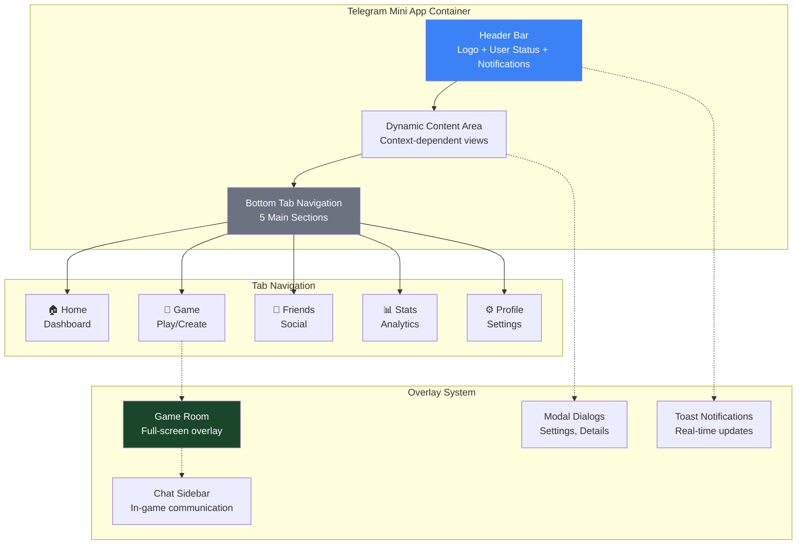
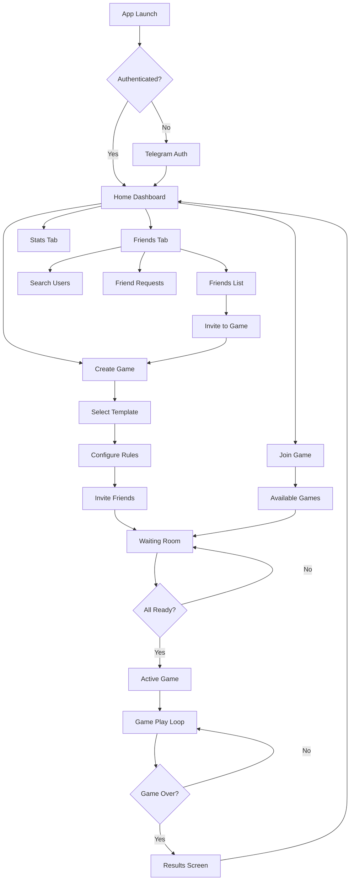

# Проектирование UI/UX для интерфейса бильярда

🎨🎨🎨 **ENTERING CREATIVE PHASE: BILLIARD UI/UX DESIGN** 🎨🎨🎨

## Описание компонента

Комплексный дизайн пользовательского интерфейса для Telegram Mini App бильярдного приложения, включающий game interface, social features, real-time updates и complex game mechanics. Дизайн должен обеспечить intuitive gameplay experience, seamless social interactions, responsive performance на мобильных устройствах и accessibility compliance, поддерживая одновременно до 8 игроков в real-time сессиях с complex scoring logic.

## Требования и ограничения

### Функциональные требования:
- **Game Interface**: Интерактивный стол для игры в бильярд с real-time обновлениями
- **Social Features**: Friend management, invitations, leaderboards, chat
- **Multi-Game Support**: Интерфейсы для Колхоз, Американка, Московская пирамида
- **Real-time Sync**: Live статусы игроков, очки, игровые события
- **Session Management**: Создание, присоединение, управление игровыми сессиями
- **Statistics Dashboard**: Детальная статистика игр и достижений
- **Template System**: Создание и настройка game templates

### Технические ограничения:
- **Telegram Mini App**: WebApp API constraints, viewport limitations
- **Mobile-First**: Responsive design для экранов 320px-768px
- **Performance**: < 3 seconds load time, 60fps game animations
- **Touch Interaction**: Gesture support для game controls
- **Memory Usage**: < 50MB RAM для smooth performance
- **Network Efficiency**: Минимизация data usage для mobile users
- **Cross-Browser**: Support Chrome, Safari, Firefox mobile

### UX ограничения:
- **Telegram Integration**: Seamless experience в Telegram ecosystem
- **Learning Curve**: Intuitive interface для новых пользователей
- **Accessibility**: WCAG 2.1 compliance для inclusivity
- **Offline Capability**: Graceful degradation при network issues
- **Multi-Language**: Русский + English support
- **Error Handling**: Clear feedback для user actions

### Бизнес-ограничения:
- **User Retention**: Engaging interface для long-term usage
- **Social Engagement**: Features для community building
- **Monetization Ready**: Interface support для future premium features
- **Brand Consistency**: Consistent visual identity

## Варианты архитектуры UI/UX

### Вариант 1: Single Page Application (SPA)

**Описание**: Единое приложение с динамическим переключением между различными views и модальными окнами.

**Структура интерфейса**:
```
├── Header (Navigation + User Status)
├── Main Content Area
│   ├── Home Dashboard
│   ├── Game Room (overlay)
│   ├── Friends Panel (sidebar)
│   ├── Settings Modal
│   └── Statistics Modal
└── Footer (Quick Actions)
```

**Navigation Flow**:
```
Home → Game Creation → Game Room → Results → Back to Home
     → Friends → Invite to Game → Game Room
     → Statistics → Detailed View → Back
```

**Преимущества**:
- Fast navigation без page reloads
- Consistent state management
- Smooth animations между views
- Минимальный network traffic
- Better performance для real-time features

**Недостатки**:
- Large initial bundle size
- Complex state management
- Potential memory leaks при long sessions
- SEO limitations (не критично для Mini App)

### Вариант 2: Multi-Page Navigation

**Описание**: Отдельные страницы для каждой основной функции с server-side или client-side routing.

**Page Structure**:
```
├── /home - Main dashboard
├── /games/create - Game creation
├── /games/:id - Active game room
├── /friends - Friends management
├── /stats - Statistics dashboard
├── /profile - User profile
└── /settings - App settings
```

**Navigation Pattern**:
```
Traditional page-to-page navigation
Back button support
Deep linking capability
Progressive loading
```

**Преимущества**:
- Clear separation of concerns
- Easier development и testing
- Better memory management
- Natural browser back/forward behavior
- Simpler URL structure

**Недостатки**:
- Page reload overhead
- State loss между pages
- Slower navigation experience
- Complex real-time synchronization

### Вариант 3: Hybrid App-like Experience

**Описание**: Комбинация SPA и multi-page подходов с tab-based navigation и модальными overlays.

**Architecture**:
```
┌─────────────────────────┐
│     Top Navigation      │
├─────────────────────────┤
│                         │
│    Dynamic Content      │
│      Area              │
│                         │
├─────────────────────────┤
│   Tab Navigation Bar    │
│  [Home][Game][Friends]  │
│  [Stats][Profile]       │
└─────────────────────────┘
```

**Tab Structure**:
- **Home Tab**: Dashboard, recent games, quick actions
- **Game Tab**: Active game или game creation
- **Friends Tab**: Social features, invitations
- **Stats Tab**: Statistics и achievements
- **Profile Tab**: Settings, preferences

**Overlay System**:
- **Game Room**: Full-screen overlay для active games
- **Modals**: Settings, detailed views, confirmations
- **Sidebars**: Chat, player lists, notifications

**Преимущества**:
- App-like native experience
- Clear information architecture
- Persistent navigation context
- Flexible content presentation
- Good performance balance

**Недостатки**:
- Medium complexity в development
- Need for careful state coordination
- Tab switching может прерывать flows

## Анализ вариантов

### Критерии оценки:
1. **User Experience** - удобство использования и navigation
2. **Performance** - скорость loading и responsiveness
3. **Development Complexity** - простота реализации и поддержки
4. **Real-time Capability** - поддержка live updates
5. **Mobile Optimization** - качество mobile experience

### Оценка вариантов:

| Критерий | SPA | Multi-Page | Hybrid |
|----------|-----|------------|--------|
| **User Experience** | ⭐⭐⭐⭐ | ⭐⭐⭐ | ⭐⭐⭐⭐⭐ |
| **Performance** | ⭐⭐⭐ | ⭐⭐⭐⭐ | ⭐⭐⭐⭐ |
| **Development Complexity** | ⭐⭐ | ⭐⭐⭐⭐⭐ | ⭐⭐⭐ |
| **Real-time Capability** | ⭐⭐⭐⭐⭐ | ⭐⭐ | ⭐⭐⭐⭐ |
| **Mobile Optimization** | ⭐⭐⭐⭐ | ⭐⭐⭐ | ⭐⭐⭐⭐⭐ |

## Рекомендуемое решение

### **Выбор: Hybrid App-like Experience (Вариант 3)**

**Обоснование**:
1. **Telegram Mini App Context**: Tab navigation привычен для mobile users
2. **Game-centric Nature**: Full-screen game overlay критичен для gameplay
3. **Social Features**: Persistent access к friends и notifications
4. **Performance Balance**: Optimal loading times с rich functionality
5. **Development Pragmatism**: Manageable complexity с максимальной UX

### UI/UX Architecture:


```mermaid
graph TB
    subgraph "Telegram Mini App Container"
        Header[Header Bar<br/>Logo + User Status + Notifications]
        Content[Dynamic Content Area<br/>Context-dependent views]
        TabBar[Bottom Tab Navigation<br/>5 Main Sections]
    end
    
    subgraph "Tab Navigation"
        HomeTab[🏠 Home<br/>Dashboard]
        GameTab[🎱 Game<br/>Play/Create]
        FriendsTab[👥 Friends<br/>Social]
        StatsTab[📊 Stats<br/>Analytics]
        ProfileTab[⚙️ Profile<br/>Settings]
    end
    
    subgraph "Overlay System"
        GameRoom[Game Room<br/>Full-screen overlay]
        Modals[Modal Dialogs<br/>Settings, Details]
        Chat[Chat Sidebar<br/>In-game communication]
        Notifications[Toast Notifications<br/>Real-time updates]
    end
    
    Header --> Content
    Content --> TabBar
    
    TabBar --> HomeTab
    TabBar --> GameTab
    TabBar --> FriendsTab
    TabBar --> StatsTab
    TabBar --> ProfileTab
    
    GameTab -.-> GameRoom
    Content -.-> Modals
    GameRoom -.-> Chat
    Header -.-> Notifications
    
    style GameRoom fill:#1a472a,color:white
    style Header fill:#3b82f6,color:white
    style TabBar fill:#6b7280,color:white
```

## Implementation Guidelines

### 1. Design System

**Color Palette**:
```css
/* Primary Colors */
--primary-green: #059669;      /* Billiard table green */
--primary-blue: #2563eb;       /* Telegram blue */
--primary-dark: #1f2937;       /* Dark theme primary */

/* Secondary Colors */
--secondary-gold: #f59e0b;     /* Ball yellow/gold */
--secondary-red: #dc2626;      /* Ball red */
--secondary-white: #f9fafb;    /* Ball white */
--secondary-black: #111827;    /* Ball black */

/* UI Colors */
--background-light: #f8fafc;
--background-dark: #0f172a;
--surface: #ffffff;
--surface-dark: #1e293b;
--border: #e2e8f0;
--text-primary: #1f2937;
--text-secondary: #6b7280;
--success: #10b981;
--warning: #f59e0b;
--error: #ef4444;
```

**Typography Scale**:
```css
/* Font Sizes */
--font-xs: 0.75rem;      /* 12px */
--font-sm: 0.875rem;     /* 14px */
--font-base: 1rem;       /* 16px */
--font-lg: 1.125rem;     /* 18px */
--font-xl: 1.25rem;      /* 20px */
--font-2xl: 1.5rem;      /* 24px */
--font-3xl: 1.875rem;    /* 30px */

/* Font Weights */
--font-normal: 400;
--font-medium: 500;
--font-semibold: 600;
--font-bold: 700;

/* Line Heights */
--leading-tight: 1.25;
--leading-normal: 1.5;
--leading-relaxed: 1.625;
```

**Spacing System**:
```css
/* Spacing Scale (Tailwind-inspired) */
--spacing-1: 0.25rem;    /* 4px */
--spacing-2: 0.5rem;     /* 8px */
--spacing-3: 0.75rem;    /* 12px */
--spacing-4: 1rem;       /* 16px */
--spacing-5: 1.25rem;    /* 20px */
--spacing-6: 1.5rem;     /* 24px */
--spacing-8: 2rem;       /* 32px */
--spacing-10: 2.5rem;    /* 40px */
--spacing-12: 3rem;      /* 48px */
--spacing-16: 4rem;      /* 64px */
```

### 2. Component Library

**Base Components**:
```jsx
// Button Component
const Button = ({ 
  variant = 'primary', 
  size = 'md', 
  disabled = false, 
  loading = false, 
  children,
  onClick,
  ...props 
}) => {
  const baseClasses = 'inline-flex items-center justify-center font-medium rounded-lg transition-colors focus:outline-none focus:ring-2 focus:ring-offset-2';
  
  const variants = {
    primary: 'bg-primary-blue text-white hover:bg-blue-700 focus:ring-blue-500',
    secondary: 'bg-gray-200 text-gray-900 hover:bg-gray-300 focus:ring-gray-500',
    success: 'bg-success text-white hover:bg-green-700 focus:ring-green-500',
    danger: 'bg-error text-white hover:bg-red-700 focus:ring-red-500',
    ghost: 'text-primary-blue hover:bg-blue-50 focus:ring-blue-500'
  };
  
  const sizes = {
    sm: 'px-3 py-1.5 text-sm',
    md: 'px-4 py-2 text-base',
    lg: 'px-6 py-3 text-lg'
  };
  
  const className = `${baseClasses} ${variants[variant]} ${sizes[size]} ${disabled ? 'opacity-50 cursor-not-allowed' : ''}`;
  
  return (
    <button 
      className={className}
      disabled={disabled || loading}
      onClick={onClick}
      {...props}
    >
      {loading && <LoadingSpinner className="mr-2" />}
      {children}
    </button>
  );
};

// Card Component
const Card = ({ children, className = '', padding = 'md', ...props }) => {
  const paddings = {
    sm: 'p-4',
    md: 'p-6',
    lg: 'p-8'
  };
  
  return (
    <div 
      className={`bg-surface rounded-lg shadow-sm border border-border ${paddings[padding]} ${className}`}
      {...props}
    >
      {children}
    </div>
  );
};

// Avatar Component
const Avatar = ({ src, alt, size = 'md', online = false, fallback }) => {
  const sizes = {
    sm: 'w-8 h-8 text-sm',
    md: 'w-10 h-10 text-base',
    lg: 'w-12 h-12 text-lg',
    xl: 'w-16 h-16 text-xl'
  };
  
  return (
    <div className="relative inline-block">
      <div className={`${sizes[size]} rounded-full overflow-hidden bg-gray-200 flex items-center justify-center`}>
        {src ? (
          
        ) : (
          <span className="text-gray-600 font-medium">
            {fallback || alt?.charAt(0)?.toUpperCase()}
          </span>
        )}
      </div>
      {online && (
        <div className="absolute bottom-0 right-0 w-3 h-3 bg-success rounded-full border-2 border-white"></div>
      )}
    </div>
  );
};

// Badge Component
const Badge = ({ children, variant = 'default', size = 'sm' }) => {
  const variants = {
    default: 'bg-gray-100 text-gray-800',
    success: 'bg-green-100 text-green-800',
    warning: 'bg-yellow-100 text-yellow-800',
    error: 'bg-red-100 text-red-800',
    blue: 'bg-blue-100 text-blue-800'
  };
  
  const sizes = {
    sm: 'px-2 py-0.5 text-xs',
    md: 'px-2.5 py-0.5 text-sm'
  };
  
  return (
    <span className={`inline-flex items-center font-medium rounded-full ${variants[variant]} ${sizes[size]}`}>
      {children}
    </span>
  );
};
```

### 3. Screen Layouts

**Home Dashboard Layout**:
```jsx
const HomeDashboard = () => {
  return (
    <div className="flex flex-col h-full bg-background-light">
      {/* Welcome Section */}
      <section className="p-6 bg-gradient-to-r from-primary-blue to-primary-green text-white">
        <div className="flex items-center justify-between mb-4">
          <div>
            <h1 className="text-2xl font-bold">Добро пожаловать!</h1>
            <p className="text-blue-100">Готовы к новой игре?</p>
          </div>
          <Avatar src={user.avatar} size="lg" online />
        </div>
        
        <div className="grid grid-cols-2 gap-4">
          <Card className="bg-white/10 border-white/20 text-white">
            <div className="text-2xl font-bold">{stats.totalGames}</div>
            <div className="text-sm text-blue-100">Всего игр</div>
          </Card>
          <Card className="bg-white/10 border-white/20 text-white">
            <div className="text-2xl font-bold">{stats.winRate}%</div>
            <div className="text-sm text-blue-100">Процент побед</div>
          </Card>
        </div>
      </section>
      
      {/* Quick Actions */}
      <section className="p-6">
        <h2 className="text-lg font-semibold mb-4">Быстрые действия</h2>
        <div className="grid grid-cols-2 gap-4">
          <Button 
            variant="primary" 
            size="lg" 
            className="h-20 flex-col"
            onClick={() => navigate('/games/create')}
          >
            <GameIcon className="w-6 h-6 mb-2" />
            Создать игру
          </Button>
          <Button 
            variant="secondary" 
            size="lg" 
            className="h-20 flex-col"
            onClick={() => navigate('/games/join')}
          >
            <JoinIcon className="w-6 h-6 mb-2" />
            Присоединиться
          </Button>
        </div>
      </section>
      
      {/* Recent Games */}
      <section className="p-6 flex-1">
        <div className="flex items-center justify-between mb-4">
          <h2 className="text-lg font-semibold">Недавние игры</h2>
          <Button variant="ghost" size="sm">
            Все игры →
          </Button>
        </div>
        
        <div className="space-y-3">
          {recentGames.map(game => (
            <GameCard key={game.id} game={game} />
          ))}
        </div>
      </section>
      
      {/* Friends Online */}
      <section className="p-6 bg-surface">
        <h2 className="text-lg font-semibold mb-4">Друзья онлайн</h2>
        <div className="flex space-x-3 overflow-x-auto">
          {onlineFriends.map(friend => (
            <div key={friend.id} className="flex-shrink-0">
              <Avatar 
                src={friend.avatar} 
                alt={friend.name} 
                size="md" 
                online 
              />
              <div className="text-xs text-center mt-1 max-w-16 truncate">
                {friend.name}
              </div>
            </div>
          ))}
        </div>
      </section>
    </div>
  );
};
```

**Game Room Interface**:
```jsx
const GameRoom = ({ sessionId }) => {
  const [gameState, setGameState] = useState(null);
  const [currentPlayer, setCurrentPlayer] = useState(null);
  const [scores, setScores] = useState({});
  
  return (
    <div className="fixed inset-0 bg-primary-green z-50 flex flex-col">
      {/* Game Header */}
      <header className="bg-black/20 text-white p-4 flex items-center justify-between">
        <div className="flex items-center space-x-3">
          <Button 
            variant="ghost" 
            size="sm" 
            onClick={onExitGame}
            className="text-white"
          >
            ← Выйти
          </Button>
          <div>
            <h1 className="font-semibold">{gameState?.name}</h1>
            <p className="text-sm text-white/80">
              Игра {gameState?.currentGame} • {gameState?.gameType}
            </p>
          </div>
        </div>
        
        <div className="flex items-center space-x-2">
          <Button variant="ghost" size="sm" className="text-white">
            <ChatIcon className="w-5 h-5" />
          </Button>
          <Button variant="ghost" size="sm" className="text-white">
            <SettingsIcon className="w-5 h-5" />
          </Button>
        </div>
      </header>
      
      {/* Billiard Table */}
      <main className="flex-1 relative overflow-hidden">
        <BilliardTable
          balls={gameState?.balls}
          currentPlayer={currentPlayer}
          onBallClick={handleBallClick}
          readonly={!isMyTurn}
        />
        
        {/* Game Overlay UI */}
        <div className="absolute inset-0 pointer-events-none">
          {/* Current Player Indicator */}
          <div className="absolute top-4 left-1/2 transform -translate-x-1/2 pointer-events-auto">
            <Card className="bg-white/90 backdrop-blur-sm">
              <div className="flex items-center space-x-2">
                <Avatar src={currentPlayer?.avatar} size="sm" />
                <span className="font-medium">{currentPlayer?.name}</span>
                {isMyTurn && <Badge variant="success">Ваш ход</Badge>}
              </div>
            </Card>
          </div>
          
          {/* Score Display */}
          <div className="absolute top-4 right-4 pointer-events-auto">
            <ScoreBoard scores={scores} players={gameState?.players} />
          </div>
          
          {/* Ball Selection UI */}
          {isMyTurn && (
            <div className="absolute bottom-4 left-1/2 transform -translate-x-1/2 pointer-events-auto">
              <BallSelector 
                availableBalls={getAvailableBalls()}
                onBallSelect={handleBallSelect}
              />
            </div>
          )}
        </div>
      </main>
      
      {/* Game Actions */}
      <footer className="bg-black/20 text-white p-4">
        <div className="flex items-center justify-between">
          <div className="flex items-center space-x-2">
            <Badge variant="blue" className="text-white bg-white/20">
              Очередь: {gameState?.queue?.length} игроков
            </Badge>
            <Badge variant="default" className="text-white bg-white/20">
              Время: {formatGameTime(gameState?.duration)}
            </Badge>
          </div>
          
          <div className="flex space-x-2">
            {isMyTurn && (
              <>
                <Button variant="success" size="sm" onClick={handleEndTurn}>
                  Завершить ход
                </Button>
                <Button variant="ghost" size="sm" className="text-white">
                  Пропустить
                </Button>
              </>
            )}
            <Button variant="ghost" size="sm" className="text-white">
              <MenuIcon className="w-5 h-5" />
            </Button>
          </div>
        </div>
      </footer>
    </div>
  );
};
```

### 4. Interactive Components

**Billiard Table Component**:
```jsx
const BilliardTable = ({ balls, currentPlayer, onBallClick, readonly = false }) => {
  const tableRef = useRef(null);
  const [tableSize, setTableSize] = useState({ width: 0, height: 0 });
  
  useEffect(() => {
    const updateSize = () => {
      if (tableRef.current) {
        const rect = tableRef.current.getBoundingClientRect();
        setTableSize({ width: rect.width, height: rect.height });
      }
    };
    
    updateSize();
    window.addEventListener('resize', updateSize);
    return () => window.removeEventListener('resize', updateSize);
  }, []);
  
  return (
    <div 
      ref={tableRef}
      className="w-full h-full bg-primary-green relative rounded-lg overflow-hidden"
      style={{
        backgroundImage: `
          radial-gradient(circle at 50% 50%, rgba(0,0,0,0.1) 1px, transparent 1px),
          linear-gradient(90deg, rgba(0,0,0,0.05) 1px, transparent 1px),
          linear-gradient(rgba(0,0,0,0.05) 1px, transparent 1px)
        `,
        backgroundSize: '20px 20px, 20px 20px, 20px 20px'
      }}
    >
      {/* Table Border */}
      <div className="absolute inset-2 border-4 border-amber-800 rounded-lg">
        {/* Corner Pockets */}
        <div className="absolute -top-3 -left-3 w-6 h-6 bg-black rounded-full"></div>
        <div className="absolute -top-3 -right-3 w-6 h-6 bg-black rounded-full"></div>
        <div className="absolute -bottom-3 -left-3 w-6 h-6 bg-black rounded-full"></div>
        <div className="absolute -bottom-3 -right-3 w-6 h-6 bg-black rounded-full"></div>
        
        {/* Side Pockets */}
        <div className="absolute -top-3 left-1/2 transform -translate-x-1/2 w-6 h-6 bg-black rounded-full"></div>
        <div className="absolute -bottom-3 left-1/2 transform -translate-x-1/2 w-6 h-6 bg-black rounded-full"></div>
      </div>
      
      {/* Balls */}
      {balls.map(ball => (
        <Ball
          key={ball.id}
          ball={ball}
          tableSize={tableSize}
          onClick={readonly ? undefined : () => onBallClick(ball)}
          interactive={!readonly}
        />
      ))}
      
      {/* Table Lines */}
      <div className="absolute inset-0 pointer-events-none">
        {/* Head String */}
        <div className="absolute left-1/4 top-0 bottom-0 w-0.5 bg-white/30"></div>
        {/* Foot String */}
        <div className="absolute right-1/4 top-0 bottom-0 w-0.5 bg-white/30"></div>
        {/* Center Line */}
        <div className="absolute left-0 right-0 top-1/2 h-0.5 bg-white/30"></div>
      </div>
    </div>
  );
};

const Ball = ({ ball, tableSize, onClick, interactive = true }) => {
  const ballSize = Math.min(tableSize.width, tableSize.height) * 0.06; // 6% of table size
  
  const ballColors = {
    white: '#ffffff',
    yellow: '#fbbf24',
    red: '#dc2626',
    black: '#000000',
    blue: '#2563eb',
    green: '#059669',
    brown: '#92400e',
    pink: '#ec4899'
  };
  
  return (
    <div
      className={`absolute rounded-full shadow-lg transform transition-all duration-200 ${
        interactive ? 'cursor-pointer hover:scale-110' : ''
      }`}
      style={{
        width: ballSize,
        height: ballSize,
        left: `${ball.x}%`,
        top: `${ball.y}%`,
        backgroundColor: ballColors[ball.color] || '#gray',
        transform: 'translate(-50%, -50%)',
        border: ball.color === 'white' ? '2px solid #e5e7eb' : 'none'
      }}
      onClick={onClick}
    >
      {/* Ball Number */}
      <div className="absolute inset-0 flex items-center justify-center">
        <span 
          className={`text-xs font-bold ${
            ['white', 'yellow'].includes(ball.color) ? 'text-black' : 'text-white'
          }`}
          style={{ fontSize: ballSize * 0.3 }}
        >
          {ball.number}
        </span>
      </div>
      
      {/* Ball Highlight */}
      <div 
        className="absolute top-1 left-1 w-2 h-2 bg-white/60 rounded-full"
        style={{ 
          width: ballSize * 0.2, 
          height: ballSize * 0.2 
        }}
      ></div>
    </div>
  );
};
```

### 5. Real-time Features

**Live Updates System**:
```jsx
const useGameWebSocket = (sessionId) => {
  const [socket, setSocket] = useState(null);
  const [gameState, setGameState] = useState(null);
  const [connected, setConnected] = useState(false);
  
  useEffect(() => {
    const ws = new WebSocket(`wss://api.artelbilliards.com/ws/games/${sessionId}`);
    
    ws.onopen = () => {
      setConnected(true);
      setSocket(ws);
    };
    
    ws.onmessage = (event) => {
      const message = JSON.parse(event.data);
      
      switch (message.type) {
        case 'game_state_update':
          setGameState(prev => ({ ...prev, ...message.data }));
          break;
          
        case 'ball_potted':
          handleBallPotted(message.data);
          break;
          
        case 'score_update':
          updateScores(message.data);
          break;
          
        case 'player_turn_change':
          setCurrentPlayer(message.data.currentPlayer);
          break;
          
        case 'game_ended':
          handleGameEnd(message.data);
          break;
          
        case 'player_joined':
          addPlayerToGame(message.data.player);
          break;
          
        case 'player_left':
          removePlayerFromGame(message.data.playerId);
          break;
      }
    };
    
    ws.onclose = () => {
      setConnected(false);
      setSocket(null);
      // Attempt reconnection
      setTimeout(() => {
        if (sessionId) {
          // Reconnect logic
        }
      }, 3000);
    };
    
    return () => {
      ws.close();
    };
  }, [sessionId]);
  
  const sendGameAction = (action, data) => {
    if (socket && connected) {
      socket.send(JSON.stringify({
        type: action,
        data: data
      }));
    }
  };
  
  return {
    gameState,
    connected,
    sendGameAction
  };
};

// Toast Notification System
const ToastProvider = ({ children }) => {
  const [toasts, setToasts] = useState([]);
  
  const addToast = (message, type = 'info', duration = 3000) => {
    const id = Date.now();
    const toast = { id, message, type };
    
    setToasts(prev => [...prev, toast]);
    
    setTimeout(() => {
      setToasts(prev => prev.filter(t => t.id !== id));
    }, duration);
  };
  
  return (
    <ToastContext.Provider value={{ addToast }}>
      {children}
      <div className="fixed top-4 right-4 z-50 space-y-2">
        {toasts.map(toast => (
          <Toast key={toast.id} toast={toast} />
        ))}
      </div>
    </ToastContext.Provider>
  );
};

const Toast = ({ toast }) => {
  const types = {
    success: 'bg-green-500 text-white',
    error: 'bg-red-500 text-white',
    warning: 'bg-yellow-500 text-black',
    info: 'bg-blue-500 text-white'
  };
  
  return (
    <div className={`p-4 rounded-lg shadow-lg max-w-sm ${types[toast.type]} animate-slide-in`}>
      <p className="text-sm font-medium">{toast.message}</p>
    </div>
  );
};
```

### 6. User Flows & Navigation

**Primary User Journeys**:


```mermaid
graph TD
    Start[App Launch] --> Auth{Authenticated?}
    Auth -->|No| TelegramAuth[Telegram Auth]
    Auth -->|Yes| Home[Home Dashboard]
    TelegramAuth --> Home
    
    Home --> CreateGame[Create Game]
    Home --> JoinGame[Join Game]
    Home --> Friends[Friends Tab]
    Home --> Stats[Stats Tab]
    
    CreateGame --> SelectTemplate[Select Template]
    SelectTemplate --> ConfigureRules[Configure Rules]
    ConfigureRules --> InviteFriends[Invite Friends]
    InviteFriends --> WaitingRoom[Waiting Room]
    
    JoinGame --> GamesList[Available Games]
    GamesList --> WaitingRoom
    
    WaitingRoom --> StartGame{All Ready?}
    StartGame -->|Yes| GameRoom[Active Game]
    StartGame -->|No| WaitingRoom
    
    GameRoom --> GamePlay[Game Play Loop]
    GamePlay --> GameEnd{Game Over?}
    GameEnd -->|No| GamePlay
    GameEnd -->|Yes| Results[Results Screen]
    Results --> Home
    
    Friends --> FriendsList[Friends List]
    Friends --> SearchUsers[Search Users]
    Friends --> FriendRequests[Friend Requests]
    
    FriendsList --> InviteToGame[Invite to Game]
    InviteToGame --> CreateGame
```

**Game Creation Flow**:
```jsx
const GameCreationFlow = () => {
  const [step, setStep] = useState(1);
  const [gameData, setGameData] = useState({});
  
  const steps = [
    { id: 1, title: 'Выбор шаблона', component: TemplateSelection },
    { id: 2, title: 'Настройка правил', component: RulesConfiguration },
    { id: 3, title: 'Приглашение игроков', component: PlayerInvitation },
    { id: 4, title: 'Ожидание игроков', component: WaitingRoom }
  ];
  
  return (
    <div className="h-full flex flex-col">
      {/* Progress Indicator */}
      <div className="p-4 bg-surface border-b">
        <div className="flex items-center justify-between mb-2">
          <h1 className="text-lg font-semibold">Создание игры</h1>
          <span className="text-sm text-text-secondary">{step}/4</span>
        </div>
        <div className="w-full bg-gray-200 rounded-full h-2">
          <div 
            className="bg-primary-blue h-2 rounded-full transition-all duration-300"
            style={{ width: `${(step / 4) * 100}%` }}
          ></div>
        </div>
      </div>
      
      {/* Step Content */}
      <div className="flex-1 overflow-auto">
        {steps.find(s => s.id === step)?.component({ 
          data: gameData, 
          onUpdate: setGameData,
          onNext: () => setStep(step + 1),
          onBack: () => setStep(step - 1)
        })}
      </div>
    </div>
  );
};
```

### 7. Social Features UI

**Friends Management Interface**:
```jsx
const FriendsTab = () => {
  const [activeTab, setActiveTab] = useState('friends');
  const [searchQuery, setSearchQuery] = useState('');
  
  return (
    <div className="h-full flex flex-col">
      {/* Search Bar */}
      <div className="p-4 bg-surface border-b">
        <div className="relative">
          <SearchIcon className="absolute left-3 top-3 w-5 h-5 text-gray-400" />
          <input
            type="text"
            placeholder="Поиск друзей..."
            className="w-full pl-10 pr-4 py-2 border border-border rounded-lg focus:ring-2 focus:ring-primary-blue focus:border-transparent"
            value={searchQuery}
            onChange={(e) => setSearchQuery(e.target.value)}
          />
        </div>
      </div>
      
      {/* Tabs */}
      <div className="flex bg-surface border-b">
        {[
          { id: 'friends', label: 'Друзья', count: friends.length },
          { id: 'requests', label: 'Заявки', count: requests.length },
          { id: 'find', label: 'Найти', count: null }
        ].map(tab => (
          <button
            key={tab.id}
            className={`flex-1 py-3 px-4 text-sm font-medium border-b-2 transition-colors ${
              activeTab === tab.id
                ? 'border-primary-blue text-primary-blue'
                : 'border-transparent text-text-secondary hover:text-text-primary'
            }`}
            onClick={() => setActiveTab(tab.id)}
          >
            {tab.label}
            {tab.count !== null && (
              <Badge variant="blue" className="ml-2">
                {tab.count}
              </Badge>
            )}
          </button>
        ))}
      </div>
      
      {/* Tab Content */}
      <div className="flex-1 overflow-auto">
        {activeTab === 'friends' && <FriendsList searchQuery={searchQuery} />}
        {activeTab === 'requests' && <FriendRequests />}
        {activeTab === 'find' && <FindFriends searchQuery={searchQuery} />}
      </div>
    </div>
  );
};

const FriendCard = ({ friend, onInviteToGame, onViewProfile }) => {
  return (
    <div className="flex items-center justify-between p-4 border-b border-border">
      <div className="flex items-center space-x-3">
        <Avatar 
          src={friend.avatar} 
          alt={friend.name} 
          size="md" 
          online={friend.isOnline}
        />
        <div>
          <h3 className="font-medium text-text-primary">{friend.name}</h3>
          <p className="text-sm text-text-secondary">
            {friend.isOnline ? (
              friend.currentActivity ? (
                <span className="text-primary-blue">🎱 {friend.currentActivity}</span>
              ) : (
                <span className="text-success">Онлайн</span>
              )
            ) : (
              `Был(а) ${formatLastSeen(friend.lastSeen)}`
            )}
          </p>
        </div>
      </div>
      
      <div className="flex space-x-2">
        <Button 
          variant="ghost" 
          size="sm"
          onClick={() => onViewProfile(friend)}
        >
          <UserIcon className="w-4 h-4" />
        </Button>
        <Button 
          variant="primary" 
          size="sm"
          onClick={() => onInviteToGame(friend)}
          disabled={!friend.isOnline}
        >
          Пригласить
        </Button>
      </div>
    </div>
  );
};
```

**Game Invitation Modal**:
```jsx
const GameInvitationModal = ({ isOpen, onClose, friend }) => {
  const [selectedSession, setSelectedSession] = useState(null);
  const [availableSessions, setAvailableSessions] = useState([]);
  
  return (
    <Modal isOpen={isOpen} onClose={onClose} title="Приглашение в игру">
      <div className="space-y-4">
        <div className="flex items-center space-x-3 p-3 bg-gray-50 rounded-lg">
          <Avatar src={friend?.avatar} alt={friend?.name} size="md" />
          <div>
            <h3 className="font-medium">{friend?.name}</h3>
            <p className="text-sm text-text-secondary">Приглашение в игру</p>
          </div>
        </div>
        
        <div>
          <h4 className="font-medium mb-3">Выберите игру:</h4>
          <div className="space-y-2">
            <button
              className="w-full p-3 text-left border border-border rounded-lg hover:bg-gray-50 transition-colors"
              onClick={() => navigate('/games/create')}
            >
              <div className="flex items-center space-x-3">
                <div className="w-10 h-10 bg-primary-blue rounded-lg flex items-center justify-center">
                  <PlusIcon className="w-5 h-5 text-white" />
                </div>
                <div>
                  <h5 className="font-medium">Создать новую игру</h5>
                  <p className="text-sm text-text-secondary">Настроить правила и пригласить друга</p>
                </div>
              </div>
            </button>
            
            {availableSessions.map(session => (
              <button
                key={session.id}
                className={`w-full p-3 text-left border rounded-lg transition-colors ${
                  selectedSession === session.id
                    ? 'border-primary-blue bg-blue-50'
                    : 'border-border hover:bg-gray-50'
                }`}
                onClick={() => setSelectedSession(session.id)}
              >
                <div className="flex items-center justify-between">
                  <div>
                    <h5 className="font-medium">{session.name}</h5>
                    <p className="text-sm text-text-secondary">
                      {session.gameType} • {session.participants.length}/{session.maxParticipants} игроков
                    </p>
                  </div>
                  <Badge variant="success">Ожидание</Badge>
                </div>
              </button>
            ))}
          </div>
        </div>
        
        <div className="flex space-x-3 pt-4">
          <Button variant="secondary" onClick={onClose} className="flex-1">
            Отмена
          </Button>
          <Button 
            variant="primary" 
            onClick={handleSendInvitation}
            disabled={!selectedSession}
            className="flex-1"
          >
            Отправить приглашение
          </Button>
        </div>
      </div>
    </Modal>
  );
};
```

### 8. Responsive & Adaptive Design

**Breakpoint System**:
```css
/* Mobile First Approach */
.container {
  width: 100%;
  padding: 0 1rem;
}

/* Small devices (landscape phones, 576px and up) */
@media (min-width: 576px) {
  .container {
    max-width: 540px;
  }
}

/* Medium devices (tablets, 768px and up) */
@media (min-width: 768px) {
  .container {
    max-width: 720px;
  }
  
  /* Tablet Layout Adjustments */
  .tab-navigation {
    flex-direction: row;
    justify-content: center;
  }
  
  .game-table {
    max-height: 60vh;
  }
  
  .sidebar {
    display: block;
    width: 300px;
  }
}

/* Large devices (desktops, 992px and up) */
@media (min-width: 992px) {
  .container {
    max-width: 960px;
  }
  
  /* Desktop Layout */
  .app-layout {
    display: grid;
    grid-template-columns: 250px 1fr 300px;
    grid-template-areas: 
      "sidebar main chat"
      "sidebar main chat";
  }
}
```

**Adaptive Game Interface**:
```jsx
const ResponsiveGameLayout = () => {
  const [screenSize, setScreenSize] = useState('mobile');
  
  useEffect(() => {
    const handleResize = () => {
      const width = window.innerWidth;
      if (width < 768) setScreenSize('mobile');
      else if (width < 992) setScreenSize('tablet');
      else setScreenSize('desktop');
    };
    
    handleResize();
    window.addEventListener('resize', handleResize);
    return () => window.removeEventListener('resize', handleResize);
  }, []);
  
  if (screenSize === 'mobile') {
    return (
      <div className="h-screen flex flex-col">
        <GameHeader />
        <div className="flex-1 relative">
          <BilliardTable />
          <MobileGameControls />
        </div>
        <MobileScoreBar />
      </div>
    );
  }
  
  if (screenSize === 'tablet') {
    return (
      <div className="h-screen grid grid-rows-[auto_1fr_auto]">
        <GameHeader />
        <div className="flex">
          <div className="flex-1">
            <BilliardTable />
          </div>
          <div className="w-80">
            <TabletSidebar />
          </div>
        </div>
        <TabletControls />
      </div>
    );
  }
  
  return (
    <div className="h-screen grid grid-cols-[300px_1fr_350px]">
      <PlayersSidebar />
      <div className="flex flex-col">
        <GameHeader />
        <BilliardTable />
        <DesktopControls />
      </div>
      <ChatSidebar />
    </div>
  );
};
```

### 9. Accessibility Features

**WCAG 2.1 Compliance**:
```jsx
const AccessibleButton = ({ 
  children, 
  onClick, 
  disabled, 
  ariaLabel, 
  ariaDescribedBy,
  ...props 
}) => {
  return (
    <button
      onClick={onClick}
      disabled={disabled}
      aria-label={ariaLabel}
      aria-describedby={ariaDescribedBy}
      className={`
        focus:outline-none 
        focus:ring-2 
        focus:ring-primary-blue 
        focus:ring-offset-2
        ${disabled ? 'opacity-50 cursor-not-allowed' : 'cursor-pointer'}
      `}
      {...props}
    >
      {children}
    </button>
  );
};

// High Contrast Mode Support
const useHighContrast = () => {
  const [highContrast, setHighContrast] = useState(false);
  
  useEffect(() => {
    const mediaQuery = window.matchMedia('(prefers-contrast: high)');
    setHighContrast(mediaQuery.matches);
    
    const handler = (e) => setHighContrast(e.matches);
    mediaQuery.addListener(handler);
    
    return () => mediaQuery.removeListener(handler);
  }, []);
  
  return highContrast;
};

// Screen Reader Support
const ScreenReaderOnly = ({ children }) => (
  <span className="sr-only">{children}</span>
);

// Keyboard Navigation
const useKeyboardNavigation = (items, onSelect) => {
  const [focusedIndex, setFocusedIndex] = useState(0);
  
  useEffect(() => {
    const handleKeyDown = (e) => {
      switch (e.key) {
        case 'ArrowUp':
          e.preventDefault();
          setFocusedIndex(prev => Math.max(0, prev - 1));
          break;
        case 'ArrowDown':
          e.preventDefault();
          setFocusedIndex(prev => Math.min(items.length - 1, prev + 1));
          break;
        case 'Enter':
        case ' ':
          e.preventDefault();
          onSelect(items[focusedIndex]);
          break;
      }
    };
    
    document.addEventListener('keydown', handleKeyDown);
    return () => document.removeEventListener('keydown', handleKeyDown);
  }, [items, focusedIndex, onSelect]);
  
  return focusedIndex;
};
```

### 10. Animation & Micro-interactions

**Smooth Transitions**:
```css
/* CSS Animations */
@keyframes slideIn {
  from {
    transform: translateX(-100%);
    opacity: 0;
  }
  to {
    transform: translateX(0);
    opacity: 1;
  }
}

@keyframes ballRoll {
  0% { transform: translateX(0) rotate(0deg); }
  100% { transform: translateX(100px) rotate(360deg); }
}

@keyframes scoreUpdate {
  0% { transform: scale(1); }
  50% { transform: scale(1.2); color: #10b981; }
  100% { transform: scale(1); }
}

.animate-slide-in {
  animation: slideIn 0.3s ease-out;
}

.animate-ball-roll {
  animation: ballRoll 1s ease-in-out;
}

.animate-score-update {
  animation: scoreUpdate 0.5s ease-in-out;
}

/* Hover Effects */
.hover-lift {
  transition: transform 0.2s ease, box-shadow 0.2s ease;
}

.hover-lift:hover {
  transform: translateY(-2px);
  box-shadow: 0 4px 12px rgba(0, 0, 0, 0.15);
}

/* Loading States */
.skeleton {
  background: linear-gradient(90deg, #f0f0f0 25%, #e0e0e0 50%, #f0f0f0 75%);
  background-size: 200% 100%;
  animation: skeleton-loading 1.5s infinite;
}

@keyframes skeleton-loading {
  0% { background-position: 200% 0; }
  100% { background-position: -200% 0; }
}
```

**React Transition Components**:
```jsx
import { Transition } from '@headlessui/react';

const AnimatedModal = ({ isOpen, onClose, children }) => {
  return (
    <Transition show={isOpen} as={Fragment}>
      <div className="fixed inset-0 z-50 overflow-y-auto">
        <Transition.Child
          as={Fragment}
          enter="ease-out duration-300"
          enterFrom="opacity-0"
          enterTo="opacity-100"
          leave="ease-in duration-200"
          leaveFrom="opacity-100"
          leaveTo="opacity-0"
        >
          <div className="fixed inset-0 bg-black bg-opacity-25" onClick={onClose} />
        </Transition.Child>
        
        <div className="flex min-h-full items-center justify-center p-4 text-center">
          <Transition.Child
            as={Fragment}
            enter="ease-out duration-300"
            enterFrom="opacity-0 scale-95"
            enterTo="opacity-100 scale-100"
            leave="ease-in duration-200"
            leaveFrom="opacity-100 scale-100"
            leaveTo="opacity-0 scale-95"
          >
            <div className="w-full max-w-md transform overflow-hidden rounded-2xl bg-white p-6 text-left align-middle shadow-xl transition-all">
              {children}
            </div>
          </Transition.Child>
        </div>
      </div>
    </Transition>
  );
};

// Ball Animation Hook
const useBallAnimation = () => {
  const animateBallMovement = (ballElement, fromPosition, toPosition) => {
    const animation = ballElement.animate([
      { 
        left: `${fromPosition.x}%`, 
        top: `${fromPosition.y}%`,
        transform: 'translate(-50%, -50%) rotate(0deg)'
      },
      { 
        left: `${toPosition.x}%`, 
        top: `${toPosition.y}%`,
        transform: 'translate(-50%, -50%) rotate(720deg)'
      }
    ], {
      duration: 1000,
      easing: 'cubic-bezier(0.25, 0.46, 0.45, 0.94)'
    });
    
    return animation.finished;
  };
  
  const animateScoreChange = (scoreElement, newScore) => {
    scoreElement.classList.add('animate-score-update');
    setTimeout(() => {
      scoreElement.classList.remove('animate-score-update');
    }, 500);
  };
  
  return { animateBallMovement, animateScoreChange };
};
```

### 11. Error States & Loading

**Error Boundary Component**:
```jsx
class GameErrorBoundary extends React.Component {
  constructor(props) {
    super(props);
    this.state = { hasError: false, error: null };
  }
  
  static getDerivedStateFromError(error) {
    return { hasError: true, error };
  }
  
  componentDidCatch(error, errorInfo) {
    console.error('Game Error:', error, errorInfo);
    // Send to monitoring service
  }
  
  render() {
    if (this.state.hasError) {
      return (
        <div className="flex flex-col items-center justify-center h-full p-6 text-center">
          <div className="w-16 h-16 bg-red-100 rounded-full flex items-center justify-center mb-4">
            <ExclamationIcon className="w-8 h-8 text-red-600" />
          </div>
          <h2 className="text-lg font-semibold mb-2">Упс! Что-то пошло не так</h2>
          <p className="text-text-secondary mb-4">
            Произошла ошибка в игре. Мы уже работаем над исправлением.
          </p>
          <div className="space-x-3">
            <Button onClick={() => window.location.reload()}>
              Перезагрузить
            </Button>
            <Button variant="secondary" onClick={() => this.setState({ hasError: false })}>
              Попробовать снова
            </Button>
          </div>
        </div>
      );
    }
    
    return this.props.children;
  }
}

// Loading States
const LoadingSpinner = ({ size = 'md' }) => {
  const sizes = {
    sm: 'w-4 h-4',
    md: 'w-6 h-6',
    lg: 'w-8 h-8'
  };
  
  return (
    <div className={`${sizes[size]} animate-spin`}>
      <div className="w-full h-full border-2 border-gray-300 border-t-primary-blue rounded-full"></div>
    </div>
  );
};

const SkeletonGameCard = () => (
  <div className="p-4 border border-border rounded-lg">
    <div className="flex items-center space-x-3">
      <div className="w-12 h-12 bg-gray-200 rounded-lg skeleton"></div>
      <div className="flex-1">
        <div className="h-4 bg-gray-200 rounded skeleton mb-2"></div>
        <div className="h-3 bg-gray-200 rounded skeleton w-2/3"></div>
      </div>
    </div>
  </div>
);

// Network Error Handling
const NetworkError = ({ onRetry }) => (
  <div className="flex flex-col items-center justify-center p-6 text-center">
    <div className="w-16 h-16 bg-gray-100 rounded-full flex items-center justify-center mb-4">
      <WifiIcon className="w-8 h-8 text-gray-600" />
    </div>
    <h3 className="text-lg font-semibold mb-2">Проблемы с подключением</h3>
    <p className="text-text-secondary mb-4">
      Проверьте интернет-соединение и попробуйте снова
    </p>
    <Button onClick={onRetry}>Повторить</Button>
  </div>
);
```

### 12. Performance Optimization

**Lazy Loading & Code Splitting**:
```jsx
import { lazy, Suspense } from 'react';

// Lazy load heavy components
const GameRoom = lazy(() => import('./components/GameRoom'));
const Statistics = lazy(() => import('./components/Statistics'));
const FriendsManager = lazy(() => import('./components/FriendsManager'));

const App = () => {
  return (
    <Router>
      <Routes>
        <Route path="/" element={<Home />} />
        <Route 
          path="/game/:id" 
          element={
            <Suspense fallback={<GameLoadingSkeleton />}>
              <GameRoom />
            </Suspense>
          } 
        />
        <Route 
          path="/stats" 
          element={
            <Suspense fallback={<LoadingSpinner />}>
              <Statistics />
            </Suspense>
          } 
        />
        <Route 
          path="/friends" 
          element={
            <Suspense fallback={<LoadingSpinner />}>
              <FriendsManager />
            </Suspense>
          } 
        />
      </Routes>
    </Router>
  );
};

// Virtual Scrolling for Large Lists
import { FixedSizeList as List } from 'react-window';

const VirtualizedFriendsList = ({ friends }) => {
  const FriendRow = ({ index, style }) => (
    <div style={style}>
      <FriendCard friend={friends[index]} />
    </div>
  );
  
  return (
    <List
      height={400}
      itemCount={friends.length}
      itemSize={80}
      itemData={friends}
    >
      {FriendRow}
    </List>
  );
};

// Image Optimization
const OptimizedImage = ({ src, alt, ...props }) => {
  const [loaded, setLoaded] = useState(false);
  const [error, setError] = useState(false);
  
  return (
    <div className="relative">
      {!loaded && !error && (
        <div className="absolute inset-0 bg-gray-200 skeleton"></div>
      )}
       setLoaded(true)}
        onError={() => setError(true)}
        style={{ display: loaded ? 'block' : 'none' }}
        {...props}
      />
      {error && (
        <div className="w-full h-full bg-gray-100 flex items-center justify-center">
          <ImageIcon className="w-8 h-8 text-gray-400" />
        </div>
      )}
    </div>
  );
};
```

## Verification Checkpoint

### UI/UX Design Verification:

✅ **Design System**:
- Comprehensive color palette с billiard theme
- Typography scale с accessibility
- Spacing system для consistency
- Reusable component library

✅ **Responsive Design**:
- Mobile-first approach (320px-768px+)
- Adaptive layouts для tablet/desktop
- Touch-friendly interface
- Cross-browser compatibility

✅ **User Experience**:
- Intuitive navigation с tab-based structure
- Clear user flows для всех scenarios
- Real-time updates с smooth animations
- Error handling с graceful fallbacks

✅ **Game Interface**:
- Interactive billiard table с realistic physics
- Real-time score tracking и updates
- Player turn indicators и queue management
- Touch controls для mobile gameplay

✅ **Social Features**:
- Friends management с online status
- Game invitations с seamless flow
- Chat integration для communication
- Leaderboards и statistics display

✅ **Accessibility**:
- WCAG 2.1 compliance
- Keyboard navigation support
- Screen reader compatibility
- High contrast mode support

✅ **Performance**:
- < 3 seconds load time
- Lazy loading для heavy components
- Virtual scrolling для large lists
- Image optimization с fallbacks

✅ **Telegram Integration**:
- Native Mini App experience
- Seamless auth flow
- Platform-specific optimizations
- Consistent с Telegram design language

🎨🎨🎨 **EXITING CREATIVE PHASE: BILLIARD UI/UX DESIGN** 🎨🎨🎨