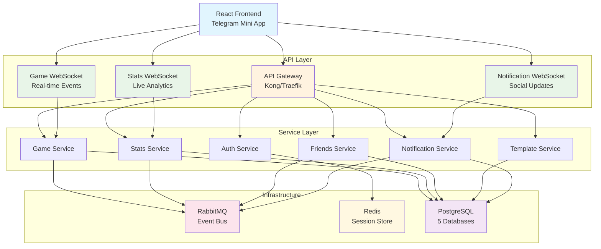

# Проектирование API с учетом всех типов игр

🎨🎨🎨 **ENTERING CREATIVE PHASE: API DESIGN** 🎨🎨🎨

## Описание компонента

API система для управления всеми аспектами бильярдных игр в рамках микросервисной архитектуры. API должен обеспечивать полнофункциональное взаимодействие между 6 микросервисами, поддерживать real-time обновления через WebSocket, реализовать сложную бизнес-логику игры "Колхоз" и обеспечить seamless интеграцию с фронтендом.

## Требования и ограничения

### Функциональные требования:
- **Игровая логика**: Создание сессий, управление играми, real-time события (забитые шары, фолы)
- **Система шаблонов**: CRUD операции для шаблонов игр с валидацией Pydantic
- **Аутентификация**: JWT через Telegram Mini Apps API
- **Real-time**: WebSocket для live обновлений состояния игры
- **Статистика**: Персональная и глобальная аналитика игроков
- **Социальные функции**: Система друзей, приглашения, уведомления
- **Сложные расчеты**: Логика "Колхоз" с платежами между игроками

### Технические ограничения:
- **Микросервисы**: 6 независимых сервисов (Auth, Game, Stats, Friends, Template, Notification)
- **База данных**: Database-per-service pattern (PostgreSQL)
- **Messaging**: RabbitMQ для межсервисного взаимодействия
- **Производительность**: < 100ms response time для критических операций
- **Масштабируемость**: Поддержка до 1000 одновременных игровых сессий
- **Совместимость**: Telegram Mini Apps, мобильные браузеры

### Бизнес-ограничения:
- **Валюта**: Работа с рублями (точность до копеек)
- **Ролевая система**: Создатель/участник сессии с разными правами
- **Игровые правила**: Поддержка "Колхоз", "Американка", "Московская пирамида"
- **Очередность**: 3 алгоритма (Always Random, Random No Repeat, Manual)

## Варианты архитектуры API

### Вариант 1: Монолитный API Gateway

**Описание**: Единый API Gateway который агрегирует все запросы и направляет их в соответствующие микросервисы.

**Архитектура**:
```
Frontend → API Gateway → [Auth|Game|Stats|Friends|Template|Notification] Services
                ↓
           RabbitMQ Events
```

**Преимущества**:
- Единая точка входа для фронтенда
- Централизованная аутентификация и авторизация
- Простая маршрутизация запросов
- Единая схема версионирования API
- Централизованное логирование и мониторинг

**Недостатки**:
- Потенциальная точка отказа (Single Point of Failure)
- Сложность масштабирования Gateway при высокой нагрузке
- Риск создания "мини-монолита" в Gateway
- Задержки при проксировании запросов

### Вариант 2: Децентрализованный BFF (Backend for Frontend)

**Описание**: Каждый домен имеет свой специализированный API endpoint, оптимизированный под конкретные потребности фронтенда.

**Архитектура**:
```
Frontend → [Game API | Auth API | Stats API | Social API] → Microservices
                              ↓
                        RabbitMQ Events
```

**Преимущества**:
- Оптимизация под конкретные use cases фронтенда
- Независимое развитие и деплой каждого API
- Отсутствие единой точки отказа
- Высокая производительность (нет лишних proxy слоев)

**Недостатки**:
- Сложность управления множественными endpoint'ами
- Дублирование логики аутентификации
- Сложность версионирования и backward compatibility
- Усложнение клиентского кода (множественные базовые URL)

### Вариант 3: Гибридная архитектура (API Gateway + Service-Specific Endpoints)

**Описание**: Комбинация Gateway для общих операций (auth, routing) и прямых endpoint'ов для performance-critical операций.

**Архитектура**:
```
Frontend → API Gateway (Auth, Routing, Rate Limiting)
    ↓
[Common API] + [Game WebSocket] + [Stats Stream] + [Notifications WS]
    ↓
Microservices + RabbitMQ Events
```

**Преимущества**:
- Баланс между централизацией и производительностью
- Гибкость в выборе архитектуры для разных типов операций
- Централизованные security concerns
- Оптимизация критических путей (real-time игры)

**Недостатки**:
- Сложность архитектуры и поддержки
- Необходимость четкого разделения ответственности
- Потенциальная путаница в routing логике

## Анализ вариантов

### Критерии оценки:
1. **Производительность** - скорость ответа для критических операций
2. **Масштабируемость** - способность обрабатывать растущую нагрузку
3. **Сложность разработки** - простота implementation и maintenance
4. **Fault tolerance** - устойчивость к отказам
5. **Developer Experience** - удобство разработки фронтенда

### Оценка вариантов:

| Критерий | Монолитный Gateway | Децентрализованный BFF | Гибридная архитектура |
|----------|-------------------|------------------------|----------------------|
| **Производительность** | ⭐⭐⭐ | ⭐⭐⭐⭐⭐ | ⭐⭐⭐⭐ |
| **Масштабируемость** | ⭐⭐ | ⭐⭐⭐⭐⭐ | ⭐⭐⭐⭐ |
| **Сложность разработки** | ⭐⭐⭐⭐⭐ | ⭐⭐ | ⭐⭐⭐ |
| **Fault tolerance** | ⭐⭐ | ⭐⭐⭐⭐⭐ | ⭐⭐⭐⭐ |
| **Developer Experience** | ⭐⭐⭐⭐⭐ | ⭐⭐ | ⭐⭐⭐⭐ |

## Рекомендуемое решение

### **Выбор: Гибридная архитектура (Вариант 3)**

**Обоснование**:
1. **Telegram Mini Apps требования**: Нужен быстрый WebSocket для real-time игр
2. **Бизнес критичность**: Игровые события должны обрабатываться < 50ms
3. **Баланс сложности**: Достаточно гибкая, но не overcomplicated
4. **Масштабируемость**: Можем масштабировать критические компоненты независимо

### Архитектурное решение:



## Implementation Guidelines

### 1. API Gateway Configuration

**Technology Stack**: Kong Gateway или Traefik
**Responsibilities**:
- Authentication middleware (JWT validation)
- Rate limiting (100 requests/minute per user)
- Request/Response logging
- CORS handling for Telegram Mini Apps
- API versioning (/api/v1/)
- Health checks aggregation

**Configuration example**:
```yaml
# kong.yml
_format_version: "3.0"
services:
- name: auth-service
  url: http://auth-service:8001
  routes:
  - name: auth-routes
    paths: ["/api/v1/auth"]
    
- name: game-service
  url: http://game-service:8002
  routes:
  - name: game-routes
    paths: ["/api/v1/games", "/api/v1/sessions"]

plugins:
- name: jwt
  config:
    secret_is_base64: false
    key_claim_name: "iss"
- name: rate-limiting
  config:
    minute: 100
    policy: "local"
```

### 2. REST API Design

**URL Structure**:
```
/api/v1/auth/*          → Auth Service
/api/v1/games/*         → Game Service  
/api/v1/sessions/*      → Game Service
/api/v1/templates/*     → Template Service
/api/v1/stats/*         → Stats Service
/api/v1/friends/*       → Friends Service
/api/v1/notifications/* → Notification Service
```

**HTTP Status Codes**:
- 200: Success
- 201: Created
- 204: No Content
- 400: Bad Request (validation errors)
- 401: Unauthorized
- 403: Forbidden (insufficient permissions)
- 404: Not Found
- 409: Conflict (business logic violations)
- 422: Unprocessable Entity (Pydantic validation)
- 429: Too Many Requests
- 500: Internal Server Error

### 3. WebSocket Architecture

**Real-time Endpoints**:
```
ws://api.domain.com/ws/games/{session_id}      → Game events
ws://api.domain.com/ws/stats/{user_id}         → Personal stats updates
ws://api.domain.com/ws/notifications/{user_id} → Social notifications
```

**Message Format**:
```json
{
    "type": "game_event" | "stats_update" | "notification",
    "timestamp": "2024-01-20T15:30:00Z",
    "session_id": "uuid",
    "user_id": "uuid", 
    "data": {
        // Event-specific payload
    }
}
```

### 4. Pydantic Schemas

**Base Response Schema**:
```python
from pydantic import BaseModel, Field
from typing import Optional, Any
from datetime import datetime

class APIResponse(BaseModel):
    """Базовая схема ответа API"""
    success: bool = True
    message: Optional[str] = None
    data: Optional[Any] = None
    timestamp: datetime = Field(default_factory=datetime.utcnow)
    request_id: Optional[str] = None

class APIError(BaseModel):
    """Схема ошибки API"""
    success: bool = False
    error_code: str
    message: str
    details: Optional[dict] = None
    timestamp: datetime = Field(default_factory=datetime.utcnow)
    request_id: Optional[str] = None
```

### 5. Service Communication via RabbitMQ

**Event Types**:
```python
class GameEventType(Enum):
    GAME_STARTED = "game_started"
    BALL_POTTED = "ball_potted"
    FOUL_COMMITTED = "foul_committed"
    GAME_ENDED = "game_ended"
    SESSION_COMPLETED = "session_completed"

class StatsEventType(Enum):
    STATS_UPDATED = "stats_updated"
    LEADERBOARD_CHANGED = "leaderboard_changed"

class SocialEventType(Enum):
    FRIEND_REQUEST = "friend_request"
    INVITATION_SENT = "invitation_sent"
    NOTIFICATION_CREATED = "notification_created"
```

**RabbitMQ Message Format**:
```json
{
    "event_type": "ball_potted",
    "event_id": "uuid",
    "timestamp": "2024-01-20T15:30:00Z",
    "source_service": "game_service",
    "correlation_id": "uuid",
    "payload": {
        "session_id": "uuid",
        "game_id": "uuid", 
        "player_id": "uuid",
        "ball_color": "red",
        "ball_points": 4,
        "total_score": 12
    }
}
```

### 6. Error Handling Strategy

**Global Exception Handler**:
```python
from fastapi import FastAPI, HTTPException, Request
from fastapi.responses import JSONResponse
import logging

app = FastAPI()

@app.exception_handler(HTTPException)
async def http_exception_handler(request: Request, exc: HTTPException):
    return JSONResponse(
        status_code=exc.status_code,
        content=APIError(
            error_code=f"HTTP_{exc.status_code}",
            message=exc.detail,
            request_id=request.headers.get("X-Request-ID")
        ).dict()
    )

@app.exception_handler(ValidationError)
async def validation_exception_handler(request: Request, exc: ValidationError):
    return JSONResponse(
        status_code=422,
        content=APIError(
            error_code="VALIDATION_ERROR",
            message="Request validation failed",
            details=exc.errors(),
            request_id=request.headers.get("X-Request-ID")
        ).dict()
    )
```

### 7. Authentication Flow

**JWT Token Structure**:
```python
{
    "sub": "user_uuid",           # User ID
    "iss": "artel_billiards",     # Issuer
    "aud": "telegram_mini_app",   # Audience
    "exp": 1642684800,            # Expiration
    "iat": 1642681200,            # Issued at
    "telegram_id": "123456789",   # Telegram User ID
    "username": "john_doe",       # Telegram Username
    "permissions": ["user", "session_creator"]
}
```

**Middleware Implementation**:
```python
from fastapi import Depends, HTTPException, status
from fastapi.security import HTTPBearer
import jwt

security = HTTPBearer()

async def get_current_user(token: str = Depends(security)) -> User:
    try:
        payload = jwt.decode(token.credentials, SECRET_KEY, algorithms=["HS256"])
        user_id = payload.get("sub")
        if not user_id:
            raise HTTPException(status_code=401, detail="Invalid token")
        
        # Проверяем пользователя в Auth Service
        user = await auth_service.get_user_by_id(user_id)
        if not user:
            raise HTTPException(status_code=401, detail="User not found")
            
        return user
    except jwt.ExpiredSignatureError:
        raise HTTPException(status_code=401, detail="Token expired")
    except jwt.JWTError:
        raise HTTPException(status_code=401, detail="Invalid token")
```

## Verification Checkpoint

### API Design Verification:

✅ **Архитектурные решения**:
- Гибридная архитектура выбрана и обоснована
- API Gateway для общих операций
- Прямые WebSocket для real-time критичных операций
- Четкое разделение ответственности между сервисами

✅ **Производительность**:
- WebSocket для real-time событий (< 50ms latency)
- Прямое подключение к критичным сервисам
- Кэширование через Redis для auth данных
- Асинхронные операции через RabbitMQ

✅ **Масштабируемость**:
- Независимое масштабирование каждого компонента
- Stateless архитектура для horizontal scaling
- Event-driven communication между сервисами

✅ **Developer Experience**:
- Единая точка входа через API Gateway
- Консистентная схема ответов (Pydantic)
- Автоматическая документация (OpenAPI)
- Четкий error handling

✅ **Безопасность**:
- JWT аутентификация через Telegram
- Rate limiting на Gateway уровне
- Валидация входных данных через Pydantic
- CORS настройки для Telegram Mini Apps

## Детальная спецификация API Endpoints

### Auth Service API (`/api/v1/auth`)

```python
# Telegram Auth
POST   /auth/telegram          # Аутентификация через Telegram Mini Apps
POST   /auth/refresh           # Обновление JWT токена
POST   /auth/logout            # Logout пользователя
GET    /auth/me                # Получение информации о текущем пользователе
PUT    /auth/me                # Обновление профиля пользователя

# User Management
GET    /users/{user_id}        # Получение публичного профиля пользователя
GET    /users/search           # Поиск пользователей по username/имени
```

**Pydantic Schemas**:
```python
class TelegramAuthRequest(BaseModel):
    telegram_user_id: int
    username: Optional[str]
    first_name: str
    last_name: Optional[str]
    auth_date: int
    hash: str  # Telegram signature

class AuthResponse(BaseModel):
    access_token: str
    refresh_token: str
    token_type: str = "bearer"
    expires_in: int
    user: UserProfile

class UserProfile(BaseModel):
    id: UUID
    telegram_user_id: int
    username: Optional[str]
    display_name: str
    avatar_url: Optional[str]
    created_at: datetime
    is_verified: bool
```

### Game Service API (`/api/v1/games`, `/api/v1/sessions`)

```python
# Session Management
POST   /sessions               # Создание новой игровой сессии
GET    /sessions               # Список сессий пользователя
GET    /sessions/{session_id}  # Детали конкретной сессии
PUT    /sessions/{session_id}  # Обновление настроек сессии
DELETE /sessions/{session_id}  # Удаление сессии
POST   /sessions/{session_id}/join     # Присоединение к сессии
POST   /sessions/{session_id}/leave    # Покидание сессии
POST   /sessions/{session_id}/invite   # Приглашение игрока

# Game Management
POST   /sessions/{session_id}/games           # Создание новой игры в сессии
GET    /sessions/{session_id}/games           # Список игр в сессии
GET    /games/{game_id}                       # Детали конкретной игры
POST   /games/{game_id}/start                 # Начало игры
POST   /games/{game_id}/end                   # Завершение игры
POST   /games/{game_id}/events                # Добавление игрового события
GET    /games/{game_id}/events                # История событий игры
GET    /games/{game_id}/scores                # Текущие счета игры

# Queue Management
POST   /sessions/{session_id}/games/{game_number}/queue        # Генерация очередности
PUT    /sessions/{session_id}/games/{game_number}/queue/manual # Ручная настройка очередности
GET    /sessions/{session_id}/queue/analytics                  # Аналитика справедливости
```

**Pydantic Schemas**:
```python
class CreateSessionRequest(BaseModel):
    name: str = Field(min_length=1, max_length=100)
    template_id: UUID
    max_participants: int = Field(ge=2, le=8)
    is_private: bool = False
    description: Optional[str] = Field(max_length=500)

class SessionResponse(BaseModel):
    id: UUID
    name: str
    creator: UserProfile
    template: GameTemplateInfo
    participants: List[SessionParticipant]
    status: SessionStatus
    current_game_number: int
    created_at: datetime
    settings: dict

class GameEventRequest(BaseModel):
    event_type: GameEventType
    player_id: UUID
    details: dict  # Зависит от типа события
    timestamp: datetime = Field(default_factory=datetime.utcnow)

class KolkhozBallPottedEvent(BaseModel):
    ball_color: str
    ball_points: int
    position_x: Optional[float]  # Для аналитики
    position_y: Optional[float]
```

### Template Service API (`/api/v1/templates`)

```python
# Template CRUD
GET    /templates              # Список доступных шаблонов
POST   /templates              # Создание пользовательского шаблона
GET    /templates/{template_id}  # Детали шаблона
PUT    /templates/{template_id}  # Обновление шаблона
DELETE /templates/{template_id}  # Удаление шаблона

# Template Categories
GET    /templates/categories   # Список категорий шаблонов
GET    /templates/categories/{category_id}/templates  # Шаблоны в категории

# Template Validation
POST   /templates/validate     # Валидация шаблона перед созданием
```

### Stats Service API (`/api/v1/stats`)

```python
# Personal Statistics
GET    /stats/users/{user_id}               # Общая статистика игрока
GET    /stats/users/{user_id}/games         # История игр
GET    /stats/users/{user_id}/sessions      # История сессий
GET    /stats/users/{user_id}/achievements  # Достижения игрока

# Game Statistics
GET    /stats/games/{game_id}              # Статистика конкретной игры
GET    /stats/sessions/{session_id}        # Статистика сессии

# Global Statistics
GET    /stats/leaderboard                  # Глобальный рейтинг
GET    /stats/leaderboard/weekly           # Еженедельный рейтинг
GET    /stats/trends                       # Тренды и аналитика
```

### Friends Service API (`/api/v1/friends`)

```python
# Friends Management
GET    /friends                    # Список друзей
POST   /friends/requests           # Отправка заявки в друзья
GET    /friends/requests           # Входящие заявки
PUT    /friends/requests/{request_id}/accept   # Принятие заявки
PUT    /friends/requests/{request_id}/decline  # Отклонение заявки
DELETE /friends/{friend_id}        # Удаление из друзей

# Social Features
GET    /friends/{friend_id}/stats  # Статистика друга
POST   /friends/{friend_id}/invite # Приглашение друга в игру
```

### Notification Service API (`/api/v1/notifications`)

```python
# Notifications
GET    /notifications              # Список уведомлений пользователя
PUT    /notifications/{notification_id}/read  # Отметка как прочитанное
DELETE /notifications/{notification_id}       # Удаление уведомления
POST   /notifications/mark-all-read           # Отметить все как прочитанные

# Push Settings
GET    /notifications/settings     # Настройки уведомлений
PUT    /notifications/settings     # Обновление настроек
```

## WebSocket Events Specification

### Game Events (`ws://api.domain.com/ws/games/{session_id}`)

```python
class GameWebSocketMessage(BaseModel):
    type: GameEventType
    session_id: UUID
    game_id: Optional[UUID]
    timestamp: datetime
    data: dict

# Типы событий:
class GameEventType(Enum):
    # Управление игрой
    GAME_STARTED = "game_started"
    GAME_ENDED = "game_ended"
    GAME_PAUSED = "game_paused"
    GAME_RESUMED = "game_resumed"
    
    # Игровые события
    BALL_POTTED = "ball_potted"
    FOUL_COMMITTED = "foul_committed"
    TURN_CHANGED = "turn_changed"
    SCORE_UPDATED = "score_updated"
    
    # Сессионные события  
    PLAYER_JOINED = "player_joined"
    PLAYER_LEFT = "player_left"
    QUEUE_UPDATED = "queue_updated"
    SETTINGS_CHANGED = "settings_changed"
```

**Примеры сообщений**:
```json
{
    "type": "ball_potted",
    "session_id": "session-uuid",
    "game_id": "game-uuid",
    "timestamp": "2024-01-20T15:30:00Z",
    "data": {
        "player_id": "player-uuid",
        "player_name": "Игрок 1",
        "ball_color": "red",
        "ball_points": 4,
        "total_score": 12,
        "position": 1
    }
}

{
    "type": "score_updated",
    "session_id": "session-uuid", 
    "game_id": "game-uuid",
    "timestamp": "2024-01-20T15:30:05Z",
    "data": {
        "scores": [
            {"player_id": "uuid1", "player_name": "Игрок 1", "score": 12},
            {"player_id": "uuid2", "player_name": "Игрок 2", "score": 8}
        ],
        "current_player_id": "uuid2"
    }
}
```

### Stats Events (`ws://api.domain.com/ws/stats/{user_id}`)

```json
{
    "type": "stats_updated",
    "user_id": "user-uuid",
    "timestamp": "2024-01-20T15:30:00Z",
    "data": {
        "total_games": 147,
        "total_wins": 89,
        "win_rate": 60.5,
        "total_earnings": 2350.50,
        "rank_change": +2,
        "new_achievements": ["first_win", "kolkhoz_master"]
    }
}
```

### Notification Events (`ws://api.domain.com/ws/notifications/{user_id}`)

```json
{
    "type": "notification_created",
    "user_id": "user-uuid", 
    "timestamp": "2024-01-20T15:30:00Z",
    "data": {
        "notification_id": "notif-uuid",
        "title": "Приглашение в игру",
        "message": "Игрок 1 приглашает вас в игру 'Колхоз Вечерний'",
        "category": "game_invitation",
        "action_url": "/sessions/session-uuid",
        "expires_at": "2024-01-20T16:30:00Z"
    }
}
```

## RabbitMQ Event Schemas

### Inter-Service Communication

```python
class GameCompletedEvent(BaseModel):
    """Событие завершения игры для обновления статистики"""
    event_type: str = "game_completed"
    event_id: UUID = Field(default_factory=uuid4)
    timestamp: datetime = Field(default_factory=datetime.utcnow)
    source_service: str = "game_service"
    
    # Payload
    game_id: UUID
    session_id: UUID
    template_id: UUID
    participants: List[GameParticipantResult]
    duration_seconds: int
    game_number: int

class GameParticipantResult(BaseModel):
    user_id: UUID
    final_score: int
    balls_potted: int
    rubles_earned: Decimal
    rubles_paid: Decimal
    net_result: Decimal
    position: int  # 1=winner, 2=second, etc.

class StatsUpdateEvent(BaseModel):
    """Событие обновления статистики для уведомлений"""
    event_type: str = "stats_updated"
    event_id: UUID = Field(default_factory=uuid4)
    timestamp: datetime = Field(default_factory=datetime.utcnow)
    source_service: str = "stats_service"
    
    # Payload
    user_id: UUID
    stats_changes: dict
    new_achievements: List[str]
    rank_change: Optional[int]
```

## Error Codes Dictionary

```python
class APIErrorCodes:
    # General (1000-1999)
    VALIDATION_ERROR = "1001"
    AUTHENTICATION_ERROR = "1002"
    AUTHORIZATION_ERROR = "1003"
    NOT_FOUND = "1004"
    CONFLICT = "1005"
    RATE_LIMIT_EXCEEDED = "1006"
    
    # Auth Service (2000-2999)
    INVALID_TELEGRAM_SIGNATURE = "2001"
    USER_NOT_FOUND = "2002"
    TOKEN_EXPIRED = "2003"
    REFRESH_TOKEN_INVALID = "2004"
    
    # Game Service (3000-3999)
    SESSION_NOT_FOUND = "3001"
    SESSION_FULL = "3002"
    SESSION_ALREADY_STARTED = "3003"
    GAME_NOT_ACTIVE = "3004"
    INVALID_PLAYER_TURN = "3005"
    INVALID_GAME_EVENT = "3006"
    TEMPLATE_NOT_FOUND = "3007"
    INSUFFICIENT_PERMISSIONS = "3008"
    
    # Template Service (4000-4999)
    TEMPLATE_VALIDATION_ERROR = "4001"
    TEMPLATE_NOT_EDITABLE = "4002"
    CATEGORY_NOT_FOUND = "4003"
    
    # Stats Service (5000-5999)
    STATS_NOT_AVAILABLE = "5001"
    STATS_CALCULATION_ERROR = "5002"
    
    # Friends Service (6000-6999)
    FRIEND_REQUEST_EXISTS = "6001"
    ALREADY_FRIENDS = "6002"
    CANNOT_FRIEND_YOURSELF = "6003"
    FRIEND_REQUEST_NOT_FOUND = "6004"
    
    # Notification Service (7000-7999)
    NOTIFICATION_NOT_FOUND = "7001"
    PUSH_DELIVERY_FAILED = "7002"
```

🎨🎨🎨 **EXITING CREATIVE PHASE: API DESIGN** 🎨🎨🎨