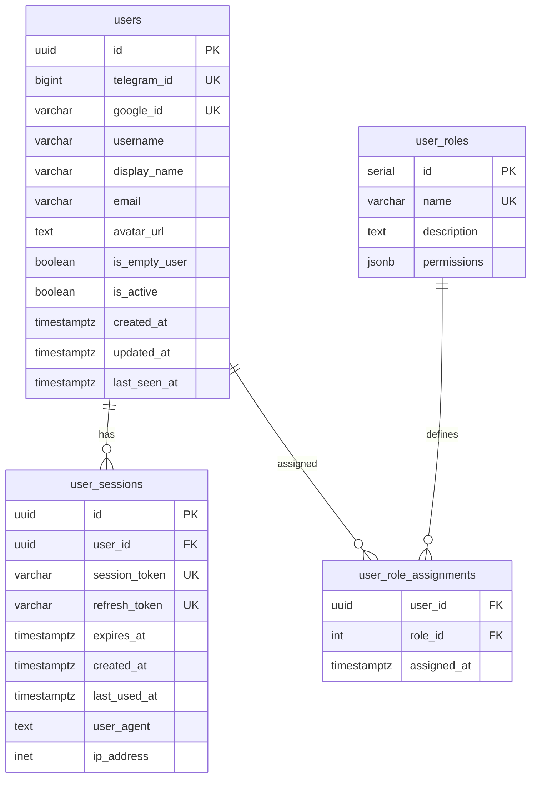
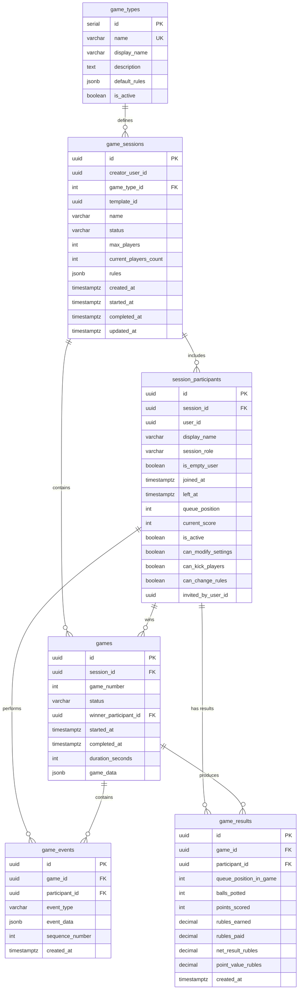
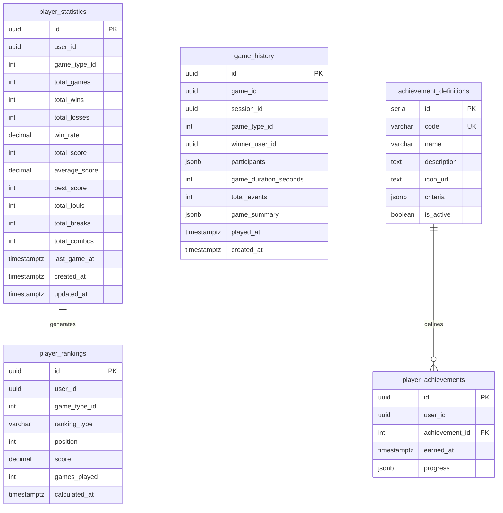
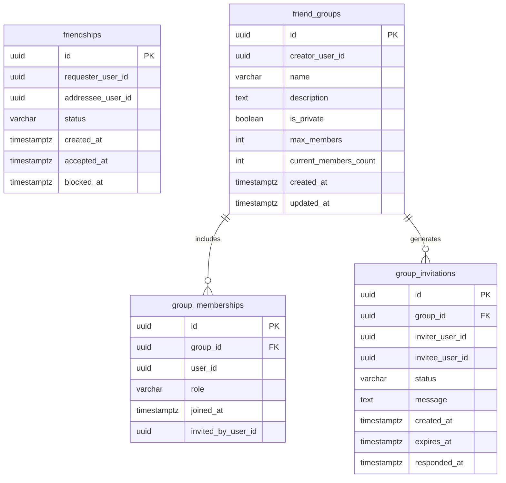
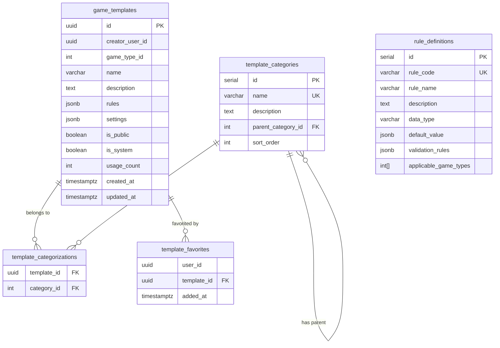
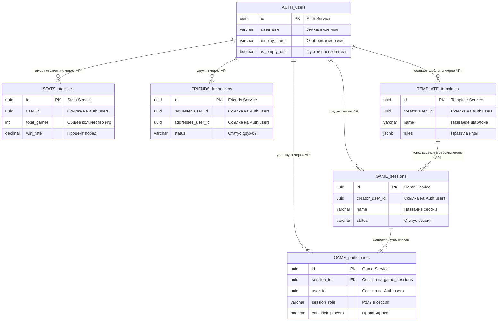
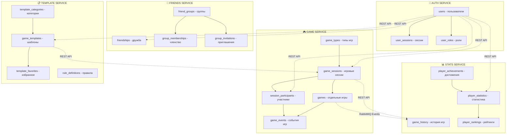
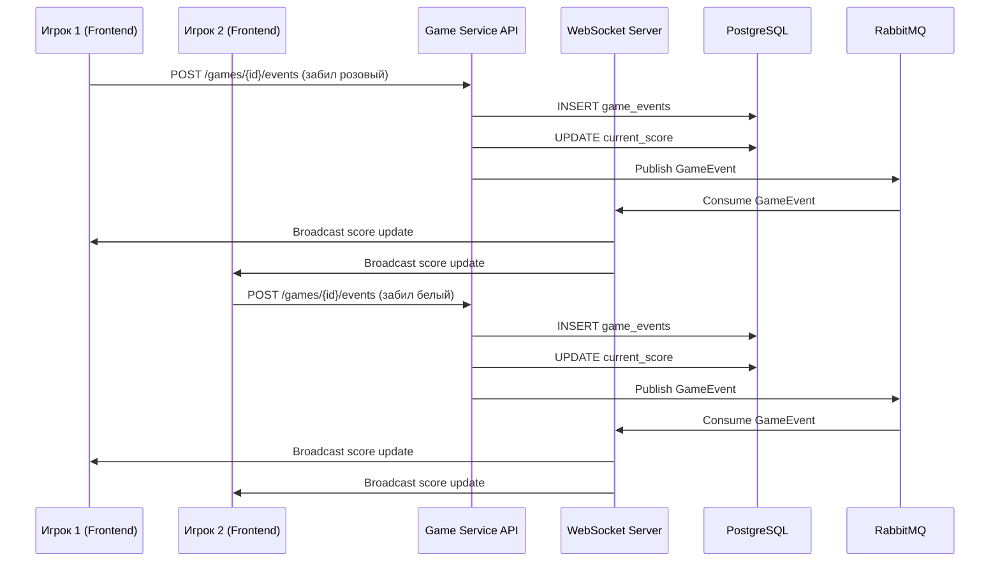

# Проектирование базы данных Artel Billiards

##  ENTERING CREATIVE PHASE: DATABASE DESIGN

## Описание компонента
В данном документе описывается структура базы данных для приложения Artel Billiards, включая основные сущности, их атрибуты и связи между ними.

## Требования и ограничения
- База данных должна поддерживать все функции, описанные в требованиях проекта
- Необходима поддержка различных типов игр (Американка, Московская, Колхоз)
- Система должна хранить историю игр и сессий для статистики
- Необходима поддержка "пустых пользователей" для игроков без приложения
- Структура должна быть оптимизирована для быстрого доступа к данным текущих игр
- **Микросервисная архитектура**: Database-per-service паттерн (6 независимых БД)
- **Технология**: PostgreSQL для всех сервисов
- **Совместимость**: Поддержка Alembic миграций

## 🎨 CREATIVE CHECKPOINT: Анализ требований завершен

## Анализ вариантов архитектуры данных

### Вариант 1: Единая монолитная база данных
**Описание**: Все данные в одной PostgreSQL базе с разными схемами.

**Плюсы**:
- Простота настройки и управления
- ACID транзакции между всеми сущностями
- Единые миграции
- Простые JOIN операции между сущностями

**Минусы**:
- Не соответствует микросервисной архитектуре
- Единая точка отказа
- Сложности масштабирования
- Связанность данных между сервисами

**Сложность**: Низкая
**Время реализации**: 2-3 дня

### Вариант 2: Database-per-service (РЕКОМЕНДУЕМЫЙ)
**Описание**: Отдельная PostgreSQL база для каждого микросервиса.

**Плюсы**:
- Полное соответствие микросервисной архитектуре
- Независимое масштабирование каждой БД
- Изоляция отказов
- Гибкость в выборе схем и оптимизации
- Независимые миграции

**Минусы**:
- Сложность управления множественными БД
- Отсутствие ACID транзакций между сервисами  
- Необходимость eventual consistency
- Дублирование некоторых данных

**Сложность**: Высокая
**Время реализации**: 5-7 дней

### Вариант 3: Гибридный подход
**Описание**: Общие справочники в shared DB + специализированные БД.

**Плюсы**:
- Баланс между простотой и гибкостью
- Общие справочники в одном месте
- Частичная изоляция сервисов

**Минусы**:
- Частичная связанность
- Сложность определения границ shared/separate
- Компромиссное решение

**Сложность**: Средняя  
**Время реализации**: 4-5 дней

## Принятое решение

**Выбранный вариант: Database-per-service (Вариант 2)**

### Обоснование выбора

1. **Соответствие архитектуре**: Полностью поддерживает принятую микросервисную архитектуру
2. **Независимость сервисов**: Каждый сервис владеет своими данными
3. **Масштабируемость**: Возможность независимого масштабирования БД
4. **Отказоустойчивость**: Сбой одной БД не влияет на другие сервисы
5. **Будущее развитие**: Легче добавлять новые сервисы и функции

## Детальное проектирование баз данных

### 1. Auth Service Database (`auth_db`)

**Назначение**: Управление пользователями, аутентификация, авторизация

#### Таблицы:

**users** - Основная таблица пользователей
```sql
CREATE TABLE users (
    id UUID PRIMARY KEY DEFAULT gen_random_uuid(),
    telegram_id BIGINT UNIQUE,
    google_id VARCHAR(255) UNIQUE,
    username VARCHAR(100) NOT NULL,
    display_name VARCHAR(255) NOT NULL,
    email VARCHAR(255),
    avatar_url TEXT,
    is_empty_user BOOLEAN DEFAULT FALSE,
    is_active BOOLEAN DEFAULT TRUE,
    created_at TIMESTAMP WITH TIME ZONE DEFAULT NOW(),
    updated_at TIMESTAMP WITH TIME ZONE DEFAULT NOW(),
    last_seen_at TIMESTAMP WITH TIME ZONE
);
```

**user_sessions** - Активные сессии пользователей
```sql
CREATE TABLE user_sessions (
    id UUID PRIMARY KEY DEFAULT gen_random_uuid(),
    user_id UUID NOT NULL REFERENCES users(id) ON DELETE CASCADE,
    session_token VARCHAR(255) UNIQUE NOT NULL,
    refresh_token VARCHAR(255) UNIQUE,
    expires_at TIMESTAMP WITH TIME ZONE NOT NULL,
    created_at TIMESTAMP WITH TIME ZONE DEFAULT NOW(),
    last_used_at TIMESTAMP WITH TIME ZONE DEFAULT NOW(),
    user_agent TEXT,
    ip_address INET
);
```

**user_roles** - Роли пользователей (админ, модератор, обычный)
```sql
CREATE TABLE user_roles (
    id SERIAL PRIMARY KEY,
    name VARCHAR(50) UNIQUE NOT NULL,
    description TEXT,
    permissions JSONB
);

CREATE TABLE user_role_assignments (
    user_id UUID REFERENCES users(id) ON DELETE CASCADE,
    role_id INTEGER REFERENCES user_roles(id) ON DELETE CASCADE,
    assigned_at TIMESTAMP WITH TIME ZONE DEFAULT NOW(),
    PRIMARY KEY (user_id, role_id)
);
```

#### Индексы:
```sql
CREATE INDEX idx_users_telegram_id ON users(telegram_id);
CREATE INDEX idx_users_google_id ON users(google_id);
CREATE INDEX idx_users_username ON users(username);
CREATE INDEX idx_sessions_token ON user_sessions(session_token);
CREATE INDEX idx_sessions_user_expires ON user_sessions(user_id, expires_at);
```

#### ER-диаграмма Auth Service:


### 2. Game Service Database (`game_db`)

**Назначение**: Управление играми, сессиями, игровой логикой

#### Таблицы:

**game_types** - Типы игр (справочник)
```sql
CREATE TABLE game_types (
    id SERIAL PRIMARY KEY,
    name VARCHAR(100) UNIQUE NOT NULL, -- 'americana', 'moscow_pyramid', 'kolkhoz'
    display_name VARCHAR(255) NOT NULL,
    description TEXT,
    default_rules JSONB,
    is_active BOOLEAN DEFAULT TRUE
);
```

**game_sessions** - Игровые сессии
```sql
CREATE TABLE game_sessions (
    id UUID PRIMARY KEY DEFAULT gen_random_uuid(),
    creator_user_id UUID NOT NULL, -- Ссылка на Auth Service
    game_type_id INTEGER NOT NULL REFERENCES game_types(id),
    template_id UUID, -- Ссылка на Template Service
    name VARCHAR(255) NOT NULL,
    status VARCHAR(50) DEFAULT 'waiting', -- waiting, in_progress, completed, cancelled
    max_players INTEGER DEFAULT 8,
    current_players_count INTEGER DEFAULT 0,
    rules JSONB, -- Конкретные правила для сессии
    created_at TIMESTAMP WITH TIME ZONE DEFAULT NOW(),
    started_at TIMESTAMP WITH TIME ZONE,
    completed_at TIMESTAMP WITH TIME ZONE,
    updated_at TIMESTAMP WITH TIME ZONE DEFAULT NOW()
);
```

**session_participants** - Участники сессий
```sql
CREATE TABLE session_participants (
    id UUID PRIMARY KEY DEFAULT gen_random_uuid(),
    session_id UUID NOT NULL REFERENCES game_sessions(id) ON DELETE CASCADE,
    user_id UUID, -- NULL для пустых пользователей, иначе ссылка на Auth Service
    display_name VARCHAR(255) NOT NULL, -- Для пустых пользователей
    session_role VARCHAR(50) DEFAULT 'participant', -- 'creator', 'participant', 'spectator'
    is_empty_user BOOLEAN DEFAULT FALSE,
    joined_at TIMESTAMP WITH TIME ZONE DEFAULT NOW(),
    left_at TIMESTAMP WITH TIME ZONE,
    queue_position INTEGER,
    current_score INTEGER DEFAULT 0,
    is_active BOOLEAN DEFAULT TRUE,
    -- Права в сессии (опционально для гибкости)
    can_modify_settings BOOLEAN DEFAULT FALSE,
    can_kick_players BOOLEAN DEFAULT FALSE,
    can_change_rules BOOLEAN DEFAULT FALSE,
    invited_by_user_id UUID, -- Кто пригласил этого игрока
    -- Накопительный баланс для игры "Колхоз"
    session_balance_rubles DECIMAL(10,2) DEFAULT 0.00, -- Общий баланс по сессии
    total_games_played INTEGER DEFAULT 0, -- Количество сыгранных игр в сессии
    total_balls_potted INTEGER DEFAULT 0 -- Общее количество забитых шаров в сессии
);
```

**games** - Отдельные игры в рамках сессии
```sql
CREATE TABLE games (
    id UUID PRIMARY KEY DEFAULT gen_random_uuid(),
    session_id UUID NOT NULL REFERENCES game_sessions(id) ON DELETE CASCADE,
    game_number INTEGER NOT NULL, -- Порядковый номер игры в сессии
    status VARCHAR(50) DEFAULT 'in_progress', -- in_progress, completed, cancelled
    winner_participant_id UUID REFERENCES session_participants(id),
    started_at TIMESTAMP WITH TIME ZONE DEFAULT NOW(),
    completed_at TIMESTAMP WITH TIME ZONE,
    duration_seconds INTEGER,
    game_data JSONB -- Специфичные данные игры
);
```

**game_events** - События в играх (удары, фолы, etc.)
```sql
CREATE TABLE game_events (
    id UUID PRIMARY KEY DEFAULT gen_random_uuid(),
    game_id UUID NOT NULL REFERENCES games(id) ON DELETE CASCADE,
    participant_id UUID NOT NULL REFERENCES session_participants(id),
    event_type VARCHAR(100) NOT NULL, -- 'shot', 'foul', 'combo', 'break', etc.
    event_data JSONB, -- Детали события
    sequence_number INTEGER NOT NULL, -- Порядок событий
    created_at TIMESTAMP WITH TIME ZONE DEFAULT NOW()
);
```

**game_results** - Результаты игроков в каждой игре (для игры "Колхоз")
```sql
CREATE TABLE game_results (
    id UUID PRIMARY KEY DEFAULT gen_random_uuid(),
    game_id UUID NOT NULL REFERENCES games(id) ON DELETE CASCADE,
    participant_id UUID NOT NULL REFERENCES session_participants(id),
    queue_position_in_game INTEGER NOT NULL, -- Позиция в очереди в этой игре
    balls_potted INTEGER DEFAULT 0, -- Количество забитых шаров в игре
    points_scored INTEGER DEFAULT 0, -- Очки в игре (сумма стоимости шаров)
    rubles_earned DECIMAL(10,2) DEFAULT 0.00, -- Заработано рублей (от предыдущего игрока)
    rubles_paid DECIMAL(10,2) DEFAULT 0.00, -- Заплачено рублей (следующему игроку)
    net_result_rubles DECIMAL(10,2) DEFAULT 0.00, -- Чистый результат (earned - paid)
    point_value_rubles DECIMAL(5,2) NOT NULL, -- Стоимость одного очка в рублях (из шаблона)
    created_at TIMESTAMP WITH TIME ZONE DEFAULT NOW(),
    UNIQUE(game_id, participant_id)
);
```

#### Индексы:
```sql
CREATE INDEX idx_sessions_creator ON game_sessions(creator_user_id);
CREATE INDEX idx_sessions_status ON game_sessions(status);
CREATE INDEX idx_sessions_type ON game_sessions(game_type_id);
CREATE INDEX idx_participants_session ON session_participants(session_id);
CREATE INDEX idx_participants_user ON session_participants(user_id);
CREATE INDEX idx_participants_role ON session_participants(session_id, session_role);
CREATE INDEX idx_participants_invited_by ON session_participants(invited_by_user_id);
CREATE INDEX idx_games_session ON games(session_id);
CREATE INDEX idx_events_game ON game_events(game_id);
CREATE INDEX idx_events_sequence ON game_events(game_id, sequence_number);
CREATE INDEX idx_results_game ON game_results(game_id);
CREATE INDEX idx_results_participant ON game_results(participant_id);
CREATE INDEX idx_results_queue ON game_results(game_id, queue_position_in_game);
```

#### ER-диаграмма Game Service:


### 3. Stats Service Database (`stats_db`)

**Назначение**: Статистика, рейтинги, аналитика

#### Таблицы:

**player_statistics** - Общая статистика игроков
```sql
CREATE TABLE player_statistics (
    id UUID PRIMARY KEY DEFAULT gen_random_uuid(),
    user_id UUID NOT NULL, -- Ссылка на Auth Service
    game_type_id INTEGER NOT NULL,
    total_games INTEGER DEFAULT 0,
    total_wins INTEGER DEFAULT 0,
    total_losses INTEGER DEFAULT 0,
    win_rate DECIMAL(5,2) DEFAULT 0.00,
    total_score INTEGER DEFAULT 0,
    average_score DECIMAL(8,2) DEFAULT 0.00,
    best_score INTEGER DEFAULT 0,
    total_fouls INTEGER DEFAULT 0,
    total_breaks INTEGER DEFAULT 0,
    total_combos INTEGER DEFAULT 0,
    last_game_at TIMESTAMP WITH TIME ZONE,
    created_at TIMESTAMP WITH TIME ZONE DEFAULT NOW(),
    updated_at TIMESTAMP WITH TIME ZONE DEFAULT NOW(),
    UNIQUE(user_id, game_type_id)
);
```

**game_history** - История завершенных игр
```sql
CREATE TABLE game_history (
    id UUID PRIMARY KEY DEFAULT gen_random_uuid(),
    game_id UUID NOT NULL, -- Ссылка на Game Service
    session_id UUID NOT NULL, -- Ссылка на Game Service
    game_type_id INTEGER NOT NULL,
    winner_user_id UUID, -- Ссылка на Auth Service
    participants JSONB, -- Массив участников с их результатами
    game_duration_seconds INTEGER,
    total_events INTEGER,
    game_summary JSONB, -- Сводка игры
    played_at TIMESTAMP WITH TIME ZONE NOT NULL,
    created_at TIMESTAMP WITH TIME ZONE DEFAULT NOW()
);
```

**player_rankings** - Рейтинги игроков
```sql
CREATE TABLE player_rankings (
    id UUID PRIMARY KEY DEFAULT gen_random_uuid(),
    user_id UUID NOT NULL, -- Ссылка на Auth Service
    game_type_id INTEGER NOT NULL,
    ranking_type VARCHAR(50) NOT NULL, -- 'global', 'monthly', 'weekly'
    position INTEGER NOT NULL,
    score DECIMAL(10,2) NOT NULL,
    games_played INTEGER DEFAULT 0,
    calculated_at TIMESTAMP WITH TIME ZONE DEFAULT NOW(),
    UNIQUE(user_id, game_type_id, ranking_type)
);
```

**achievement_definitions** - Определения достижений
```sql
CREATE TABLE achievement_definitions (
    id SERIAL PRIMARY KEY,
    code VARCHAR(100) UNIQUE NOT NULL,
    name VARCHAR(255) NOT NULL,
    description TEXT,
    icon_url TEXT,
    criteria JSONB, -- Критерии получения
    is_active BOOLEAN DEFAULT TRUE
);
```

**player_achievements** - Достижения игроков
```sql
CREATE TABLE player_achievements (
    id UUID PRIMARY KEY DEFAULT gen_random_uuid(),
    user_id UUID NOT NULL, -- Ссылка на Auth Service
    achievement_id INTEGER NOT NULL REFERENCES achievement_definitions(id),
    earned_at TIMESTAMP WITH TIME ZONE DEFAULT NOW(),
    progress JSONB, -- Прогресс к достижению
    UNIQUE(user_id, achievement_id)
);
```

#### Индексы:
```sql
CREATE INDEX idx_stats_user_type ON player_statistics(user_id, game_type_id);
CREATE INDEX idx_history_game ON game_history(game_id);
CREATE INDEX idx_history_winner ON game_history(winner_user_id);
CREATE INDEX idx_history_played_at ON game_history(played_at);
CREATE INDEX idx_rankings_type_pos ON player_rankings(game_type_id, ranking_type, position);
CREATE INDEX idx_achievements_user ON player_achievements(user_id);
```

#### ER-диаграмма Stats Service:


### 4. Friends Service Database (`friends_db`)

**Назначение**: Управление друзьями, группы, социальные связи

#### Таблицы:

**friendships** - Дружеские связи
```sql
CREATE TABLE friendships (
    id UUID PRIMARY KEY DEFAULT gen_random_uuid(),
    requester_user_id UUID NOT NULL, -- Ссылка на Auth Service
    addressee_user_id UUID NOT NULL, -- Ссылка на Auth Service
    status VARCHAR(50) DEFAULT 'pending', -- pending, accepted, blocked, declined
    created_at TIMESTAMP WITH TIME ZONE DEFAULT NOW(),
    accepted_at TIMESTAMP WITH TIME ZONE,
    blocked_at TIMESTAMP WITH TIME ZONE,
    CONSTRAINT no_self_friendship CHECK (requester_user_id != addressee_user_id),
    UNIQUE(requester_user_id, addressee_user_id)
);
```

**friend_groups** - Группы друзей
```sql
CREATE TABLE friend_groups (
    id UUID PRIMARY KEY DEFAULT gen_random_uuid(),
    creator_user_id UUID NOT NULL, -- Ссылка на Auth Service
    name VARCHAR(255) NOT NULL,
    description TEXT,
    is_private BOOLEAN DEFAULT FALSE,
    max_members INTEGER DEFAULT 50,
    current_members_count INTEGER DEFAULT 1,
    created_at TIMESTAMP WITH TIME ZONE DEFAULT NOW(),
    updated_at TIMESTAMP WITH TIME ZONE DEFAULT NOW()
);
```

**group_memberships** - Членство в группах
```sql
CREATE TABLE group_memberships (
    id UUID PRIMARY KEY DEFAULT gen_random_uuid(),
    group_id UUID NOT NULL REFERENCES friend_groups(id) ON DELETE CASCADE,
    user_id UUID NOT NULL, -- Ссылка на Auth Service
    role VARCHAR(50) DEFAULT 'member', -- admin, moderator, member
    joined_at TIMESTAMP WITH TIME ZONE DEFAULT NOW(),
    invited_by_user_id UUID, -- Ссылка на Auth Service
    UNIQUE(group_id, user_id)
);
```

**group_invitations** - Приглашения в группы
```sql
CREATE TABLE group_invitations (
    id UUID PRIMARY KEY DEFAULT gen_random_uuid(),
    group_id UUID NOT NULL REFERENCES friend_groups(id) ON DELETE CASCADE,
    inviter_user_id UUID NOT NULL, -- Ссылка на Auth Service
    invitee_user_id UUID NOT NULL, -- Ссылка на Auth Service
    status VARCHAR(50) DEFAULT 'pending', -- pending, accepted, declined, expired
    message TEXT,
    created_at TIMESTAMP WITH TIME ZONE DEFAULT NOW(),
    expires_at TIMESTAMP WITH TIME ZONE,
    responded_at TIMESTAMP WITH TIME ZONE
);
```

#### Индексы:
```sql
CREATE INDEX idx_friendships_requester ON friendships(requester_user_id);
CREATE INDEX idx_friendships_addressee ON friendships(addressee_user_id);
CREATE INDEX idx_friendships_status ON friendships(status);
CREATE INDEX idx_groups_creator ON friend_groups(creator_user_id);
CREATE INDEX idx_memberships_group ON group_memberships(group_id);
CREATE INDEX idx_memberships_user ON group_memberships(user_id);
CREATE INDEX idx_invitations_invitee ON group_invitations(invitee_user_id);
```

#### ER-диаграмма Friends Service:


### 5. Template Service Database (`template_db`)

**Назначение**: Шаблоны игр, правила, конфигурации

#### Таблицы:

**game_templates** - Шаблоны игр
```sql
CREATE TABLE game_templates (
    id UUID PRIMARY KEY DEFAULT gen_random_uuid(),
    creator_user_id UUID NOT NULL, -- Ссылка на Auth Service
    game_type_id INTEGER NOT NULL, -- Ссылка на справочник типов игр
    name VARCHAR(255) NOT NULL,
    description TEXT,
    rules JSONB NOT NULL, -- Правила игры
    settings JSONB, -- Дополнительные настройки
    is_public BOOLEAN DEFAULT FALSE,
    is_system BOOLEAN DEFAULT FALSE, -- Системные шаблоны
    usage_count INTEGER DEFAULT 0,
    created_at TIMESTAMP WITH TIME ZONE DEFAULT NOW(),
    updated_at TIMESTAMP WITH TIME ZONE DEFAULT NOW()
);
```

**template_categories** - Категории шаблонов
```sql
CREATE TABLE template_categories (
    id SERIAL PRIMARY KEY,
    name VARCHAR(100) UNIQUE NOT NULL,
    description TEXT,
    parent_category_id INTEGER REFERENCES template_categories(id),
    sort_order INTEGER DEFAULT 0
);
```

**template_categorizations** - Связь шаблонов с категориями
```sql
CREATE TABLE template_categorizations (
    template_id UUID REFERENCES game_templates(id) ON DELETE CASCADE,
    category_id INTEGER REFERENCES template_categories(id) ON DELETE CASCADE,
    PRIMARY KEY (template_id, category_id)
);
```

**template_favorites** - Избранные шаблоны пользователей
```sql
CREATE TABLE template_favorites (
    user_id UUID NOT NULL, -- Ссылка на Auth Service
    template_id UUID NOT NULL REFERENCES game_templates(id) ON DELETE CASCADE,
    added_at TIMESTAMP WITH TIME ZONE DEFAULT NOW(),
    PRIMARY KEY (user_id, template_id)
);
```

**rule_definitions** - Определения правил (справочник)
```sql
CREATE TABLE rule_definitions (
    id SERIAL PRIMARY KEY,
    rule_code VARCHAR(100) UNIQUE NOT NULL,
    rule_name VARCHAR(255) NOT NULL,
    description TEXT,
    data_type VARCHAR(50) NOT NULL, -- 'boolean', 'integer', 'string', 'select'
    default_value JSONB,
    validation_rules JSONB,
    applicable_game_types INTEGER[] -- Массив ID типов игр
);
```

#### Индексы:
```sql
CREATE INDEX idx_templates_creator ON game_templates(creator_user_id);
CREATE INDEX idx_templates_type ON game_templates(game_type_id);
CREATE INDEX idx_templates_public ON game_templates(is_public);
CREATE INDEX idx_templates_system ON game_templates(is_system);
CREATE INDEX idx_favorites_user ON template_favorites(user_id);
CREATE INDEX idx_categories_parent ON template_categories(parent_category_id);
```

#### ER-диаграмма Template Service:


## Обобщенная ER-диаграмма всех сервисов



## Схема межсервисного взаимодействия



## Управление ролями в игровых сессиях

### Типы ролей в сессиях

**🎮 Сессионные роли:**

1. **`creator` (Создатель сессии)**
   - Создал игровую сессию
   - Полные права управления сессией
   - Может приглашать/кикать игроков
   - Может изменять правила игры
   - Может завершить сессию

2. **`participant` (Участник)**
   - Приглашен в сессию или присоединился
   - Может играть в игры
   - Ограниченные права управления
   - Может покинуть сессию

3. **`spectator` (Наблюдатель)** - для будущих версий
   - Может наблюдать за игрой
   - Не может участвовать в играх
   - Минимальные права

### Логика назначения ролей

```sql
-- При создании сессии
INSERT INTO session_participants (
    session_id, user_id, display_name, session_role,
    can_modify_settings, can_kick_players, can_change_rules
) VALUES (
    session_id, creator_user_id, display_name, 'creator',
    TRUE, TRUE, TRUE
);

-- При приглашении игрока
INSERT INTO session_participants (
    session_id, user_id, display_name, session_role,
    can_modify_settings, can_kick_players, can_change_rules,
    invited_by_user_id
) VALUES (
    session_id, invited_user_id, display_name, 'participant',
    FALSE, FALSE, FALSE, inviter_user_id
);
```

### Примеры использования (ваш кейс)

**День 1: Игрок 1 создает сессию**
```sql
-- Игрок 1 создает сессию
INSERT INTO game_sessions (id, creator_user_id, name) 
VALUES ('session-1', 'user-1', 'Вечерняя игра');

-- Игрок 1 автоматически становится создателем
INSERT INTO session_participants 
VALUES ('part-1', 'session-1', 'user-1', 'Игрок 1', 'creator', FALSE, NOW(), NULL, 1, 0, TRUE, TRUE, TRUE, TRUE, NULL);

-- Игрок 1 приглашает Игрока 2
INSERT INTO session_participants 
VALUES ('part-2', 'session-1', 'user-2', 'Игрок 2', 'participant', FALSE, NOW(), NULL, 2, 0, TRUE, FALSE, FALSE, FALSE, 'user-1');

-- Игрок 1 приглашает Игрока 3
INSERT INTO session_participants 
VALUES ('part-3', 'session-1', 'user-3', 'Игрок 3', 'participant', FALSE, NOW(), NULL, 3, 0, TRUE, FALSE, FALSE, FALSE, 'user-1');
```

**День 2: Игрок 2 создает новую сессию**
```sql
-- Игрок 2 создает новую сессию
INSERT INTO game_sessions (id, creator_user_id, name) 
VALUES ('session-2', 'user-2', 'Дневная игра');

-- Игрок 2 теперь создатель новой сессии
INSERT INTO session_participants 
VALUES ('part-4', 'session-2', 'user-2', 'Игрок 2', 'creator', FALSE, NOW(), NULL, 1, 0, TRUE, TRUE, TRUE, TRUE, NULL);

-- Игрок 2 приглашает Игрока 1 (теперь он участник)
INSERT INTO session_participants 
VALUES ('part-5', 'session-2', 'user-1', 'Игрок 1', 'participant', FALSE, NOW(), NULL, 2, 0, TRUE, FALSE, FALSE, FALSE, 'user-2');

-- Игрок 2 приглашает Игрока 4
INSERT INTO session_participants 
VALUES ('part-6', 'session-2', 'user-4', 'Игрок 4', 'participant', FALSE, NOW(), NULL, 3, 0, TRUE, FALSE, FALSE, FALSE, 'user-2');
```

### API запросы для проверки прав

```sql
-- Проверить, является ли пользователь создателем сессии
SELECT session_role = 'creator' as is_creator
FROM session_participants 
WHERE session_id = ? AND user_id = ?;

-- Получить все права пользователя в сессии
SELECT session_role, can_modify_settings, can_kick_players, can_change_rules
FROM session_participants 
WHERE session_id = ? AND user_id = ?;

-- Получить список всех участников с ролями
SELECT sp.user_id, sp.display_name, sp.session_role, sp.joined_at,
       invited_by.display_name as invited_by_name
FROM session_participants sp
LEFT JOIN session_participants invited_by ON sp.invited_by_user_id = invited_by.user_id
WHERE sp.session_id = ?
ORDER BY sp.joined_at;
```

### Бизнес-правила

1. **Создатель сессии**:
   - Может кикать любого участника
   - Может изменять настройки игры
   - Может завершить сессию досрочно
   - Может передать права создателя другому игроку

2. **Участник**:
   - Может покинуть сессию самостоятельно
   - Может видеть настройки, но не менять их
   - Может предлагать изменения через чат

3. **Система безопасности**:
   - Нельзя кикнуть самого себя
   - Нельзя кикнуть создателя сессии
   - При выходе создателя - права передаются первому участнику

## Детальная схема фиксации игровых событий

### Структура событий в game_events

**Типы событий и их структура в `event_data` (JSONB):**

#### 1. Событие "Забитый шар" (`shot_made`)
```json
{
  "event_type": "shot_made",
  "ball_color": "pink",          // цвет шара
  "ball_value": 4,               // очки за шар
  "ball_number": 6,              // номер шара (если применимо)
  "shot_type": "normal",         // normal, combo, break, bank
  "table_position": {            // позиция на столе (опционально)
    "x": 150,
    "y": 200
  },
  "remaining_balls": ["yellow", "green", "brown", "blue", "black"], // оставшиеся шары
  "score_before": 0,             // очки до этого удара
  "score_after": 4,              // очки после удара
  "is_foul": false,              // был ли фол
  "continues_turn": true         // продолжает ли игрок ход
}
```

#### 2. Событие "Фол" (`foul`)
```json
{
  "event_type": "foul",
  "foul_type": "potted_white",   // potted_white, missed_target, touched_wrong
  "penalty_points": 4,           // штрафные очки (обычно = стоимости целевого шара)
  "target_ball": "pink",         // целевой шар
  "description": "Забил белый шар",
  "awarded_to_opponent": true,   // очки переходят сопернику
  "turn_ends": true              // ход переходит к сопернику
}
```

#### 3. Событие "Промах" (`miss`)
```json
{
  "event_type": "miss",
  "target_ball": "pink",
  "description": "Промахнулся по розовому",
  "turn_ends": true
}
```

#### 4. Событие "Начало игры" (`game_start`)
```json
{
  "event_type": "game_start",
  "starting_player": "participant_id",
  "initial_balls": ["red", "yellow", "green", "brown", "blue", "pink", "black"],
  "game_rules": {
    "game_type": "snooker",
    "max_score": 147
  }
}
```

#### 5. Событие "Конец игры" (`game_end`)
```json
{
  "event_type": "game_end",
  "winner": "participant_id",
  "final_scores": {
    "participant_1": 35,
    "participant_2": 12
  },
  "game_duration_seconds": 1245,
  "total_shots": 28,
  "reason": "all_balls_potted"  // all_balls_potted, forfeit, time_limit
}
```

### Пример фиксации вашего игрового сценария

**Ваш пример:**
1. Игрок 1 забил розовый (4 очка)
2. Игрок 2 забил белый (1 очко)  
3. Игрок 2 забил еще белый (1 очко)
4. Игрок 1 забил желтый (2 очка)

**Последовательность записей в game_events:**

```sql
-- Событие 1: Игрок 1 забивает розовый шар
INSERT INTO game_events (game_id, participant_id, event_type, event_data, sequence_number) 
VALUES (
  'game-uuid-1', 
  'participant-1-uuid', 
  'shot_made',
  '{
    "ball_color": "pink",
    "ball_value": 4,
    "score_before": 0,
    "score_after": 4,
    "continues_turn": true,
    "shot_type": "normal"
  }',
  1
);

-- Событие 2: Игрок 2 забивает белый шар  
INSERT INTO game_events (game_id, participant_id, event_type, event_data, sequence_number) 
VALUES (
  'game-uuid-1', 
  'participant-2-uuid', 
  'shot_made',
  '{
    "ball_color": "white",
    "ball_value": 1,
    "score_before": 0,
    "score_after": 1,
    "continues_turn": true,
    "shot_type": "normal"
  }',
  2
);

-- Событие 3: Игрок 2 забивает еще один белый шар
INSERT INTO game_events (game_id, participant_id, event_type, event_data, sequence_number) 
VALUES (
  'game-uuid-1', 
  'participant-2-uuid', 
  'shot_made',
  '{
    "ball_color": "white",
    "ball_value": 1,
    "score_before": 1,
    "score_after": 2,
    "continues_turn": true,
    "shot_type": "normal"
  }',
  3
);

-- Событие 4: Игрок 1 забивает желтый шар
INSERT INTO game_events (game_id, participant_id, event_type, event_data, sequence_number) 
VALUES (
  'game-uuid-1', 
  'participant-1-uuid', 
  'shot_made',
  '{
    "ball_color": "yellow",
    "ball_value": 2,
    "score_before": 4,
    "score_after": 6,
    "continues_turn": false,
    "shot_type": "normal"
  }',
  4
);
```

### Real-time обновление очков

**Обновление `current_score` в session_participants:**

```sql
-- После каждого события обновляем текущий счет
UPDATE session_participants 
SET current_score = (
  SELECT COALESCE(
    SUM((event_data->>'ball_value')::integer), 0
  )
  FROM game_events ge
  WHERE ge.participant_id = session_participants.id 
    AND ge.game_id = 'current-game-uuid'
    AND ge.event_type = 'shot_made'
)
WHERE session_id = 'current-session-uuid';
```

### WebSocket архитектура для real-time обновлений

**Поток данных:**



### Структура WebSocket сообщений

**Формат real-time обновления счета:**

```json
{
  "type": "score_update",
  "game_id": "game-uuid-1",
  "session_id": "session-uuid-1",
  "event_sequence": 4,
  "scores": {
    "participant-1-uuid": {
      "display_name": "Игрок 1",
      "current_score": 6,
      "last_shot": {
        "ball_color": "yellow", 
        "points": 2
      }
    },
    "participant-2-uuid": {
      "display_name": "Игрок 2", 
      "current_score": 2,
      "last_shot": {
        "ball_color": "white",
        "points": 1
      }
    }
  },
  "current_turn": "participant-2-uuid",
  "game_status": "in_progress",
  "timestamp": "2024-01-15T14:30:45Z"
}
```

### API эндпоинты для игровых событий

```python
# FastAPI эндпоинты для фиксации событий

@router.post("/games/{game_id}/events")
async def create_game_event(
    game_id: UUID,
    event: GameEventCreate,
    current_user: User = Depends(get_current_user)
):
    # 1. Валидация права на создание события
    participant = await get_participant(game_id, current_user.id)
    if not participant:
        raise HTTPException(404, "Участник не найден")
    
    # 2. Создание события
    db_event = await create_event(
        game_id=game_id,
        participant_id=participant.id,
        event_type=event.event_type,
        event_data=event.event_data
    )
    
    # 3. Обновление текущего счета
    if event.event_type == "shot_made":
        await update_participant_score(
            participant.id, 
            event.event_data["ball_value"]
        )
    
    # 4. Отправка в RabbitMQ для WebSocket broadcast
    await publish_game_event(GameEventMessage(
        game_id=game_id,
        session_id=participant.session_id,
        event=db_event,
        scores=await get_current_scores(game_id)
    ))
    
    return {"status": "success", "event_id": db_event.id}

@router.get("/games/{game_id}/current-scores")
async def get_current_scores(game_id: UUID):
    return await calculate_live_scores(game_id)
```

### Подсчет итоговых результатов

**При завершении игры:**

```sql
-- Подсчет финальных очков и определение победителя
WITH final_scores AS (
  SELECT 
    sp.id as participant_id,
    sp.user_id,
    sp.display_name,
    COALESCE(SUM((ge.event_data->>'ball_value')::integer), 0) as total_score
  FROM session_participants sp
  LEFT JOIN game_events ge ON ge.participant_id = sp.id 
    AND ge.game_id = ?
    AND ge.event_type = 'shot_made'
  WHERE sp.session_id = ?
  GROUP BY sp.id, sp.user_id, sp.display_name
),
winner AS (
  SELECT participant_id
  FROM final_scores
  ORDER BY total_score DESC
  LIMIT 1  
)
UPDATE games 
SET 
  status = 'completed',
  winner_participant_id = (SELECT participant_id FROM winner),
  completed_at = NOW(),
  duration_seconds = EXTRACT(EPOCH FROM (NOW() - started_at))::integer,
  game_data = (
    SELECT jsonb_build_object(
      'final_scores', jsonb_object_agg(display_name, total_score),
      'total_events', COUNT(ge.id)
    )
    FROM final_scores fs
    LEFT JOIN game_events ge ON ge.game_id = ?
  )
WHERE id = ?;
```

### Синхронизация с Stats Service

**События через RabbitMQ:**

```json
{
  "event_type": "GameCompleted",
  "data": {
    "game_id": "game-uuid-1",
    "session_id": "session-uuid-1", 
    "game_type_id": 1,
    "duration_seconds": 1245,
    "participants": [
      {
        "user_id": "user-1",
        "score": 6,
        "is_winner": true,
        "shots_made": 2,
        "fouls": 0
      },
      {
        "user_id": "user-2", 
        "score": 2,
        "is_winner": false,
        "shots_made": 2,
        "fouls": 0
      }
    ]
  }
}
```

## Логика расчетов для игры "Колхоз"

### Алгоритм расчета результатов

**Правило:** Каждый игрок получает от предыдущего игрока за свои забитые шары и платит следующему игроку за его забитые шары.

### Ваш пример с 2 игроками - Игра 1

**Исходные данные:**
- Игрок 1: забил розовый (4 очка) + желтый (2 очка) = 6 очков
- Игрок 2: забил желтый (2 очка) + белый (1 очко) = 3 очка  
- Стоимость очка: 50 рублей
- Очередность: Игрок 1 → Игрок 2

**SQL для подсчета результатов Игры 1:**
```sql
-- Подсчет забитых шаров и очков для каждого игрока
WITH game_stats AS (
  SELECT 
    ge.participant_id,
    sp.display_name,
    sp.queue_position,
    COUNT(*) as balls_potted,
    SUM((ge.event_data->>'ball_value')::integer) as points_scored
  FROM game_events ge
  JOIN session_participants sp ON ge.participant_id = sp.id
  WHERE ge.game_id = 'game-1-uuid' 
    AND ge.event_type = 'shot_made'
  GROUP BY ge.participant_id, sp.display_name, sp.queue_position
),
-- Расчет платежей по правилам "Колхоз"
payments AS (
  SELECT 
    gs1.participant_id,
    gs1.display_name,
    gs1.queue_position,
    gs1.balls_potted,
    gs1.points_scored,
    -- Получаем от предыдущего игрока за свои очки
    gs1.points_scored * 50 as rubles_earned,
    -- Платим следующему игроку за его очки  
    COALESCE(gs2.points_scored * 50, 0) as rubles_paid
  FROM game_stats gs1
  LEFT JOIN game_stats gs2 ON 
    gs2.queue_position = CASE 
      WHEN gs1.queue_position = (SELECT MAX(queue_position) FROM game_stats) 
      THEN 1 
      ELSE gs1.queue_position + 1 
    END
)
-- Вставка результатов в game_results
INSERT INTO game_results (
  game_id, participant_id, queue_position_in_game, 
  balls_potted, points_scored, rubles_earned, rubles_paid, net_result_rubles, point_value_rubles
)
SELECT 
  'game-1-uuid',
  participant_id,
  queue_position,
  balls_potted,
  points_scored,
  rubles_earned,
  rubles_paid,
  rubles_earned - rubles_paid as net_result_rubles,
  50 as point_value_rubles
FROM payments;
```

**Результат Игры 1:**
```
┌─────────────┬──────────────┬────────────┬─────────────┬─────────────┬─────────────┐
│ Игрок       │ Забито шаров │ Очков      │ Получил ₽   │ Заплатил ₽  │ Итого ₽     │
├─────────────┼──────────────┼────────────┼─────────────┼─────────────┼─────────────┤
│ Игрок 1     │ 2            │ 6          │ 300         │ 150         │ +150        │
│ Игрок 2     │ 2            │ 3          │ 150         │ 300         │ -150        │
└─────────────┴──────────────┴────────────┴─────────────┴─────────────┴─────────────┘
```

### Ваш пример с 2 игроками - Игра 2

**Исходные данные:**
- Игрок 1: забил розовый (4 очка) + розовый (4 очка) = 8 очков
- Игрок 2: забил желтый (2 очка) + белый (1 очко) = 3 очка

**Результат Игры 2:**
```sql
-- Аналогичный расчет для Игры 2
-- Игрок 1: получает 8*50=400₽, платит 3*50=150₽ = +250₽
-- Игрок 2: получает 3*50=150₽, платит 8*50=400₽ = -250₽
```

### Обновление накопительного баланса сессии

**После каждой игры обновляем session_balance_rubles:**
```sql
-- Обновление накопительного баланса в session_participants
UPDATE session_participants sp
SET 
  session_balance_rubles = session_balance_rubles + COALESCE(
    (SELECT net_result_rubles 
     FROM game_results gr 
     WHERE gr.participant_id = sp.id 
       AND gr.game_id = 'current-game-uuid'), 
    0
  ),
  total_games_played = total_games_played + 1,
  total_balls_potted = total_balls_potted + COALESCE(
    (SELECT balls_potted 
     FROM game_results gr 
     WHERE gr.participant_id = sp.id 
       AND gr.game_id = 'current-game-uuid'), 
    0
  )
WHERE sp.session_id = 'current-session-uuid';
```

### Итоговый баланс сессии после 2 игр

```
┌─────────────┬─────────────┬─────────────┬─────────────────────┐
│ Игрок       │ Игра 1      │ Игра 2      │ Баланс сессии       │
├─────────────┼─────────────┼─────────────┼─────────────────────┤
│ Игрок 1     │ +150₽       │ +250₽       │ +400₽              │
│ Игрок 2     │ -150₽       │ -250₽       │ -400₽              │
└─────────────┴─────────────┴─────────────┴─────────────────────┘
```

### Пример с 3 игроками

**Исходные данные:**
- Игрок 1: забил 5 шаров (очередность: 1)
- Игрок 2: забил 8 шаров (очередность: 2)
- Игрок 3: забил 2 шара (очередность: 3)
- Стоимость очка: 50 рублей

**Логика расчета:**
- Игрок 1 получает от Игрока 3 за свои 5 шаров: +250₽
- Игрок 1 платит Игроку 2 за его 8 шаров: -400₽
- **Игрок 1 итого: -150₽**

- Игрок 2 получает от Игрока 1 за свои 8 шаров: +400₽
- Игрок 2 платит Игроку 3 за его 2 шара: -100₽
- **Игрок 2 итого: +300₽**

- Игрок 3 получает от Игрока 2 за свои 2 шара: +100₽
- Игрок 3 платит Игроку 1 за его 5 шаров: -250₽
- **Игрок 3 итого: -150₽**

### API для получения результатов

```python
@router.get("/games/{game_id}/results")
async def get_game_results(game_id: UUID):
    """Получить результаты конкретной игры"""
    return await get_kolkhoz_game_results(game_id)

@router.get("/sessions/{session_id}/balance")  
async def get_session_balance(session_id: UUID):
    """Получить накопительный баланс сессии"""
    return await get_session_cumulative_balance(session_id)

# Функция расчета результатов игры "Колхоз"
async def calculate_kolkhoz_results(game_id: UUID, point_value: Decimal):
    # 1. Получить статистику забитых шаров
    stats = await get_game_participant_stats(game_id)
    
    # 2. Применить алгоритм "Колхоз"
    results = []
    for i, participant in enumerate(stats):
        prev_participant = stats[i-1] if i > 0 else stats[-1]
        next_participant = stats[i+1] if i < len(stats)-1 else stats[0]
        
        earned = participant.balls_potted * point_value
        paid = next_participant.balls_potted * point_value
        net_result = earned - paid
        
        results.append(GameResult(
            participant_id=participant.id,
            rubles_earned=earned,
            rubles_paid=paid, 
            net_result_rubles=net_result
        ))
    
    return results
```

### Смена очередности между играми

```sql
-- Возможность изменить очередность для новой игры
UPDATE session_participants 
SET queue_position = CASE 
  WHEN id = 'participant-1' THEN 2
  WHEN id = 'participant-2' THEN 1  
  WHEN id = 'participant-3' THEN 3
END
WHERE session_id = 'session-uuid';
```

## Стратегия миграций

### Alembic настройка для каждого сервиса:

1. **Отдельный Alembic проект** для каждой БД
2. **Версионирование схем** независимо для каждого сервиса
3. **Координация миграций** через CI/CD pipeline
4. **Rollback стратегия** для каждого сервиса

### Пример структуры миграций:
```
fast-api-app/
├── auth_service/
│   └── alembic/
│       ├── versions/
│       └── alembic.ini
├── game_service/
│   └── alembic/
│       ├── versions/
│       └── alembic.ini
├── stats_service/
│   └── alembic/
│       ├── versions/
│       └── alembic.ini
...
```

## Data Consistency Strategy

### Eventual Consistency подход:

1. **События через RabbitMQ** для синхронизации данных
2. **Компенсирующие транзакции** при ошибках
3. **Периодическая синхронизация** для исправления inconsistencies
4. **Monitoring несоответствий** между сервисами

### Примеры событий:
- `UserCreated` → Stats Service создает профиль статистики
- `GameCompleted` → Stats Service обновляет статистику
- `FriendshipAccepted` → Notification Service отправляет уведомление

## Верификация против требований

✅ **Типы игр**: Поддержаны через game_types и специализированную логику
✅ **История и статистика**: Полная история в Stats Service
✅ **Пустые пользователи**: Поддержаны в session_participants
✅ **Быстрый доступ**: Оптимизированные индексы для текущих игр
✅ **Микросервисная архитектура**: Database-per-service реализован
✅ **Масштабируемость**: Независимое масштабирование каждой БД

## Оптимизация производительности

### Индексирование:
- **Составные индексы** для частых запросов
- **Частичные индексы** для фильтрованных данных
- **GIN индексы** для JSONB полей

### Кеширование:
- **Redis кеш** для часто запрашиваемых данных
- **Application-level кеширование** в каждом сервисе
- **Database query кеширование** на уровне PostgreSQL

### Партиционирование:
- **Временное партиционирование** для game_history
- **Hash партиционирование** для больших таблиц статистики

🎨🎨🎨 EXITING CREATIVE PHASE: DATABASE DESIGN 🎨🎨🎨

**Ключевые решения:**
- Database-per-service архитектура для 5 сервисов
- PostgreSQL для всех баз данных
- Alembic миграции в каждом сервисе
- Eventual consistency через RabbitMQ события
- Comprehensive индексирование для производительности
- Поддержка всех требований проекта

**Следующие шаги:** Проектирование API эндпоинтов на основе созданных схем БД
